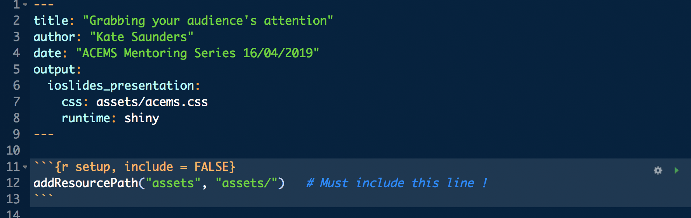
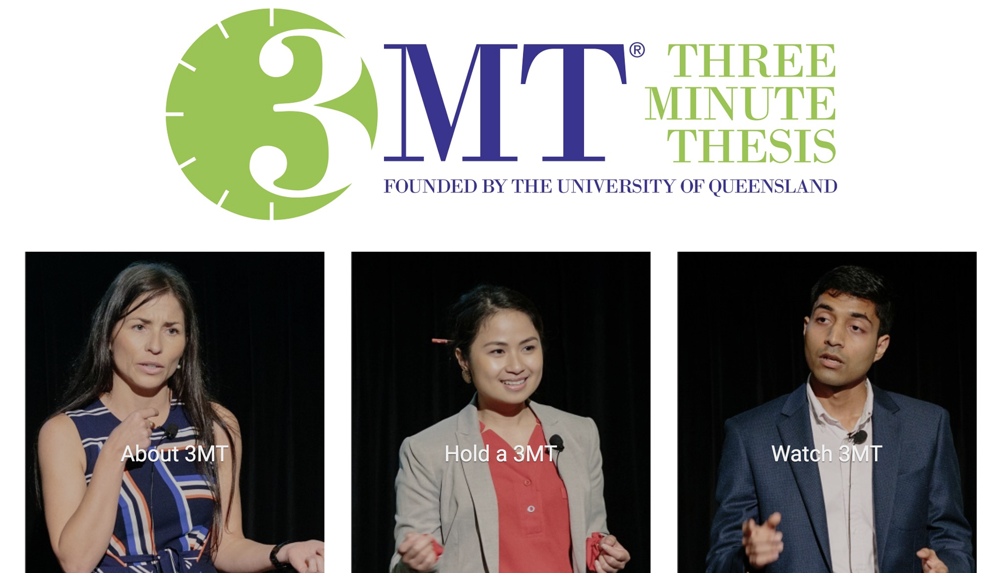

```{r setup, include = FALSE}
# runtime: shiny
# addResourcePath("assets", "assets/")   # Must include this line !
library(ggplot2)
library(plotly)
```

## Disclaimer 

<br><br>
<center>
   
</center>

<div class = "notes"> 
* Spend time introducing yourself - UQ, CSIRO, Phd, Postdoc
* Tall order to give a talk on giving talks
* I gave a good talk one time
</div>

## Why me?

<br><br><br>
**Challenge what it means to present mathematical research**

<div class = "notes">
* Jokes aside
* Challenge what it means to present research
* Haven't used Beamer since 2016
* Know LaTEX great for math typsetting
* Inflexible for almost everything else!
* Particularly: Images/Videos/GiFs
</div>

## Why me?

<br><br><br>
**Challenge what it means to present mathematical research**

<br><br><br>
**Haven't given a talk in Beamer since 2016**

## R - RMarkdown and Ioslides

<center> </center>  
<br>

* [RMarkdown Tutorials](https://rmarkdown.rstudio.com/)

* [RMarkdown Cheat Sheet](https://www.rstudio.com/wp-content/uploads/2015/02/rmarkdown-cheatsheet.pdf)  

* [RMarkdown Ioslides](https://bookdown.org/yihui/rmarkdown/ioslides-presentation.html)

<!-- (Make picture a bit bigger - show slide) -->

<div class = "notes">
* Can still use LaTEXKat
* Code in R (extra so I don't need to convert my graphs to images, embed the code)
* Reproducible workflow
* Can still produce pdf output
</div>

<!-- ## Interactive graphics -->

<!-- **Parameter's of the GEV Distribution**: location is <span style="color:#099EA2"> $\mu$ </span>, scale is <span style="color:#099EA2"> $\sigma$ </span> and the shape is <span style="color:#099EA2"> $\xi$ </span>. -->

<!-- ```{r, echo = FALSE} -->
<!-- shinyAppDir("app/GEV_slider/", -->
<!--   options = list(width = "100%", height = 700) -->
<!--    ) -->
<!-- ``` -->

<!-- Ideally convert this to standard plotly so I can save the html -->

<div class = "notes">
* Sexy
* Creative and use data visualisation
* R also allows me more flexibility in how I present
</div>

## Interactive graphics

```{r dist loc plot, echo = F, message = F, warning = F}
subsetData.file = "data/subsetData.txt"
subsetData = read.table(subsetData.file, head = T, sep = ",", stringsAsFactors = F)
subsetData$SiteNum = formatC(subsetData$SiteNum, width = 6, flag = "0")

x.list <- list(title = "Distance to Coast (km)")
y.list <- list(title = "Location Parameter")
main.list <- list(title = "Visualisation Covariates")
dist.loc.plot <- plot_ly(data = subsetData,
                        x = ~Dist, y = ~loc,
                        text = ~paste("Name:", Name, "Elev:", Elev,
                                     "Long:", Long, "Lat:", Lat),
                        mode = "markers", color = ~Elev) %>%
                        layout(xaxis = x.list, yaxis = y.list,
                               title = "Visualising Covariates")
dist.loc.plot
```

## Interactive graphics

<br><br><br><center>
 <span style="color:#099EA2"> **Just because you have interactive graphics doesn't mean you'll give a good talk** </span></center>

## Interactive graphics

<br><br><br><center>
 <span style="color:gray"> **Just because you have interactive graphics doesn't mean you'll give a good talk** </span></center>

<br><br><br><center>
<span style="color:#099EA2">
**You still need to communicate your research well!!!** 
<!-- </span><br> -->
<!-- <span style="color:#099EA2"> -->
<!-- **and communicating it well!!!** -->
<!-- </span> -->
</center>

## Outline:

* Why bother giving a good talk?

<br>
  <!-- So many people give rubbish talks -->
  <!-- (Selling your research) -->
  <!-- (Time to effort ratio) -->
  <!-- (Trailer) -->
  
* Conveying your message

<br>
  <!-- (Pitch) -->
  <!-- (If someone summaries your talk after) -->
  <!-- (Can't tell people everything - don't expecet to either) -->
  <!-- (What do you want to convey) -->
  <!-- (Timing vs Key points) -->
  <!-- (Storyboarding) -->

* Relationship with your audience

<br>
  <!-- (Contract) -->
  <!-- (How much do you want people to understand) -->
  <!-- (Pitch should differ based on your audience) -->
  <!-- Style -->
  <!-- Nerves -->
  <!-- Questions -->
  <!-- Opportunity to come back to you -->
  
* Slide layout

<br>  
  <!-- (Text - don't put anything up you don't want people to read!) -->
  <!-- (Say it in it's simplest form wherever possible) -->
  <!-- (Give people the opportunity to come back in) -->
  <!-- (Interactive graphics as a tool - when to use them) -->
  <!-- (Caution: Slides get shared afterward) -->
  <!-- (Caution: Backup) -->
 
# Why bother?

<div class = "notes">
* Most talks begin with a motivation - this talk is no different
* Important to answer the questions why bother
* Most talks are rubbish so why should you put in the effort
</div>

## Some reasons

* You have to (milestones)

* Conferences / Workshops

* Promote a paper

## Some reasons

* You have to (milestones)

* Conferences / Workshops

* Promote a paper

<br><br><center><span style="color:#099EA2"> **Trailer to your research !!!** </span></center>

## Some reasons

* You have to (milestones)

* Conferences / Workshops

* Promote a paper

<br><br><center><span style="color:#099EA2"> **Trailer to your research !!!** </span></center>

<br><br><center><span style="color:#099EA2"> **Sell to your research !!!** </span></center>

## Some reasons

* You have to (milestones)

* Conferences / Workshops

* Promote a paper

<br><br><center><span style="color:#099EA2"> **Trailer to your research !!!** </span></center>

<br><br><center><span style="color:#099EA2"> **Sell to your research !!!** </span></center>

<br><br><center><span style="color:#099EA2"> **Pride in your research !!!** </span></center>

<br>

## Others reasons 

<center><span style="color:#099EA2"> **Why are you motivated to give a good talk?** </span>

???

Tweet them to: @ACEMathStats @katerobsau

## Motivated ✓ 

<br><br><br><center>
<span style="color:#099EA2"> **Now how do we actually give a good talk?** </span>

# Message

 <!-- (Pitch) -->
  <!-- (If someone summaries your talk after) -->
  <!-- (Can't tell people everything - don't expecet to either) -->
  <!-- (What do you want to convey) -->
  <!-- (Timing vs Key points) -->
  <!-- (Storyboarding) -->

## Why do I care?

<iframe src="https://giphy.com/embed/GkHJKqIa14mB2" width="480" height="360" frameBorder="0" class="giphy-embed" allowFullScreen></iframe><p><a href="https://giphy.com/gifs/animated-staring-GkHJKqIa14mB2">via GIPHY</a></p>

<div class = "notes">
Extreme value theory or extreme value analysis (EVA) is a branch of statistics dealing with the extreme deviations from the median of probability distributions. It seeks to assess, from a given ordered sample of a given random variable, the probability of events that are more extreme than any previously observed. Extreme value analysis is widely used in many disciplines, such as structural engineering, finance, earth sciences, traffic prediction, and geological engineering. For example, EVA might be used in the field of hydrology to estimate the probability of an unusually large flooding event, such as the 100-year flood. Similarly, for the design of a breakwater, a coastal engineer would seek to estimate the 50-year wave and design the structure accordingly.
</div>

## Pitching 1.0

<center>
   
</center>
         
<!--                                                                                     <div class = "notes"> -->

<!-- * What is your elevator pitch? -->
<!-- * How do you explain your research at parties? -->
<!-- * Can you summarise your research in a twitter statement -->
<!-- * How do you convey concisely what your reserach is about -->
<!-- * The motivation for what you study -->

<!-- </div> -->

## Set of key messages

<center><span style="color:#099EA2"> **Can't tell people everything!!!**</span>
</center><br>

3 minute talk = 1 idea

10 minute talk = 1 - 2 ideas and a bit of background

20 minute talk = A few (2 - 4) of ideas and introductory background

etc. 

## Set of key messages

<center><span style="color:#099EA2"> **Can't tell people everything!!!**</span>
</center><br>

3 minute talk = 1 idea

10 minute talk = 1 - 2 ideas and a bit of background

20 minute talk = A few (2 - 4) of ideas and introductory background

etc. 

<center><span style="color:#099EA2">
  **Think about these key messages as your roadmap** 
</span><br>

<span style="color:#099EA2">
  **Build your slides around them to support this story**
</span>

## Take home message

<br><br><br><center>
<span style="color:#099EA2"> **If someone summarises your talk after** </span>
<br>

<span style="color:#099EA2"> **What do you want them to remember?** </span>

# Audience

## Pitching 2.0

<br><br><br><center>
<span style="color:#099EA2"> **Which key messages do you want your audience to understand?** </span> </center> 
<br>

Audience:

* Masters and PhD students at different levels
* Researchers from the application, not mathematically trained
* Important people in your field

## Temptation

<br><br><br>
<center>
<span style="color:#099EA2"> **Pack your talk full of complicated maths** </span>
</center>
<br>

<center>
<span style="color:#099EA2"> **DON'T DO IT!!!** </span>
</center>
<br>

<div class = "notes">
* No one in your audience is going home after disappointed because they understand your talk!
* People may think it's a waste of time on the other hand if they can't understand any of it!
</div>

## Contract 

* As a speaker your job is try to communicate your reserach

* As an audience member your job is to listen

## Contract 

* As a speaker your job is try to communicate your reserach

* As an audience member your job is to listen

<br><br><center>
<span style="color:#099EA2"> **If you break the contract as a speaker**</span> 
<br> 

<span style="color:#099EA2"> **The audience can break their contract** </span>
</center>

## Communicating with your audience

**Some suggestions:**

* Keep ideas in their simplest possible form

* Where possible, develop in stories in a dual way   
eg. skoof, proof by picture
  
* Tell the audience how it's relevant to them

<div class = "notes">
* Make an effort to communicate your ideas
* If people understand they will engage
* If you are clear people will follow!
</div>

## Questions

<center> **If the audience engaged with your talk you will get asked questions!** -<span style="color:#099EA2">  **Getting asked questions is good!** </span>
<br>

<iframe src="https://giphy.com/embed/7rj2ZgttvgomY" width="240" frameBorder="0" class="giphy-embed" allowFullScreen></iframe><p><a href="https://giphy.com/gifs/reaction-7rj2ZgttvgomY">via GIPHY</a></p>

<div class = "notes">
* This is my barometer for how well people understood my talk
* How well I explained concepts
* What people found interesting
* Get excited about questions
* People ask questions because they are curious!!!
</div>

## Question Fear

<center>
Giving talks and getting asked questions is scary for some people

<iframe src="https://giphy.com/embed/3o7abrH8o4HMgEAV9e" width="480" height="241" frameBorder="0" class="giphy-embed" allowFullScreen></iframe><p><a href="https://giphy.com/gifs/starwars-3o7abrH8o4HMgEAV9e">via GIPHY</a></p>

<div class = "notes">
* As a young researcher questions scared me (still do sometimes)
* You can simply say - let's discuss that afterwards or I don't know
* You are in the power seat!!
* For a long time I was scared of giving talks
* Mostly because I saw some very bad behaviour in my Honours from a member of the audience who berrated a young speaker
* Since then I've realised - bad behaviour at talks isn't about you!
* In one of my first talks at conference I got an equation wrong
* What happened - wrote it on a piece of paper, slipped it to me afterward politely, he thanked me for my effort.
</div>

  <!-- (Contract) -->
  <!-- (How much do you want people to understand) -->
  <!-- (Pitch should differ based on your audience) -->
  <!-- Style -->
  <!-- Nerves -->
  <!-- Questions -->
  <!-- Opportunity to come back to you -->

## What next

✓ Motivation

✓ Messages 

✓ Audience

? Slide layout

# Slide Layout

## Sign posts

* Repeat your messages

* People have short attention spans!

* Get people to listen again

<center>
   
</center>

<div class = "notes">
* inspired them
* confused them
* bored them
</div>

## Pink elephants

**Scientific thinking in words - David Lindsay**

* Book about scientific writing
* Covers: paper writing, talks, posters, presentations
* Written by for more general science, still applicable to mathematics
* Highly recommended
* Makes this interesting point about "pink elephants"
* Which is where people reading your slide and not paying attention
* So you can basically say anything - like pink elephants!!!
* Or touch your nose

## Text

<center><br><br>
<span style="color:#099EA2">**I try never to put text on slides that I do not intend to read!!** </span>
<br>

## Text

<center><br><br>
<span style="color:#099EA2">**I try never to put text on slides that I do not intend to read!!** </span>
<br>

<center><br><br>
<span style="color:#099EA2"> **Same goes for equations** </span>
<br>

<center><br><br>
<span style="color:#099EA2"> **Same goes for pictures** </span>
<br>


## Structure vs Style

<span style="color:#099EA2"> **Structure:** </span>

* Messages
* Audience
* Slide Layout

<span style="color:#099EA2"> **Style:** </span>

* Honesty
* Humour

# Final remarks

## Keeping it real

<center><span style="color:#099EA2"> **Creating a well crafted story and ** </span>

<span style="color:#099EA2"> **clear accompanying slides takes time** </span>
</center>
 <!-- **But Kate we don't have time!!!**  -->

<iframe src="https://giphy.com/embed/JIX9t2j0ZTN9S" frameBorder="0" class="giphy-embed" allowFullScreen></iframe><p><a href="https://giphy.com/gifs/JIX9t2j0ZTN9S">via GIPHY</a></p>

<br>

<div class = "notes">
* Just starting it'll take longer
* Have to practice - lots
* Busy important people
* Research Ouptut: Papers > Talks 
* Researchers profile is multifaceted (do it all!)
</div>

## Keeping it real

<center><span style="color:#099EA2"> **Creating a well crafted story and ** </span>

<span style="color:#099EA2"> **clear accompanying slides takes time** </span>
</center>
<br>

* Okay to give the same talk more than once!

* You probably won't give an amazing talk the first time

* Improve aspects of your talk each time 

## Upward mentoring

<br><br><br>
<center><span style="color:#099EA2">  **If you are a supervisor:** </span>

* Let your student know you are in their corner 

* Encourage them to get out there and try

<div class = "notes">
* Thanks to Peter Taylor for encouraging me and given me opportunity to practice giving talks
* Acems gives thoughts of opportunity - very lucky!!
</div>

## Conclusions

✓ Motivation

✓ Messages 

✓ Audience

✓ Slide layout

## Questions

<iframe src="https://giphy.com/embed/7PfwoiCwBp6Ra" width="480" height="384" frameBorder="0" class="giphy-embed" allowFullScreen></iframe><p><a href="https://giphy.com/gifs/ellen-degeneres-questions-ask-7PfwoiCwBp6Ra">via GIPHY</a></p>

<script src = "assets/acems.js"></script>
