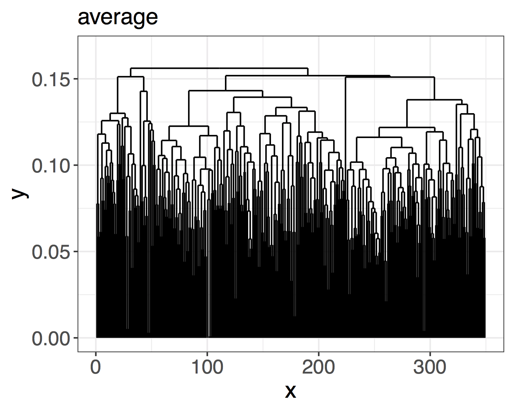

  
<style>
  .fullslide img {
    margin-top: -85px;
    margin-left: -60px;
    width: 900px; 
    height: 700px;
  }
</style>
  
```{r, echo = FALSE, warning = FALSE, include=FALSE}
knitr::opts_chunk$set(echo = FALSE)
addResourcePath("assets", "assets/")   # Must include this line !
library(cluster)
library(ggplot2)
library(plotly)
library(dplyr)
library(shiny)
```

# Motivation

## Standard Approach

To make statistical problems more tractable:
  <br>
  <br>
  <br>
  <br>
  $\cdot$ Common to pool data eg. spatially
<br>
  <br>
  <br>
  <br>
  $\cdot$ Create a partition eg. consider region by region

## Climate example

National Resource Management Regions

<center>


  
<font size="3">
CSIRO and Bureau of Meteorology, 2015. Climate change in Australia information for Australia's natural resource management regions: Technical report.
</font>

## Post-processing example

<center>

</center>
<br>
<font size="3">
Whan, Kirien, and Maurice Schmeits. "Comparing area probability forecasts of (extreme) local precipitation using parametric and machine learning statistical postprocessing methods." Monthly Weather Review 146.11 (2018): 3651-3673.</font>


## Question 

<br><br><br><br><br>
<font color="2292B5">**How should partition regions for the analysis of extremes?** </font> 

## Application

```{r, echo = FALSE}
wdir = paste(getwd(), "data", sep = "/")
mainland_df = readRDS(paste(wdir, "mainland_df.rds", sep =  "/"))
tas_df = readRDS(paste(wdir, "tas_df.rds", sep =  "/"))
coords = readRDS(paste(wdir, "region_coords.rds", sep = "/")) %>%
dplyr::bind_rows()
station_plot <- ggplot(data = coords) +
geom_point(aes(x = longitude, y = latitude), size = 0.2, alpha = 0.5) +
geom_path(data = mainland_df, aes(x = Long, y =Lat)) +
geom_path(data = tas_df, aes(x = Long, y =Lat)) +
xlab("Longitude") +
ylab("Latitude") +
ggtitle("Station Locations") +
coord_fixed() +
theme_bw()
station_plot
```
<font color="2292B5">**Create regions that are likely to experience similar impacts** </font>

## Regionalisation

<center>


<font color="2292B5">**These regions can then inform our statistical analysis** </font>

## Challenge

<br>


<font color="2292B5">**How should we deal with the varied climate, complex topography and large geographical scale?** </font>

<div class="notes">
- Want to understand extremes on an Australian wide scale
- Challenge is complexity of climate and topography
- Size
</div>

## Outline 

<font color="2292B5">**1. Regionalisation** </font>

* Clustering
* Dependence of bivariate extremes
* Practicalities
* Classification

<font color="2292B5">**2. Visualise full spatial dependence** </font>

* Max-stable processes

<!-- <font color="2292B5">**3. Spatial post-processing** </font> -->


# Regionalisation

## Clustering Distance

<br><br>
<font color="2292B5">**Require:**</font> Measure of closeness between two locations<br/ >
<br><br>
<font color="2292B5">**Want:**</font> Form clusters based on extremal dependence<br/ >
<br><br>
<font color="2292B5">**Solution:**</font> The F-madogram distance</br>

<br><br><br><br>
<font size="3">
Bernard, Elsa, et al. "Clustering of maxima: Spatial dependencies among heavy rainfall in France." Journal of Climate 26.20 (2013): 7929-7937.
</font>

## F-madogram distance

<font color="2292B5">$$d(x_i, x_j) = \tfrac{1}{2} \mathbb{E} \left[ \left| F_i(M_{x_i}) - F_j(M_{x_j}) \right| \right]$$</font>
where
<font color="2292B5">$M_{x_i}$</font> is the annual maximum rainfall at location
<font color="2292B5">$x_i \in \mathbb{R}^2$</font> and <font color="2292B5">$F_i$</font> is the distribution function of
<font color="2292B5">$M_{x_i}$</font>.

<br>
<font color="2292B5"> **Advantages:** </font>

* Only use the raw block (annual) maxima
* No information about climate or topography
* Non-parametric estimation (fast)

<br>
<font size="3">
Cooley, D., Naveau, P. and Poncet, P., 2006. Variograms for spatial max-stable random fields. In Dependence in probability and statistics (pp. 373-390). Springer, New York, NY.
</font>

<div class="notes">
- In spatial statistics normally we have a notion of how close two things are using the variogram
- For heavy-tail distribution (problem) variance isn't finite
- Fmadogram gets aroudn this by using distribution funcitons
- Estiamte this distance non-parametrically
- Just going to consider hte clustering in terms of hte dependence
</div>

## Clustering
<br><br>
$\checkmark$ Distance

<br><br><br>
  <!-- $?$ Algorithm -->
  <font color="2292B5">**But how is this related to extremal dependence?**</font>

## Standard Formulation

Let <font color="2292B5">$X_i$</font> be a sequence of iid random variables, define
<font color="2292B5">$$M_{n} = \max\{X_1, \dots, X_{n}\}.$$</font>

The distribution function of <font color="2292B5">$M_n$</font>  is
<font color="2292B5">$$\mathbb{P}(M_n \leq z) = \mathbb{P}(X_1 \leq z, \dots, X_n \leq z) = \mathbb{P}(X \leq z)^n = F(z)^n,$$</font>
where <font color="2292B5">$F(z)$</font>  is the distribution function of <font color="2292B5">$X$</font> .

Let <font color="2292B5">$z^F$</font>  denote the right endpoint of the support of <font color="2292B5">$F$</font> ,
<font color="2292B5">$$z^F = \sup \{z : F(z) < 1\},$$</font>
then as <font color="2292B5">$n \rightarrow \infty$</font>, <font color="2292B5">$F(z)^n \rightarrow 0$</font> for any <font color="2292B5">$z < z^F$</font>.

## GEV Distribution

If there exists sequences of constants
  <font color="2292B5">$\{a_n\} \in \mathbb{R}^+$</font> and
  <font color="2292B5">$\{b_n\} \in \mathbb{R}$</font>
  such that
<font color="2292B5">$$\mathbb{P} \left\{\dfrac{M_n - b_n}{a_n} \leq z \right \} \rightarrow G(z) \quad\hbox{as}\quad\, n \rightarrow \infty
$$</font>
where
  <font color="2292B5">$G(z)$</font> is a non-degenerate distribution function, then
  <font color="2292B5">$G(z)$</font> is a member of the generalised extreme value (GEV) family
<font color="2292B5">$$
 	G(z) = \exp \left\{ - \left[ 1 + \xi \left(\dfrac{z-\mu}{\sigma}\right) \right]_+^{-1 / \xi} \right\},$$</font>
where
  <font color="2292B5">$[v]_+ = \max \left\lbrace 0,v \right\rbrace$</font>,
  <font color="2292B5">$\mu \in \mathbb{R}$</font>,
  <font color="2292B5">$\sigma \in \mathbb{R}^+$</font> and
  <font color="2292B5">$\xi \in \mathbb{R}$</font>.
  
(Fisher and Tippett 1928, Gnendenko 1943)
\citep{fisher1928limiting, gnedenko1943distribution}

<!-- ## GEV Distribution -->

<!-- Parameters: location is <span style="color:#2292B5"> $\mu$ </span>, scale is <span style="color:#2292B5"> $\sigma$ </span> and the shape is <span style="color:#2292B5"> $\xi$ </span>. -->

<!-- ```{r, echo = FALSE} -->
<!-- shinyAppDir("shiny_apps/GEV_slider/",  -->
<!--   options = list(width = "100%", height = 700) -->
<!--    ) -->
<!-- ``` -->

## Practicalities

<font color="2292B5">**Why approximate the $\mathbb{P}(M_n \leq z)$ by the GEV distribution?**</font>  

<div class="notes">
Key Points:
- Most of the time, we don't have a lot of data
- Estimate the probability of rare events
- So events that we've only seen once or twice, or maybe never at all
- By approximating by the limit distribution, have justification for extrolapolation outside the range of our data
</div>

## Practicalities

<font color="lightgray">**Why approximate the $\mathbb{P}(M_n \leq z)$ by the GEV distribution?**</font>    
<br />  
<br />
<br />
<font color="2292B5">**Rainfall observations aren't independent**</font>  
<br />  
<br />
<br />

## Practicalities

<font color="lightgray">**Why approximate the $\mathbb{P}(M_n \leq z)$ by the GEV distribution?**</font>    
<br />  
<br />
<br />  
<font color="lightgray">**Rainfall observations aren't independent**</font>    
<br />  
<br />
<br /> 
<font color="2292B5">**Rainfall observations aren't identically distributed**</font>  
<!-- Okay - provided data meets conditions preventing long range dependence (Leadbetter 1983)   -->
  
## Extremal Coefficient
  
For <font color="2292B5">$M_{x_i}$</font> and
<font color="2292B5">$M_{x_j}$</font> with GEV(1,1,1) marginal distributions is
<font color="2292B5">$$\mathbb{P}\left( M_{x_i} \leq z, M_{x_j} \leq z \right) = \left[\mathbb{P}(M_{x_i}\leq z)\mathbb{P}(M_{x_i}\leq z)) \right]^{\tfrac{1}{2}\theta(x_i - x_j)}. %= \exp\left(\dfrac{-\theta(h)}{z}\right),$$</font>
  where <font color="2292B5">$\theta(x_i - x_j)$</font> is the extremal coefficient and the range of <font color="2292B5">$\theta(x_i - x_j)$</font> is <font color="2292B5">$[1 , 2]$</font>.

## F-madogram and Extremal Coefficient

Can express the F-madogram as:
  <font color="2292B5">
  $$d(x_i, x_j) = \dfrac{\theta(x_i - x_j) - 1}{2(\theta(x_i - x_j) + 1)},$$</font>
  so the range of <font color="2292B5">$d(x_i, x_j)$</font> is <font color="2292B5">$[0 , 1/6]$</font>.

 <font color="2292B5">**Clusters will have a physical interpretation in terms of extremal dependence**</font>

<div class="notes">
  - Extremal coefficient is a measure for parital dependence
- Using it for clustering, means our clsuters will have a natural interpretation
- Importnat to note the range (talk about that again in a little bit)
</div>

## Clustering
<br><br>
$\checkmark$ Distance

<br><br><br>
  $?$ Algorithm
  <!-- <font color="2292B5">**But how is this related to extremal dependence?**</font> -->

## K-Medoids Clustering and PAM

1. Randomly select an initial set of <font color="2292B5">$K$</font> stations. These are the set of the initial medoids.
2. Assign each station, <font color="2292B5">$x_i$</font>, to its closest medoid, <font color="2292B5">$m_k$</font>, based on the F-madogram distance.
3. For each cluster, <font color="2292B5">$C_k$</font>, update the medoid according to
<font color="2292B5">
  $$m_k = \mathop{\mathrm{argmin}}\limits_{x_i \in C_k} \sum_{x_j \in C_k} d(x_i, x_j).$$</font>
  4. Repeat steps 2. -- 4. until the medoids are no longer updated.

<br>
  <font size="3">Kaufman, L. and Rousseeuw, P.J., 1990. Partitioning around medoids (PAM). Finding groups in data: an introduction to cluster analysis, pp.68-125.</font>
  
## Example: Southwest Western Australia
  
```{r, echo = FALSE, warning = FALSE}

plot_coords = readRDS(paste(wdir, "plot_coords.rds", sep =  "/"))
text.type.large <- element_text(size = 12)
text.type.small <- element_text(size = 11)

gg_color_hue <- function(n) {
  hues = seq(15, 375, length = n + 1)
  hcl(h = hues, l = 65, c = 100)[1:n]
}

plot_coords <- plot_coords %>%
  mutate(temp = if_else(distance_type == plot_coords$distance_type[1],
                        T, F)) %>%
  mutate(cluster_id = cluster_id + temp*10) %>%
  mutate(cluster_id = if_else(cluster_id == 12, 1, cluster_id)) %>%
  mutate(cluster_id = if_else(cluster_id == 11, 3, cluster_id)) %>%
  mutate(cluster_id = if_else(cluster_id == 15, 2, cluster_id)) %>%
  mutate(cluster_id = if_else(cluster_id == 17, 4, cluster_id)) %>%
  mutate(cluster_id = if_else(cluster_id == 13, 7, cluster_id)) %>%
  mutate(cluster_id = if_else(cluster_id == 16, 5, cluster_id)) %>%
  mutate(cluster_id = if_else(cluster_id == 14, 6, cluster_id))

plot_title = "K-medoids clustering"

cluster_plot <- ggplot() +
  geom_point(data = plot_coords %>% 
               filter(distance_type == plot_coords$distance_type[1]),
             aes(x = longitude, y = latitude,
                 col = as.factor(cluster_id),
                 shape = as.factor(cluster_id%%6),
                 key = cluster_id), size = 0.8) + #,
  # group = distance_type)) +
  coord_fixed() +
  # facet_wrap(~distance_type, ncol = 2) +
  geom_path(data = mainland_df, aes(x = Long, y = Lat)) +
  geom_path(data = tas_df, aes(x = Long, y = Lat)) +
  scale_x_continuous(limits = range(plot_coords$longitude) + c(-0.1, 0.1)) +
  scale_y_continuous(limits = range(plot_coords$latitude) + c(-0.1, 0.1)) +
  scale_color_manual(values = gg_color_hue(10)[c(1,2,3,4,5,6,7, rep(8,2))]) + 
  # red, orange, #brown, # green, #lightgreen, #light blue, #blue
  theme_bw() +
  xlab("Longitude") +
  ylab("Latitude") +
  ggtitle(plot_title) +
  theme(legend.position = "none",
        legend.text = text.type.small,
        strip.text.x = text.type.large,
        axis.text = text.type.small,
        plot.title = text.type.large,
        axis.title = text.type.large)

ggplotly(cluster_plot, source = "select", tooltip = c("key"))
```

## Example

Consider the <font color="2292B5"> $\max \{ \| x_i - x_j \|, 2\}$</font> as the clustering distance.
```{r, echo = F, warning = F}
set.seed(1)
cap = 2
theta = seq(0, 2*pi, length.out = 360)
circle = data.frame(x = cap*cos(theta), y = cap*sin(theta))

# CAP ON DISTANCE
xshift = 7

x0 = rnorm(500, 0, 1)
y0 = rnorm(500, 0, 1)

x1 = x0 + xshift
y1 = y0

x = c(x0,x1)
y = c(y0,y1)

DD = dist(cbind(x,y))
i = which(DD > cap)
DD[i] = cap

pam_clusters = pam(DD, k = 2)

k = 2
cap_df = data.frame(x,y)
cap_df$K = rep(k, nrow(cap_df))
cap_df$cluster_id = pam_clusters$clustering
cap_df$medoids_x = rep(NA, nrow(cap_df))
cap_df$medoids_y = rep(NA, nrow(cap_df))
cap_df$medoids_x[pam_clusters$medoids] = cap_df$x[pam_clusters$medoids]
cap_df$medoids_y[pam_clusters$medoids] = cap_df$y[pam_clusters$medoids]

kmedoids_eg1_plot <- ggplot() +
  geom_point(data = cap_df, aes(x=x, y=y,
                                col = as.factor(pam_clusters$clustering),
                                shape = as.factor(pam_clusters$clustering),
                                text = paste("Cluster ID:", as.factor(pam_clusters$clustering)))) +
  scale_color_manual(values = c("purple", "orange")) +
  geom_point(data = cap_df, aes(x = medoids_x,
                                y = medoids_y),
             col = "black", shape = 20, size = 2) +
  geom_path(aes(x = circle$x, y = circle$y), linetype = "dashed") +
  geom_path(aes(x = circle$x + xshift, y = circle$y), linetype = "dashed") +
  coord_fixed() +
  xlab("") + ylab("") +
  theme_bw() +
  theme(legend.position = "none") +
  ggtitle("Example of K-Medoids showing spurious clustering")

ggplotly(kmedoids_eg1_plot, tooltip = c("text"))

```

## Density example

```{r, echo = F, warning = F}

xshift = 7
x0 = rnorm(1000, 0, 1)
y0 = rnorm(1000, 0, 1)

i = sample(1:length(x0), 100)
x1 = x0[i] + xshift
y1 = y0[i]

x = c(x0,x1)
y = c(y0,y1)

cap = 2
DD = dist(cbind(x,y))
i = which(DD > cap)
DD[i] = cap

pam_clusters_1 = pam(DD, k = 2)

plot_df = data.frame(x,y)
plot_df$K = paste("K = ", c(rep(2, length(x))))
plot_df$cluster_id = c(pam_clusters_1$clustering)
plot_df$medoids_x = rep(NA, nrow(plot_df))
plot_df$medoids_y = rep(NA, nrow(plot_df))
plot_df$medoids_x[pam_clusters_1$medoids] = plot_df$x[pam_clusters_1$medoids]
plot_df$medoids_y[pam_clusters_1$medoids] = plot_df$y[pam_clusters_1$medoids]

density_eg_plot <- ggplot(plot_df) +
  geom_point(aes(x = x, y = y,
                 col = as.factor(cluster_id),
                 shape = as.factor(cluster_id),
                 text = paste("Cluster ID:", as.factor(cluster_id)))) +
  geom_point(aes(x = medoids_x,
                 y = medoids_y),
             col = "black", shape = 20, size = 2) +
  coord_fixed() +
  theme_bw() +
  facet_wrap( ~ K, nrow = 2) +
  theme(legend.position = "none") +
  ggtitle("Station Density Example of K-Medoids")

ggplotly(density_eg_plot, tooltip = c("text"))

```

## Gridded data

* Ensure there are sufficient medoids

<br>
  
  * Spatial density is changed by land-sea and domain boundaries  

<br>
  
  * Tendancy toward clusters of equal size 

<br>
  
  * Clustering is in F-madogram space not Euclidean  

## Hierarchical Clustering

<center>
  
  </center>
  
  <font color="2292B5">**Linkage Rule:**</font>
  For each pair of clusters, <font color="2292B5">$C_k$</font> and <font color="2292B5">$C_k'$</font>
<!-- , define the distance between the clusters as -->
<font color="2292B5">$$d(C_k, C_{k'}) = \frac{1}{|C_k| |C_{k'}|} \sum_{x_k \in C_k} \sum_{x_{k'} \in C_{k'}} d(x_k, x_{k'}).$$</font>
  
  <!-- ## Hierarchical Clustering -->
  
  <!-- 1. Each station starts in its own cluster -->
  <!-- 2. For each pair of clusters, <font color="2292B5">$C_k$</font> and <font color="2292B5">$C_k'$</font>, define the distance between the clusters as -->
  <!-- <font color="2292B5">$$d(C_k, C_{k'}) = \frac{1}{|C_k| |C_{k'}|} \sum_{x_k \in C_k} \sum_{x_{k'} \in C_{k'}} d(x_k, x_{k'}).$$</font> -->
  <!-- 3. Merge the the clusters with the smallest distance -->
  <!-- 4. Update the distances relative to the new cluster -->
  <!-- 5. Repaet steps 3 - 5, until all points are combined in a single cluster -->
  
## Back to the first example
  
```{r, echo = FALSE, warning = FALSE}

plot_title = "Comparison"

plot_coords = readRDS(paste(wdir, "plot_coords.rds", sep =  "/"))

plot_coords <- plot_coords %>%
  mutate(temp = if_else(distance_type == plot_coords$distance_type[1],  
                        T, F)) %>%
  mutate(cluster_id = cluster_id + temp*10) %>%
  mutate(cluster_id = if_else(cluster_id == 12, 1, cluster_id)) %>%
  mutate(cluster_id = if_else(cluster_id == 11, 3, cluster_id)) %>%
  mutate(cluster_id = if_else(cluster_id == 15, 2, cluster_id)) %>%
  mutate(cluster_id = if_else(cluster_id == 17, 4, cluster_id)) %>%
  mutate(cluster_id = if_else(cluster_id == 13, 7, cluster_id)) %>%
  mutate(cluster_id = if_else(cluster_id == 16, 8, cluster_id)) %>%
  mutate(cluster_id = if_else(cluster_id == 14, 6, cluster_id)) 


cluster_plot1 <- ggplot() +
  geom_point(data = plot_coords,
             aes(x = longitude, y = latitude,
                 col = as.factor(cluster_id),
                 shape = as.factor(cluster_id%%6),
                 group = distance_type), size = 0.8) +
  coord_fixed() +
  facet_wrap(~distance_type, ncol = 2) +
  geom_path(data = mainland_df, aes(x = Long, y = Lat)) +
  geom_path(data = tas_df, aes(x = Long, y = Lat)) +
  scale_x_continuous(limits = range(plot_coords$longitude) + c(-0.1, 0.1)) +
  scale_y_continuous(limits = range(plot_coords$latitude) + c(-0.1, 0.1)) +
  scale_color_manual(values = gg_color_hue(10)[c(1,2,3,4,5,6,7, 8,9,10)]) + 
  theme_bw() +
  xlab("Longitude") +
  ylab("Latitude") +
  ggtitle(plot_title) +
  theme(legend.position = "none",
        legend.text = text.type.small,
        strip.text.x = text.type.large,
        axis.text = text.type.small,
        plot.title = text.type.large,
        axis.title = text.type.large)

# got a bug here - need to find out what it is!!!
# ggplotly(cluster_plot1)
cluster_plot1
```

## Classify

* Classify a station relative to its closest neighbours
* Use a weighted classification $w$-kNN

<center>
  
  
  <div class="notes">
  * clustering is so good not really much need
* Need to be able to classify locations without a station
* Need to be able to identify regional boundaries
</div>
  
## Results
  
```{r regions, echo = FALSE}
shinyAppDir("shiny_apps/region_summary/", 
            options = list(width = "100%", height = 700))
```

## Choosing a cut height
  
  <center>
  
  </center>
  
  <div class="notes">
  Depends on what you are trying to do?
  
  Lower cut heights ~0.115 stronger dependence

Higher cut heights ~0.133 weaer dependence

Low than 0.1 (very strong dependence, starts to decrease rapidly to zero - clusters become small)

Greater than 0.135 (very week depdence, starts to decrease rapidly to zero - clusters become small)

Depends on the topography as well
</div>
  
## Similar Dependence
  
  <br>
  <br>
  <br>
  <font color="2292B5"> **Where can we assume a common dependence structure for extremes?** </font >

<div class="notes">
* Created this regionalisation
* Used a measure for partial dependence
* How well do we do at creating regions of similar dependence
* Can we assume a similar dependence structure
</div>


## Visualising Dependence

* Fit a model for spatial extremes with a Guassian dependence structure  
  
* Visualise the partition using elliptical level curves  

* Centre the curve on the centroid of cluster $k$ <font color="2292B5">$\mathbf{c_k}$</font>

<font color="2292B5">
  $$ \mathbb{P}(\| \mathbf{x} - \mathbf{c_k} \| < r) = 1 - \exp \left( \frac{-r^2}{2} \right)$$
  </font>

* Understand uncertainty by sampling stations and repeating the fitting 

* Size and direction of ellipses have a natural intepretation in terms dependence

## Southwest Western Australia

<center>
  
  </center>
  
## Tasmania
  
  <center>
  
  
  </center>

## Conclusions

* Create a regionalisation of based on extremal dependence

* Highlighted some considerations for clustering

* Used the regionalisation to inform fitting of spatial models for extremes

* Visualise full extremal dependence

* Better idea of where a single dependence structure can be assumed

## Future work

* Non-stationary dependence!
  
* Post-processing of compound events: Storm surge and Precipitation

* Changing dependence of temperature extremes

**e.** K.R.Saunders@tudelft.nl

**t.** @katerobsau

**g.** github.com/katerobsau

## {.fullslide}

<center>
  
</center>

<script src = "assets/delft.js"></script>  