<style>
  .fullslide img {
    margin-top: -85px;
    margin-left: -60px;
    width: 900px; 
    height: 700px;
  }
</style>

```{r setup, include=FALSE}
knitr::opts_chunk$set(echo = FALSE)
library(evd)
library(ggplot2)
library(tidyverse)
library(plotly)
library(extRemes)
library(cowplot)

data_dir = "/Users/katesaunders/Documents/Git/Tmax/"
load(paste(data_dir, "stn1_name.RData", sep = ""))
load(paste(data_dir, "stn2_name.RData", sep = ""))
load(paste(data_dir, "bootstrap_ci.RData", sep = ""))
load(paste(data_dir, "bootstrap_ci_late.RData", sep = ""))
load(paste(data_dir, "dep_early.RData", sep = ""))
load(paste(data_dir, "dep_late.RData", sep = ""))

```

## {.fullslide}

<center>


## Changing Distributions

<center>
<!-- 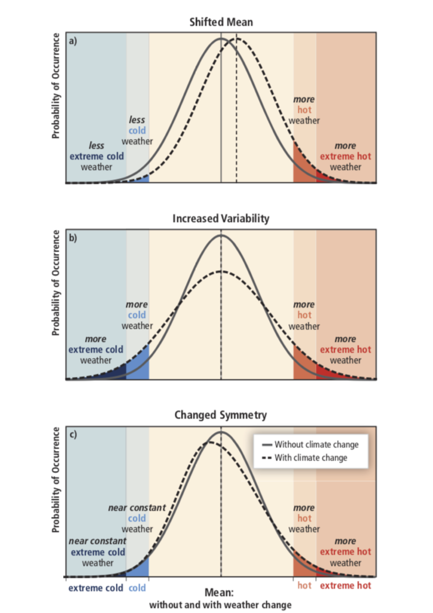 -->
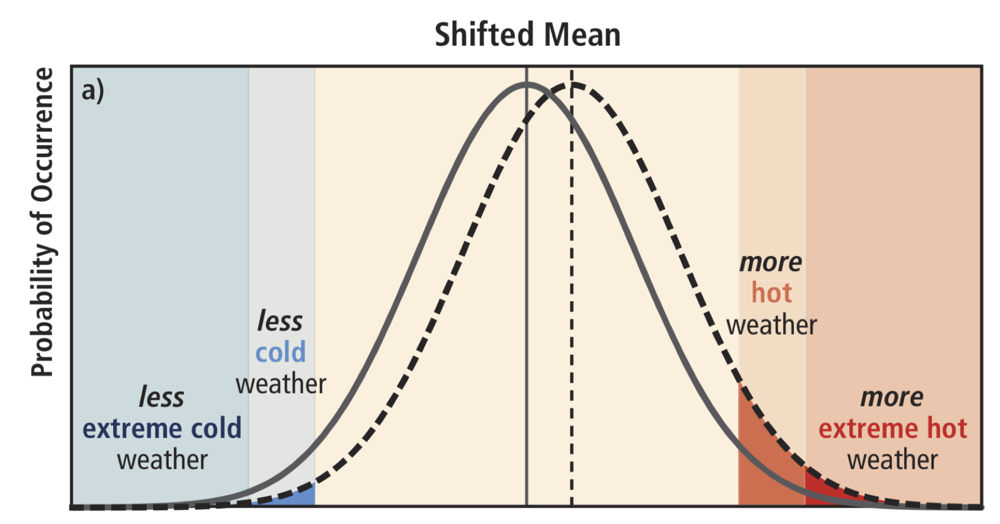
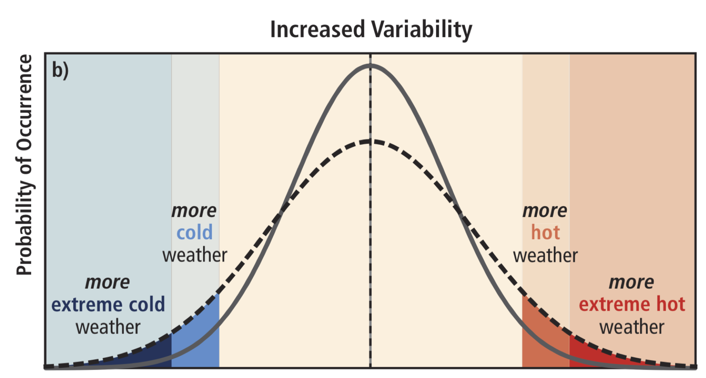
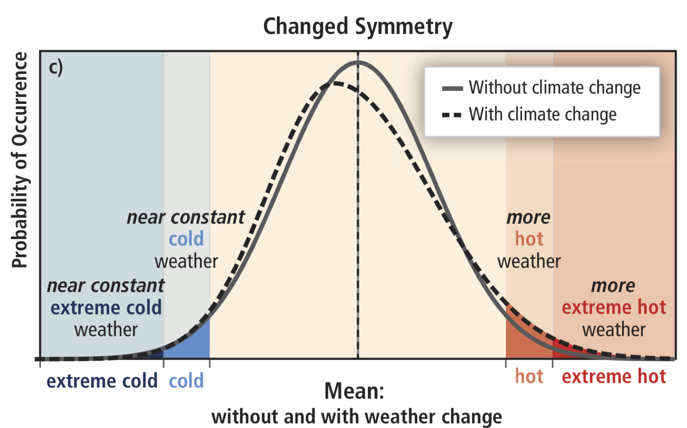

IPCC (2012)

## Bivariate Formulation

```{r, echo = FALSE, warning = FALSE, message = FALSE}
set.seed(3)
samps <- 500
mar1 = c(27, 0.2,  -0.25)
mar2 = c(28, 0.25, -0.2)
sims = rbvevd(n = samps, dep = 0.6, model = "log", 
              mar1 = mar1,
              mar2 = mar2
              ) %>%
    as.data.frame()
names(sims) = c("Location 1", "Location 2")
marginal_gather = sims %>% gather(key = "Location", value = "Marginal")
axis_breaks = sims %>% unlist() %>% floor() %>% unique() %>% sort()
marg_plot <- ggplot(data = marginal_gather) + 
  geom_density(aes(Marginal), col = "blue") + 
  scale_x_continuous(breaks = axis_breaks) +
  facet_wrap(~Location) + 
  xlab("Annual Maximum Temperature") + 
  ylab("Marginal Density")

scatter_plot <- ggplot(data = sims) + 
  geom_point(aes(x = `Location 1`, y = `Location 2`), col = "gray") +
  geom_density2d(aes(x = `Location 1`, y = `Location 2`)) + 
  scale_x_continuous(breaks = axis_breaks) +
  coord_fixed() +
  ggtitle("Dependence")

par_plot <- ggdraw() +
  draw_plot(marg_plot, x = 0, y = 0, width = 0.66, height = 0.8) +
  draw_plot(scatter_plot, x = 0.66, y = 0, width = 0.33, height = 0.8) 
par_plot
```

## What about Dependence?

```{r, echo = FALSE, warning = FALSE, message = FALSE}
set.seed(3)
n = 10
alpha = c(rep(0.6, samps/20), rep(0.3, samps/20))

bv_data = lapply(alpha, function(x){
  sims = rbvevd(n = n, dep = x, model = "log", 
                  mar1 = c(27 + (x == 0.3), 0.2 + 0.1*(x == 0.3),  -0.25),
                  mar2 = c(28 + (x == 0.3), 0.25 + 0.05*(x == 0.3), -0.2)
              ) %>%
    as.data.frame()
  sims$alpha = x
  names(sims) = c("x", "y", "alpha")
  return(sims)})
bv_data = bind_rows(bv_data)

names(bv_data) = c("Location 1", "Location 2", "alpha")
marginal_gather = bv_data %>% gather(key = "Location", value = "Marginal", 1:2)
axis_breaks = bv_data[,1:2] %>% unlist() %>% floor() %>% unique() %>% sort()
marg_plot <- ggplot(data = marginal_gather) + 
  geom_density(aes(Marginal, group = alpha, col = alpha %>% as.factor())) +
  scale_x_continuous(breaks = axis_breaks) +
  scale_color_manual("Period:", labels = c("Late", "Early"), values = c("red", "blue")) +
  facet_wrap(~Location) + 
  xlab("Annual Maximum Temperature") + 
  ylab("Marginal Density")

bv_data <- bv_data %>%
  mutate(alpha = if_else(alpha == 0.3, "Late", "Early"))

early_data <- bv_data %>% 
  dplyr::filter(alpha == "Early") 
names(early_data) = c("L1", "L2", "A")
l1 = ecdf(early_data$L1)(early_data$L1)
l2 = ecdf(early_data$L2)(early_data$L2)
early_data =early_data%>% 
  mutate(L1 = l1) %>%
  mutate(L2 = l2)
late_data <- bv_data %>% 
  dplyr::filter(alpha == "Late") 
names(late_data) = c("L1", "L2", "A")
l1 = ecdf(late_data$L1)(late_data$L1)
l2 = ecdf(late_data$L2)(late_data$L2)
late_data = late_data%>% 
  mutate(L1 = l1) %>%
  mutate(L2 = l2)
ecdf_data = rbind(early_data, late_data)
names(ecdf_data) = names(bv_data)

scatter_plot <- ggplot(data = ecdf_data) + 
  geom_point(aes(x = `Location 1`, y = `Location 2`), col = "gray") +
  geom_density2d(aes(x = `Location 1`, y = `Location 2`, group = alpha, 
                     col = alpha %>% as.factor())) + 
  scale_x_continuous(breaks = seq(0,1,0.5)) +
  scale_color_manual("Period:", labels = c("Late", "Early"), values = c("blue", "red")) +
  facet_wrap(~alpha) +
  coord_fixed() + 
  ggtitle("Dependence") + 
  theme(legend.position = "none")

par_plot <- ggdraw() +
  draw_plot(marg_plot, x = 0, y = 0.6, width = 1, height = 0.4) +
  draw_plot(scatter_plot, x = 0, y = 0, width = 1, height = 0.6)
par_plot
```

## Question

The marginal distribution of temperature extremes is changing -
<br><br><br>

<font color="2292B5">
**Is the dependence also changing?**
</font>
<br><br><br>

<font color="2292B5">
**If so by how much?**
</font>
<br><br><br>

<font color="2292B5">
**What does this mean for events like heatwaves?**
</font>

## Outline

* Marginals
<br>

* Dependence
<br>

* Observations
<br>

* Climate Models

## GEV Distribution
Let <font color="2292B5"> $M$ </font> hottest 3-day average temperature in a year:
<font color="2292B5">$$
 	\mathbb{P}(M < z) = \exp \left\{ - \left[ 1 + \xi \left(\dfrac{z-\mu}{\sigma}\right) \right]_+^{-1 / \xi} \right\},$$</font>
where
  <font color="2292B5">$[v]_+ = \max \left\lbrace 0,v \right\rbrace$</font>,
  <font color="2292B5">$\mu \in \mathbb{R}$</font>,
  <font color="2292B5">$\sigma \in \mathbb{R}^+$</font> and
  <font color="2292B5">$\xi \in \mathbb{R}$</font>.  
(Fisher and Tippett 1928, Gnendenko 1943)

```{r, echo = FALSE, warning = FALSE, message = FALSE, out.width = '50%', fig.align = "center"}
    loc = 28; scale = 0.3; shape = -0.025
     x = seq(25, 41, length.out = 500)
     y = devd(x, loc, scale, shape)
     y[x > loc - scale/shape] = NA
     
     df = data.frame(x, y)

    gev_plot <- ggplot(data = df) + 
      geom_line(aes(x=x, y=y), col = "blue", size = 1.5) + 
      geom_point(aes(x = loc - scale/shape, y = 0), col = "blue",
                 size = 1.5) +
      # scale_x_continuous(limits = c(-10, 20)) +
      # scale_y_continuous(limits = c(0, 0.6)) + 
      xlab("x") +
      ylab("y") +
      theme_bw()
    
    # ggplotly(gev_plot)
    gev_plot
    
```
  
<!-- ## De Bilt, NL: 30 year sliding window -->

<!-- ```{r, echo = FALSE, warning = FALSE, message = FALSE} -->
<!-- tmax_gev_pars = readRDS("Data/sliding_window_gev_pars.rds") -->
<!-- fit_data = readRDS("Data/fit_data.rds") -->

<!-- plot_df <- tmax_gev_pars -->
<!-- min_temp = fit_data$TMAX %>% min(na.rm = TRUE) -->
<!-- min_temp = min_temp - 5 -->
<!-- upper_support = tmax_gev_pars$location -  -->
<!--   tmax_gev_pars$scale/tmax_gev_pars$shape -->
<!-- max_temp = max(upper_support, na.rm = TRUE) -->
<!-- x = seq(min_temp, max_temp, 0.25) -->
<!-- y <- apply(tmax_gev_pars, 1, function(row){ -->
<!--   loc = row[1] -->
<!--   scale = row[2] -->
<!--   shape = row[3] -->
<!--   year = row[4] -->
<!--   y <- devd(x, loc, scale, shape) -->
<!--   y[x > loc - scale/shape] = NA -->
<!--   x <- c(x, loc - scale/shape) -->
<!--   y <- c(y , 0) -->
<!--   len = length(x) -->
<!--   df <- data.frame(x, y, YEAR = rep(year, len)) -->
<!--   return(df) -->
<!-- }) %>% do.call(rbind, .) -->

<!-- plot_df <- y %>%  -->
<!--   mutate(YEAR = YEAR %>% as.numeric()) %>% -->
<!--   left_join(fit_data %>% select(YEAR, TMEAN), by = "YEAR") -->

<!-- sliding_col_gev <- ggplot(data = plot_df %>% filter(YEAR%%10 == 0)) + -->
<!--   geom_line(aes(x = x, y = y, col = TMEAN, group = YEAR)) + -->
<!--   geom_point(data = plot_df %>% filter(y == 0),  -->
<!--              aes(x = x, y = y, col = TMEAN %>% as.numeric())) +  -->
<!--   scale_colour_distiller(palette = "RdBu") + -->
<!--   theme(legend.position = "none") -->
<!-- # sliding_col_gev -->

<!-- # sliding_col_gev + transition_time(YEAR) + -->
<!--   # labs(title = "Year: {frame_time}") +  -->
<!--   # view_follow(fixed_y = TRUE) -->

<!-- sliding_gev <- ggplot() + -->
<!--   geom_line(data = plot_df %>% filter(YEAR%%2 == 0), aes(x = x, y = y,  -->
<!--      group = YEAR), col = "gray", -->
<!--     alpha = 0.5, size = 0.25) + -->
<!--   geom_line(data = plot_df %>% filter(YEAR%%2 == 0), aes(x = x, y = y, col = TMEAN %>% as.numeric(), frame = YEAR), size = 1.25) +  -->
<!--   geom_point(data = plot_df %>% filter(YEAR%%2 == 0) %>% filter(y == 0),  -->
<!--              aes(x = x, y = y, col = TMEAN %>% as.numeric(), frame = YEAR), size = 1.25) +  -->
<!--   scale_colour_distiller("Annual Mean", palette = "RdYlBu") + -->
<!--   ylab("Annual Maximum") +  -->
<!--   theme_bw() -->

<!-- ggplotly(sliding_gev) -->
<!-- ``` -->

<!-- ## GEV Parameters -->

<!-- ```{r, echo = FALSE, warning = FALSE, message = FALSE} -->

<!-- loc_plot <- ggplot(tmax_gev_pars, aes(x= YEAR, y = location)) +  -->
<!--   geom_point() +  -->
<!--   # geom_smooth(aes(x= YEAR, y = location), col = "blue", se = FALSE) + -->
<!--   geom_smooth(method = "lm", formula = y ~ poly(x, 4), se = TRUE) -->

<!-- ## EXAMINE ASSUMPTION ON OUR SCALE AND SHAPE PARAMETERS LATER -->
<!-- # Can try using 1960 as a knot and see if it's worthwhile -->

<!-- scale_plot <- ggplot(tmax_gev_pars, aes(x= YEAR, y = scale)) +  -->
<!--   geom_point() +  -->
<!--   # geom_smooth(aes(x= YEAR, y = scale),se = FALSE) -->
<!--   scale_x_continuous(breaks = seq(1900, 2000, 50)) -->

<!-- shape_plot <- ggplot(tmax_gev_pars, aes(x= YEAR, y = shape)) +  -->
<!--   geom_point() +  -->
<!--   # geom_smooth(aes(x= YEAR, y = shape),se = FALSE)  -->
<!--   scale_x_continuous(breaks = seq(1900, 2000, 50)) -->

<!-- support_plot <- ggplot(tmax_gev_pars, aes(x= YEAR, y = location - scale/shape)) + -->
<!--   geom_point() +  -->
<!--   geom_smooth(aes(x= YEAR, y = location - scale/shape),se = FALSE) + -->
<!--   ylab("Upper Support") -->

<!-- par_plot <- ggdraw() + -->
<!--   draw_plot(loc_plot, x = 0, y = 0, width = 0.66, height = 1) + -->
<!--   draw_plot(shape_plot, x = 0.66, y = 0, width = 0.33, height = 0.5) + -->
<!--   draw_plot(scale_plot, x = 0.66, y = 0.5, width = 0.33, height = 0.5) #+ -->
<!--   # draw_plot(support_plot, x = .5, y = 0, width = 0.5, height = 0.5) -->
<!-- par_plot -->
<!-- ``` -->

## Transform our marginals


* Address the trend in changing temperature by fitting temporal covariates to our parameters   

* Transform the GEV marginals to common GEV(1,1,1) marignal distributions:   
<font color="2292B5">$\mathbb{P}(M < z) = \exp(-1/z)$</font> 

<br><br>
<font color="2292B5">**Now dependence!**</font>

## Bivariate Extreme Value Theory

Assume the distribution of <font color="2292B5">$(M_{i}, M_{j})$</font> can be approximated with a bivariate extreme value theory distribution, then  

 <font color="2292B5">
$$\mathbb{P}\left( M_{i} \leq z_i,\, M_{j} \leq z_j \right) = \exp\left\{ - V_{ij} \left( \dfrac{-1}{\log F_i(z_i)}, \, \dfrac{-1}{\log F_j(z_j)}\right) \right\}$$</font>
where the exponent measure <font color="2292B5">$V_{ij}(a,b)$</font> is given by 
 <font color="2292B5">
$$V_{ij}(a, b) = 2 \int_0^1 \max \left(\dfrac{w}{a}, \dfrac{1-w}{b} \right) \text{d}H_{ij}(w)$$
</font>
and <font color="2292B5">$H$</font> is any distribution function on <font color="2292B5">$[0,1]$</font> with expectation equal to <font color="2292B5">0.5</font>.

## Approach

Lots of parameteric options to specify form of <font color="2292B5">$V_{ij}(a, b)$</font>, but 

 * Want to avoid assuming that a parametric form that is constant in time

* Want a solution that will work for lots of different pairs

so ...

<br><br>
<font color="2292B5">
**Nonparametric**
</font>

## Pickands Dependence Function

<font color="2292B5"> $$V_{ij}(z_i, z_j) = \left(\frac{1}{z_i} + \frac{1}{z_j}\right)A\left(\frac{z_i}{|z_i + z_j|} + \frac{z_j}{|z_i + z_j|}\right)$$ </font>
```{r, echo = FALSE, warning = FALSE, message = FALSE, out.width = '55%', fig.align = "center"}
i = which.min(abs(dep_early$x - 0.5))[1]
# mid_point 
pickands_plot <- ggplot() +
  geom_path(data = dep_early,
            aes(x = x, y = y), col = "black") +
  geom_line(data = NULL, aes(x = c(0, 0.5, 1), y = c(1, 0.5, 1)), linetype = "dotted") +
  ylim(c(0, 1)) +
  coord_fixed() +
  ylab("A(t)") +
  xlab("t") +
  theme_bw()
pickands_plot
```

**C1:** <font color="2292B5">$A(t)$</font> is continuous and convex for <font color="2292B5">$t \in [0,1]$</font>  
**C2:** Bounds on the function of
<font color="2292B5">$\max \{(1 - t), t \} \leq A(t) \leq 1$   </font>   
**C3:** Boundary conditions of <font color="2292B5">$A(0) = A(1) = 1$</font>

<!-- Necessary and sufficient conditions on <font color="2292B5">$A(t)$</font> in <font color="2292B5">$\mathbb{R}^2$</font> -->

## Simulate Example: Logistic

```{r, echo = FALSE, warning = FALSE, message = FALSE}
set.seed(1)
alpha = seq(0.1, 1, 0.1)

# bvdata <- lapply(alpha, function(x){
#   bvdata <- rbvevd(250, dep = x, model = "log",
#                    mar1 = c(0,1,0),
#                    mar2 = c(0,1,0)) %>%
#     as.data.frame() %>%
#     mutate(alpha = rep(x, 250))
#   return(bvdata)
# }) %>% do.call("rbind", . )
# saveRDS(bvdata, "Data/bvdata.rds")
# 
# pickdata <- lapply(alpha, function(x, bvdata){
#   pickdata <- abvnonpar(data = bvdata %>%
#                           filter(alpha == x) %>%
#                           select(-alpha),
#                          method = "cfg", plot = TRUE,
#                          convex = TRUE) %>%
#     as.data.frame()
#   pickdata$alpha = x
#   return(pickdata)
# }, bvdata = bvdata) %>% do.call("rbind", . )
# saveRDS(pickdata, "Data/pickdata.rds")
```

```{r, echo = FALSE, warning = FALSE, message = FALSE}
bvdata <- readRDS("Data/bvdata.rds")

bvdata <- bvdata %>%
  mutate(time = alpha * 10)

bi_density_plot <- ggplot() +
    geom_point(data = bvdata,
            aes(x = V1, y = V2),
            col = "black", alpha = 0.4) +
  geom_point(data = bvdata,
            aes(x = V1, y = V2, frame = time),
            col = "blue") +
  geom_abline(slope = 1, yintercept = 0, 
              col = "red", linetype = "dotted") +
  xlab("x") + 
  ylab("y") + 
  theme_bw() +
  coord_fixed()

ggplotly(bi_density_plot)

```

## Fitted Example: Pickands Function

```{r, echo = FALSE, warning = FALSE, message = FALSE}
pickdata <- readRDS("Data/pickdata.rds")
pickdata <- pickdata %>%
  mutate(time = alpha * 10)

pickands_plot <- ggplot() +
  geom_path(data = pickdata,
            aes(x = x, y = y, frame = time), col = "black") +
  geom_line(data = NULL, aes(x = c(0, 0.5, 1), y = c(1, 0.5, 1)), linetype = "dotted") +
  ylim(c(0, 1)) +
  coord_fixed() +
  ylab("A(t)") +
  xlab("t") +
  theme_bw()

ggplotly(pickands_plot)

```

## Estimators

```{r}
library(DiagrammeR)
grViz("digraph flowchart {
      # node definitions with substituted label text
      node [fontname = Helvetica, shape = rectangle]        
      tab1 [label = '@@1']
      tab2 [label = '@@2']
      tab3 [label = '@@3']
      tab4 [label = '@@4']
      tab5 [label = '@@5']
      tab6 [label = '@@6']
      tab7 [label = '@@7']

      # edge definitions with the node IDs
      tab1 -> tab2 -> tab3 -> tab4 -> tab5 -> tab6 -> tab7;
      }

      [1]: 'Pickands, J. (1981): Estimator'
      [2]: 'Deheuvels, P. (1991): Adjustment for A(0) = A(1) = 1'
      [3]: 'Caperaa, P. Fougeres, A.-L. and Genest, C. (1997): New estimator'
      [4]: 'Hall, P. and Tajvidi, N. (2000): Improvements on Pickands'
      [5]: '...'
      [6]: 'Mhalla, L. Chavez-Demoulin, V. and Naveau,P. (2017): Nonstationary & nonparametric'
      [7]: 'Castro-Camilo, D., de Carvalho, M., & Wadsworth, J. (2018): Nonstationary & parametric'
      ")
```

## Observations 

```{r, echo = FALSE, warning = FALSE, message = FALSE}
early_vs_late_plot <- ggplot() +
  geom_ribbon(data = bootstrap_ci,
              aes(x = x, ymin = `5%`, ymax = `95%`),
              fill = "blue", alpha = 0.25) +
  geom_path(data = dep_early,
            aes(x = x, y = y), col = "blue") +
  geom_ribbon(data = bootstrap_ci_late,
              aes(x = x, ymin = `5%`, ymax = `95%`),
              fill = "red", alpha = 0.25) +
  geom_path(data = dep_late,
            aes(x = x, y = y), col = "red") +
  geom_line(data = NULL, aes(x = c(0, 0.5, 1), y = c(1, 0.5, 1)),
            linetype = "dotted") +
  ggtitle(paste(stn1_name, "and", stn2_name), "Early: 1910 - 1959, Late: 1960 - 2018") +
  ylim(c(0, 1)) +
  coord_fixed() +
  ylab("A(t)") +
  xlab("t") +
  theme_bw()

early_vs_late_plot

```

## Climate Models
<font color="2292B5">
**Model background:**
</font>

  *   22 Global Climate Model and Regional Climate Model combinations from EURO-CORDEX
  
  *   0.11 degree resolation (upscale)
  
  *   rotated-pole grid
  
  *   1950-2005 with historical forcing
  
  *   2006-2100 with RCP 8.5
  
## Approach 

  * Consider Annual Maxima
  
  * <font color="blue"> Early: </font> 1951 - 2000   
  <font color="forestgreen"> Middle: </font> 2001 - 2050   
  <font color="red"> Late: </font>2051 - 2100     
  Assume stationarity within each window (*big assumption*)  
  
  * Fit pairwise distributions relative to a central location

## Multimodel Mean

```{r, echo = FALSE, warning = FALSE, message = FALSE}
set.seed(1)
alpha = runif(22, 0.4, 0.6)
# 
# bvdata1 <- lapply(alpha, function(x){
#   bvdata <- rbvevd(50, dep = x, model = "log",
#                    mar1 = c(0,1,0),
#                    mar2 = c(0,1,0)) %>%
#     as.data.frame() %>%
#     mutate(alpha = rep(x, 50))
#   return(bvdata)
# }) %>% do.call("rbind", . )
# saveRDS(bvdata1, "Data/bvdata1.rds")
# 
# pickdata1 <- lapply(alpha, function(x, bvdata1){
#   pickdata <- abvnonpar(data = bvdata1 %>%
#                           filter(alpha == x) %>%
#                           select(-alpha),
#                          method = "cfg", plot = TRUE,
#                          convex = TRUE) %>%
#     as.data.frame()
#   pickdata$alpha = x
#   return(pickdata)
# }, bvdata = bvdata1) %>% do.call("rbind", . )
# saveRDS(pickdata1, "Data/pickdata1.rds")

```

```{r, echo = FALSE, warning = FALSE, message = FALSE}

pickdata1 <- readRDS("Data/pickdata1.rds")
mean_pick <- pickdata1 %>% 
  group_by(x) %>%
  summarise(y = mean(y))

pickands_plot1 <- ggplot() +
  geom_path(data = pickdata1,
            aes(x = x, y = y, group = alpha), alpha = 0.3, col = "black") +
  geom_path(data = mean_pick,
            aes(x = x, y = y), col = "red", size = 1.5) +
  geom_line(data = NULL, aes(x = c(0, 0.5, 1), y = c(1, 0.5, 1)), linetype = "dotted") +
  ylim(c(0, 1)) +
  coord_fixed() +
  ylab("A(t)") +
  xlab("t") +
  theme_bw()

pickands_plot1

```

## Summary statistic

<font color="2292B5">
  $$\mathbb{P}\left(M_{i} \leq z, M_{j} \leq z\right) =
  \left[\mathbb{P}(M_{i} \leq z)\mathbb{P}(M_{j} \leq z) \right]^{A\left(1/2\right)}.$$
</font>

```{r, echo = FALSE, warning = FALSE, message = FALSE, out.width = '75%', fig.align = "center"}
i = which.min(abs(mean_pick$x - 0.5))

# mid_point 
pickands_plot2 <- ggplot() +
  geom_path(data = mean_pick,
            aes(x = x, y = y), col = "red", size = 1.5) +
  geom_line(data = rbind(mean_pick[i, ], c(0.5,0)),
            aes(x = x, y = y), col = "black", 
            arrow = arrow(length=unit(0.30,"cm"), 
                          ends="both", type = "closed")) +
  geom_line(data = NULL, aes(x = c(0, 0.5, 1), y = c(1, 0.5, 1)), linetype = "dotted") +
  ylim(c(0, 1)) +
  coord_fixed() +
  ylab("A(t)") +
  xlab("t") +
  theme_bw()
pickands_plot2
```

<!-- ## Analysis -->
<!-- <font color="2292B5"> -->
<!-- **Preprocessing** -->
<!-- </font> -->

<!--   *   Annual maximum value of daily maximum temperature (tasmax)   -->
<!--   (Later consider rolling average) -->

<!--   *   Aggregated to 0.55 degrees so it is quicker to estimate    -->
<!--     (Later use the original resolution) -->

<!--   *  Some regridding was necessary to compare models -->

  <!-- Where necessary EC-Earth_RACMO was regridded grid using nearest neighbour, before taking the ensemble mean for each grid cell -->

<!-- 6 GCMs: -->

<!-- "CNRM-CERFACS-CNRM-CM5" -->

<!-- "ICHEC-EC-EARTH" -->

<!-- "IPSL-IPSL-CM5A-MR" -->

<!-- "MOHC-HadGEM2-ES" -->

<!-- "MPI-M-MPI-ESM-LR" -->

<!-- "NCC-NorESM1-M" -->

<!-- 9 RCMs: -->

<!-- "DMI-HIRHAM5" -->
<!-- "KNMI-RACMO22E" -->
<!--  "IPSL-WRF381P" -->
<!-- "SMHI-RCA4" -->
<!-- "CLMcom-CCLM4-8-17" -->
<!-- "GERICS-REMO2015" -->
<!-- "ICTP-RegCM4-6" -->
<!-- "UHOH-WRF361H" -->
<!-- "MPI-CSC-REMO2009" -->

## Centre of De Bilt, NL
Early: 1951 - 2000

<center>
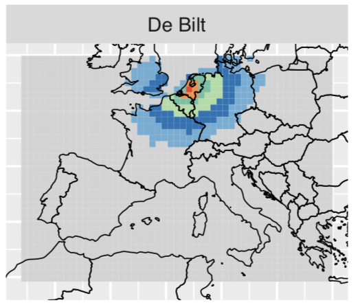
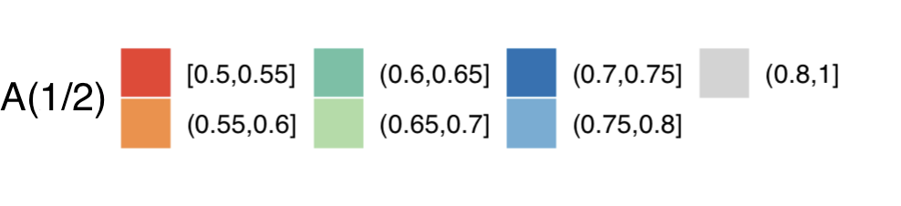

## Changes in Spatial Extent

<center>
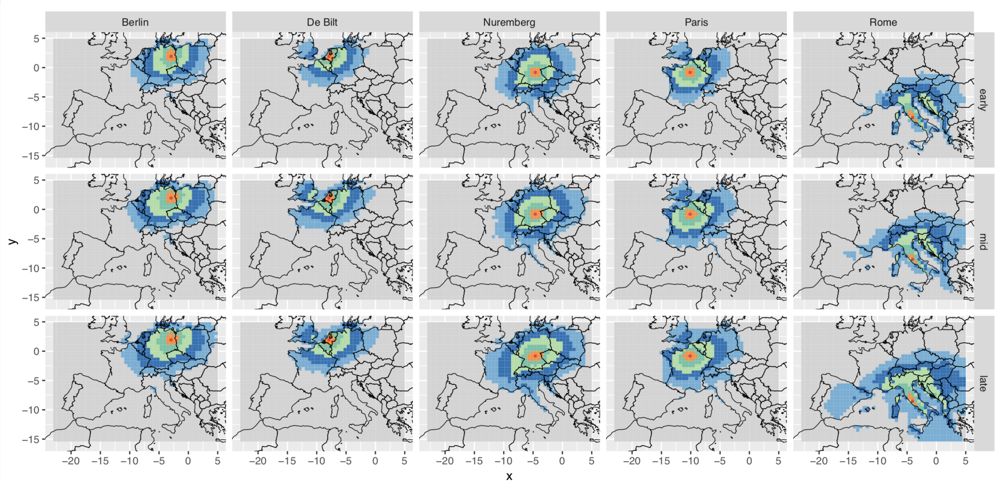


## A(1/2) < 0.7

<center>
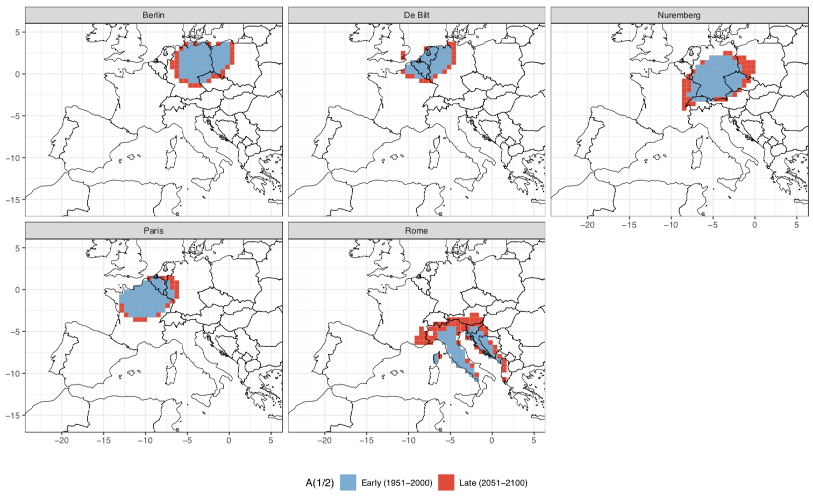

<!-- ## Sweet spot theory -->

<!-- <center> -->
<!--  -->

## Density of A(1/2)

<center>
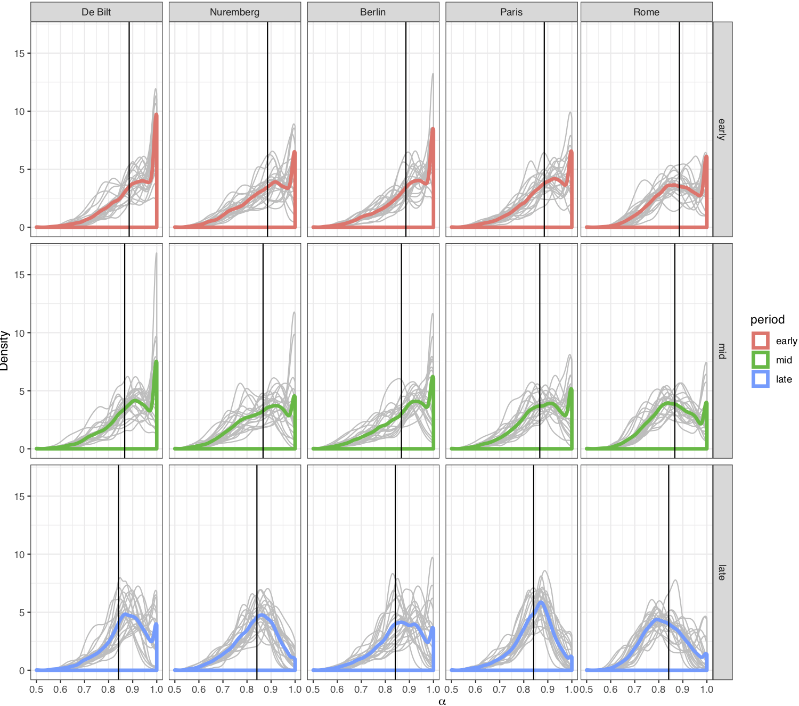

## Conclusions

Strong *initial* evidence to suggest:  

<br><br>

* The dependence between temperature extremes is increasing  

<br><br>

* Area impacted by heat extremes is getting larger 

## Future Work

* Fit a time-varying Pickands dependence function

* Examine assumptions on the marginal distriubtion     

* Examine whether models are accurately representing heat extremes 

* Think about how to translate insights from extreme value statistics into insights about changing heat extremes 

## {.fullslide}

<center>


<script src = "assets/delft.js"></script>  

## Density of A(1/2)

<center>
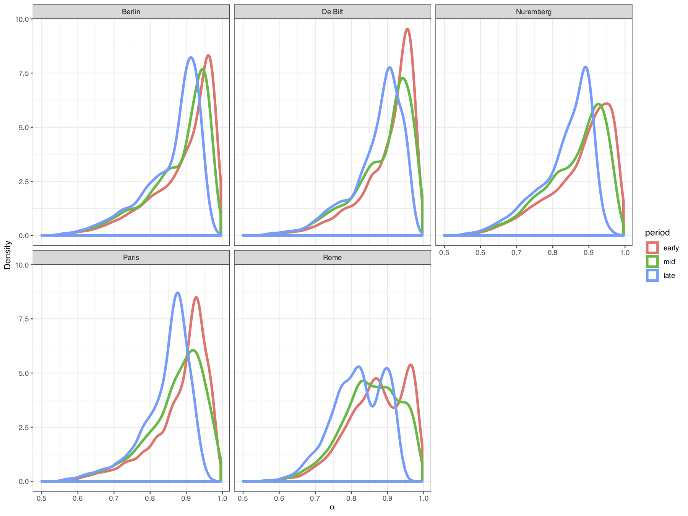

## A(1/2) < 0.7

<center>
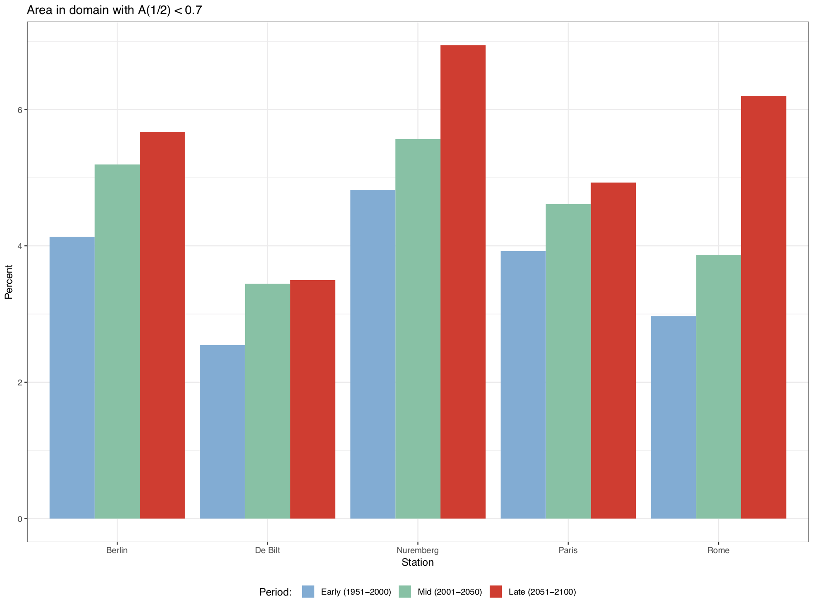

<!-- ## Standard Formulation -->

<!-- Let <font color="2292B5">$X_i$</font> be a sequence of iid random variables, define -->
<!-- <font color="2292B5">$$M_{n} = \max\{X_1, \dots, X_{n}\}.$$</font> -->

<!-- The distribution function of <font color="2292B5">$M_n$</font>  is -->
<!-- <font color="2292B5">$$\mathbb{P}(M_n \leq z) = \mathbb{P}(X_1 \leq z, \dots, X_n \leq z) = \mathbb{P}(X \leq z)^n = F(z)^n,$$</font> -->
<!-- where <font color="2292B5">$F(z)$</font>  is the distribution function of <font color="2292B5">$X$</font> . -->

<!-- Let <font color="2292B5">$z^F$</font>  denote the right endpoint of the support of <font color="2292B5">$F$</font> , -->
<!-- <font color="2292B5">$$z^F = \sup \{z : F(z) < 1\},$$</font> -->
<!-- then as <font color="2292B5">$n \rightarrow \infty$</font>, <font color="2292B5">$F(z)^n \rightarrow 0$</font> for any <font color="2292B5">$z < z^F$</font>. -->

<!-- ## GEV Distribution -->

<!-- If there exists sequences of constants -->
<!--   <font color="2292B5">$\{a_n\} \in \mathbb{R}^+$</font> and -->
<!--   <font color="2292B5">$\{b_n\} \in \mathbb{R}$</font> -->
<!--   such that -->
<!-- <font color="2292B5">$$\mathbb{P} \left\{\dfrac{M_n - b_n}{a_n} \leq z \right \} \rightarrow G(z) \quad\hbox{as}\quad\, n \rightarrow \infty -->
<!-- $$</font> -->
<!-- where -->
<!--   <font color="2292B5">$G(z)$</font> is a non-degenerate distribution function, then -->
<!--   <font color="2292B5">$G(z)$</font> is a member of the generalised extreme value (GEV) family -->
<!-- <font color="2292B5">$$ -->
<!--  	G(z) = \exp \left\{ - \left[ 1 + \xi \left(\dfrac{z-\mu}{\sigma}\right) \right]_+^{-1 / \xi} \right\},$$</font> -->
<!-- where -->
<!--   <font color="2292B5">$[v]_+ = \max \left\lbrace 0,v \right\rbrace$</font>, -->
<!--   <font color="2292B5">$\mu \in \mathbb{R}$</font>, -->
<!--   <font color="2292B5">$\sigma \in \mathbb{R}^+$</font> and -->
<!--   <font color="2292B5">$\xi \in \mathbb{R}$</font>. -->

<!-- (Fisher and Tippett 1928, Gnendenko 1943) -->
<!-- \citep{fisher1928limiting, gnedenko1943distribution} -->

<!-- ## Practicalities -->

<!-- <font color="2292B5">**Why approximate the $\mathbb{P}(M_n \leq z)$ by the GEV distribution?**</font>   -->

<!-- <div class="notes"> -->
<!-- Key Points: -->
<!-- - Most of the time, we don't have a lot of data -->
<!-- - Estimate the probability of rare events -->
<!-- - So events that we've only seen once or twice, or maybe never at all -->
<!-- - By approximating by the limit distribution, have justification for extrolapolation outside the range of our data -->
<!-- </div> -->

<!-- ## Practicalities -->

<!-- <font color="lightgray">**Why approximate the $\mathbb{P}(M_n \leq z)$ by the GEV distribution?**</font>     -->
<!-- <br />   -->
<!-- <br /> -->
<!-- <br /> -->
<!-- <font color="2292B5">**Temperature observations aren't independent**</font>   -->
<!-- <br />   -->
<!-- <br /> -->
<!-- <br /> -->

<!-- ## Practicalities -->

<!-- <font color="lightgray">**Why approximate the $\mathbb{P}(M_n \leq z)$ by the GEV distribution?**</font> -->
<!-- <br />   -->
<!-- <br /> -->
<!-- <br />   -->
<!-- <font color="lightgray">**Temperature observations aren't independent**</font>     -->
<!-- <br />   -->
<!-- <br /> -->
<!-- <br />  -->
<!-- <font color="2292B5">**Temperature observations aren't identically distributed**</font>   -->
<!-- <!-- Okay - provided data meets conditions preventing long range dependence (Leadbetter 1983)   --> -->
