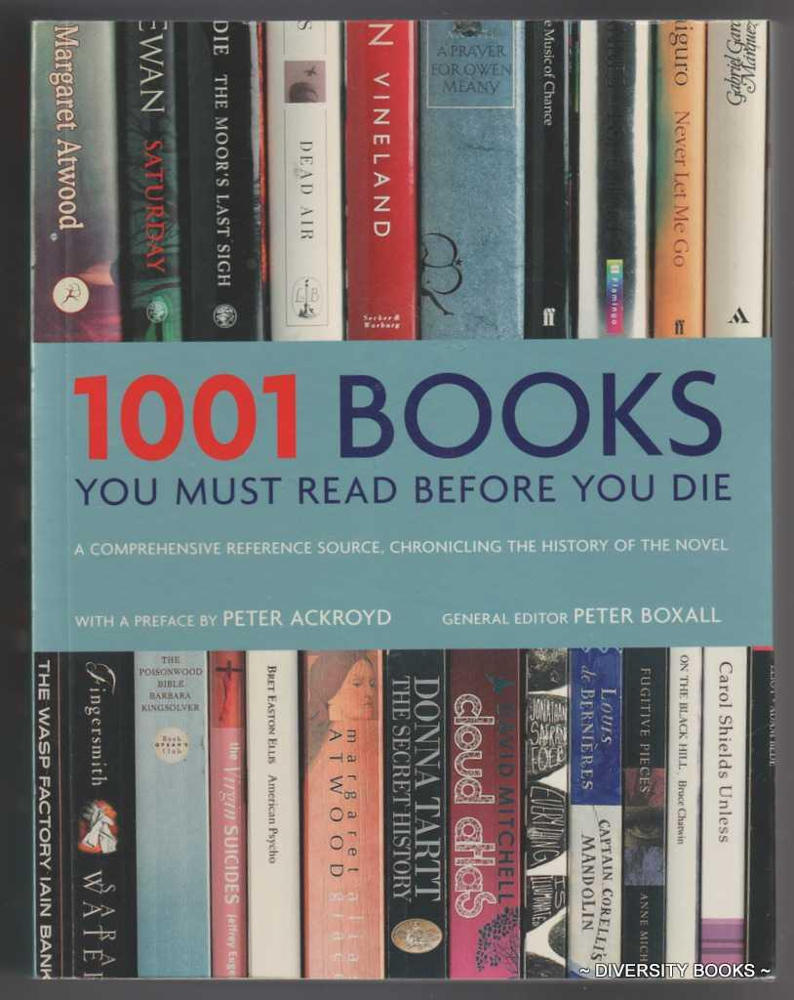
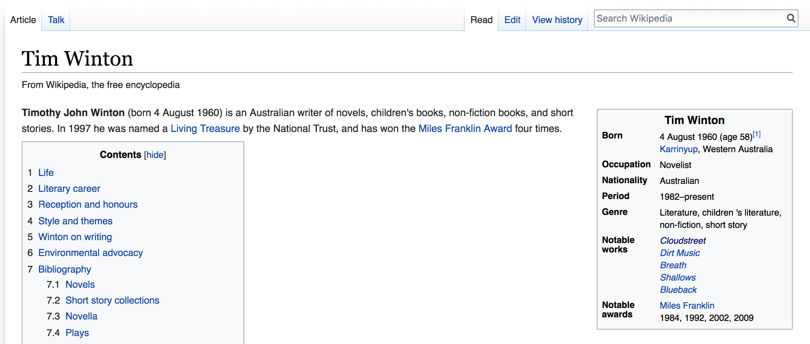
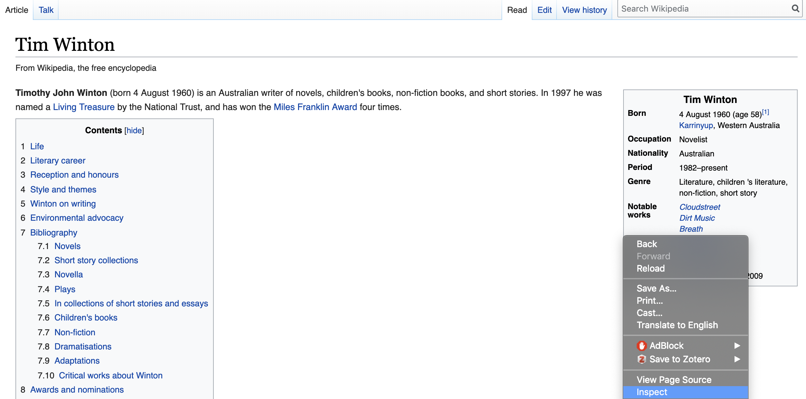
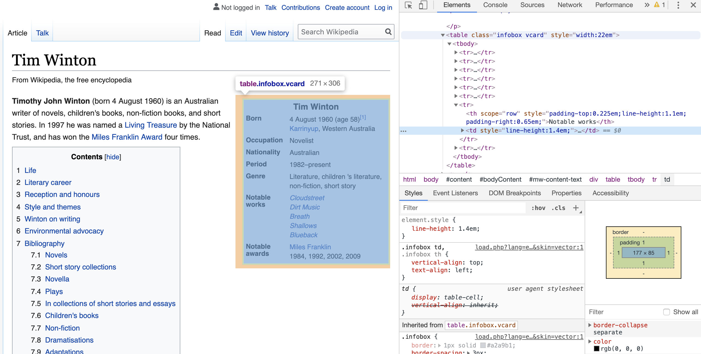
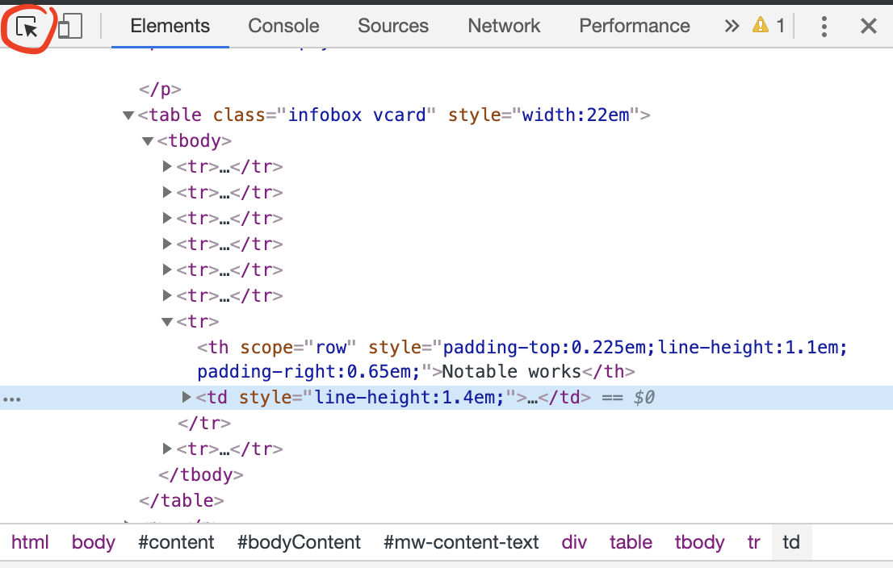
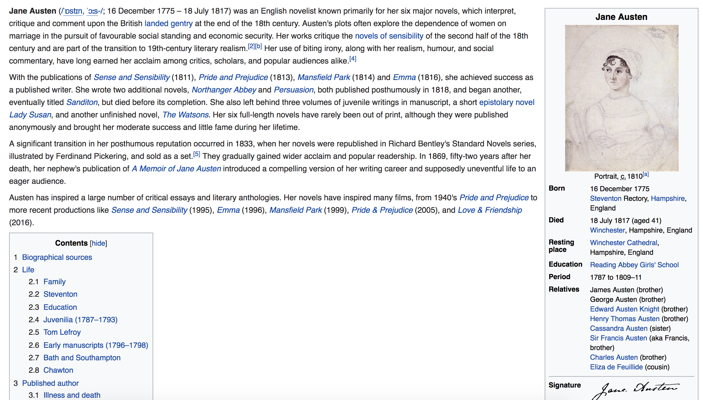
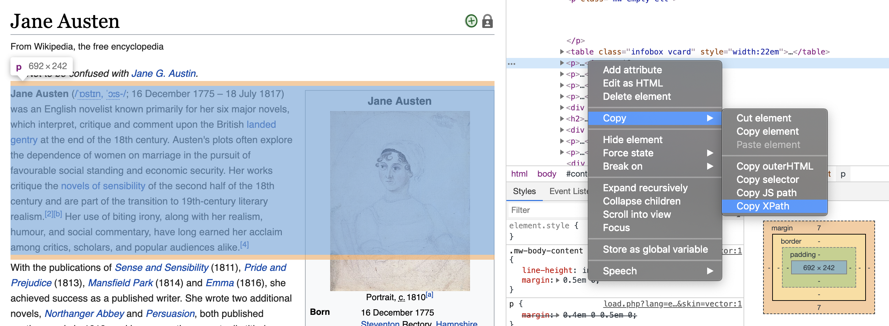
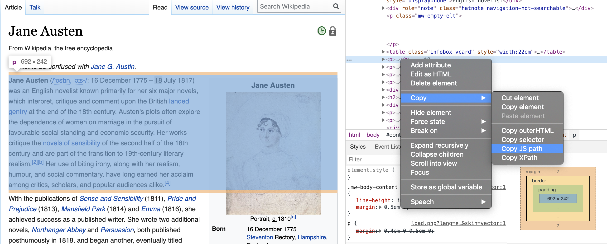
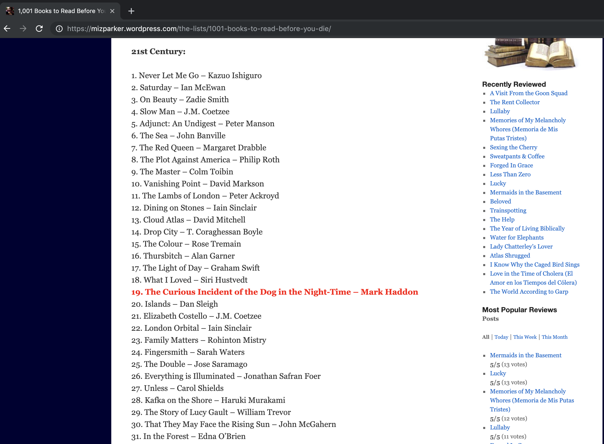

```{r setup, include = FALSE}
# addResourcePath("assets", "assets/")   # Must include this line !
library(rvest)
library(tidyverse)
library(plotly)
```

```{r wrap-hook, echo = FALSE}
library(knitr)
hook_output = knit_hooks$get('output')
knit_hooks$set(output = function(x, options) {
  # this hook is used only when the linewidth option is not NULL
  if (!is.null(n <- options$linewidth)) {
    x = knitr:::split_lines(x)
    # any lines wider than n should be wrapped
    if (any(nchar(x) > n)) x = strwrap(x, width = n)
    x = paste(x, collapse = '\n')
  }
  hook_output(x, options)
})
```

## Motivation

<center>
<blockquote class="twitter-tweet" data-lang="en"><p lang="en" dir="ltr">The most important thing I&#39;ve ever done for learning R is to paradoxically stop &quot;learning&quot; (e.g. classes and problem sets) and start doing. Take a problem you have at work or school or a dataset you find interesting and get to work. Then write it up and post on githib or a blog. <a href="https://t.co/9aQZJRrlFK">https://t.co/9aQZJRrlFK</a></p>&mdash; We are R-Ladies (@WeAreRLadies) <a href="https://twitter.com/WeAreRLadies/status/1110229736956067840?ref_src=twsrc%5Etfw">March 25, 2019</a></blockquote>
<script async src="https://platform.twitter.com/widgets.js" charset="utf-8"></script>

## After PhD - I wanted to read more!

<iframe src="https://giphy.com/embed/WoWm8YzFQJg5i" width="480" height="351" frameBorder="0" class="giphy-embed" allowFullScreen></iframe><p><a href="https://giphy.com/gifs/cartoons-comics-sea-reading-WoWm8YzFQJg5i">via GIPHY</a></p>

## Question

<center>
<br><br><br>
<font color="#8B008B">**How should I choose what to read?** </font> 

## Question

<center>
<br><br><br>
<font color="lightgray">**How should I choose what to read?** </font> 

<br><br><br>
<font color="#8B008B"> **Am I reading diversely?** </font> 

## Picking from lists

<center>  </center>

## Questions for our data

<br><br><br>
<font color="#8B008B"> **Are lists like this biased?** </font> 

## Outline

<br>
<font color="#8B008B">**1.**</font> Get to know the basics of webpages

<br>
<font color="#8B008B">**2.**</font> Look at some examples of webscraping

<br>
<font color="#8B008B">**3.**</font> Get some data to answer my questions 

## Packages we need

```{r eval = FALSE}
library(rvest)
library(tidyverse)
library(devtools)
devtools::install_github("famguy/rgoodreads")
```

## Disclaimer

<center>
<br><br>
<font color="#8B008B">**I am not a web scraping expert**</font> 

## Disclaimer

<center>
<br><br>
<font color="lightgray">**I am not a web scraping expert**</font>

<br><br>
<font color="#8B008B">**And sometimes I write naughty code ... **</font> 

## Disclaimer

<center>
<br><br>
<font color="lightgray">**I am not a web scraping expert**</font> 

<br><br>
<font color="lightgray">**And sometimes I write naughty code ... **</font> 

<br><br>
<font color="#8B008B">**But I can share what I know**</font> 

# Tidyverse refresher

## Favourites

* Pipe (magrittr)
```{r}

```


# Webpage basics

## Go to a webpage

https://en.wikipedia.org/wiki/Tim_Winton

<center>  </center>

## View html code in Chrome

* Right click the part of the page you want
* Select inpsect 
<center>  </center>

## Html code

* Brings up the html code
* Highlights the piece of html code related to your click
* Hover over html code to see other features of the web page
<center>  </center>

## Inpsect button

* Similarly, click the top left button in the side panel
* Explore related features of the webpage and html code
<center>  </center>

## Basic html types

**Structure:** \<tag\> Some stuff \<\/tag\>

**Basic tag types are:**

div - Division or section  

table - Table  

p - Paragraph elements  

h - Heading  

# Webscraping basics

## Read a webpage

```{r, linewidth = 80}
library(rvest)
author_url <- "https://en.wikipedia.org/wiki/Tim_Winton"
wiki_data <- read_html(author_url) # Scrape the data from the webpage
wiki_data
```

## How to scrape a table - html_table()

```{r, linewidth = 80}
table_data <- wiki_data %>% 
  rvest::html_table() #Get all tables on the webpage

length(table_data)
str(table_data[[1]])
```

## Other approaches - html_nodes()

```{r, linewidth = 80}
table_data_eg1 <- wiki_data %>%
 rvest::html_nodes("table") %>% # get all the nodes of type table
 purrr::pluck(1) %>% #pull out the first one
 rvest::html_table(header = FALSE) #convert it to table type
str(table_data_eg1)
```

## Other approaches - html_node()

```{r, linewidth = 80}
table_data_eg2 <- wiki_data %>%
  rvest::html_node("table") %>% # just get the first table match
  rvest::html_table(header = FALSE) #convert it to table type
str(table_data_eg2)
```

## Get the Nationality

```{r, linewidth = 80}
author_nationality = table_data_eg2 %>%
  dplyr::rename(Category = X1, Response = X2) %>%
  dplyr::filter(Category == "Nationality") %>%
  dplyr::select(Response) %>%
  as.character()
author_nationality
```

<font color="#8B008B"> **Can we generalise?** </font> 

## Same example - Different author

"https://en.wikipedia.org/wiki/Jane_Austen"

<center>  </center>

## Generalise the web page

```{r, linewidth = 80}
author_first_name = "Jane"
author_last_name = "Austen"
author_url <- paste("https://en.wikipedia.org/wiki/", 
  author_first_name, "_", author_last_name, sep = "")
wiki_data <- read_html(author_url)
```

## Let's get that table

```{r, linewidth = 80}
table_again <- wiki_data %>%
  rvest::html_nodes(".infobox.vcard") %>% #search for a class
  rvest::html_table(header = FALSE) %>% 
  purrr::pluck(1) 
head(table_again)
```

## Web scraping is tricky

**No nationality category in Jane Austen's table**

```{r, echo = FALSE, linewidth = 80}
table_again %>% dplyr::select(X1) %>% unlist() %>% as.vector()
```

## Differnt way - Matching paragraphs

```{r, linewidth = 80}
para_data <- wiki_data %>%
  rvest::html_nodes("p") # get all the paragraphs
head(para_data)
```

## Get the text - html_text()

```{r, linewidth = 80}
text_data <- para_data %>%
  purrr::pluck(2) %>% # get the second paragraph
  rvest::html_text() # convert the paragraph to text
head(text_data)
```

## Xpath Example

* Right click html code, copy, copy Xpath
<center>  </center>

## Using an Xpath

```{r, eval = FALSE, linewidth = 80}
para_xpath = '//*[@id="mw-content-text"]/div/p[2]'
text_data <- wiki_data %>%
  rvest::html_nodes(xpath = para_xpath) %>%
  rvest::html_text()
text_data
```

## JSpath Example

* Right click html code, copy, copy JS path
<center>  </center>

## Using CSS ID

```{r, linewidth = 80}
para_css = "#mw-content-text > div > p:nth-child(5)"
text_data <- wiki_data %>%
  rvest::html_nodes(css = para_css) %>%
  rvest::html_text()
text_data
```

## Text Analysis

```{r, linewidth = 80}
possible_nationalities <- c("Australian", "Chinese", "Mexican", "English", "Ethiopian")

# Do any of these nationalities appear in the text?
count_values = str_count(text_data, possible_nationalities)
possible_nationalities[count_values == TRUE]
```

## Learnt so far

* Know how to explore a web page with inspect
* Know some basics about how to get data

Also know:

* Can be hard to generalise 
* Formats aren't always standard

## Learnt so far

* Know how to explore a web page with inspect
* Know some basics about how to get data

Also know:  

* Can be hard to generalise 
* Formats aren't always standard

<font color="#8B008B">**Back to the original question ... ** </font> 

# How diversely do we read

## 1001 books to read

<center>  </center>

## Read the book list from a website

```{r, linewidth = 80}
book_list_url <- "https://mizparker.wordpress.com/the-lists/1001-books-to-read-before-you-die/"
paragraph_data <- read_html(book_list_url) %>% # read the web page
  rvest::html_nodes("p") # get the paragraphs
str(paragraph_data)
```

## Get the book list from the paragraphs 

```{r, linewidth = 80}
book_string <- paragraph_data %>%  #the list is in pieces
  purrr::pluck(4) %>% # get the first part of the list
  html_text(trim = TRUE) %>% # convert it to text, remove white space
  gsub("\n", "", .) #remove the newline character
head(book_string)
```

## Let's put our list together

But .... web scraping often means string handling

We want to split the string by any numbers followed by a full stop

Careful:  

  * don't want to split book titles with numbers, like Catch 22, 
  * don't want to split authors with full stops, like J.R.R Tolkien
  
Actually bit tricky!

Resources:

   * https://regexr.com/
   * stringr cheatsheet from RStudio

## Do some string handling

```{r, eval = FALSE, linewidth = 80}
strsplit("a123b", split = "\\d") 
  #Split by digits \\d
strsplit("a123b", split = "\\d+") 
  #Split by one or more digits \\d+
strsplit("a.b", split = "\\.") 
  #Split by fullstop \\.
strsplit("a1.b", split = "\\d+\\.") 
  #Split by digits and fullstop \\d+\\.
strsplit("a1.b", split = "\\d+?\\.") 
  #Matches as few digits as possible \\d+? and fullstop \\.
```
Check out: https://regexr.com/

## Split up our list

```{r, linewidth = 80}
split_book_string <- book_string %>% 
  strsplit(split = "\\d+?\\.") %>% 
    # split the string by any numbers followed by a full stop
  as.data.frame(stringsAsFactors = FALSE) %>% 
    # make this a data frame
  dplyr::filter(. != "")  
    # remove any empty rows
head(split_book_string)
```

## Split up our columns 
```{r, linewidth = 80}
names(split_book_string) <- "book_string"
book_df <-split_book_string %>%
  tidyr::separate(book_string, sep = "\\–", into = c("book", "author"))
  # split our author and book into columns
  # very lucky that whoever coded this webpage used a long hash!
head(book_df)
```

## Wrap the code chunks

Could vectorise it properly, but we leave that for later.  
For now we'll just wrap that our code snippets in a function and use lapply

```{r, linewidth = 80}
Get_book_data <- function(para_ind){
  
  book_str <- paragraph_data %>%
    purrr::pluck(para_ind) %>%
    html_text(trim = TRUE) %>% 
    gsub("\n", "", .)  #remove newline character
  
  book_df <- book_str %>% 
    strsplit(split = "\\d+?\\.") %>% #match the number index
    as.data.frame(stringsAsFactors = FALSE) %>% 
    dplyr::filter(. != "")  # remove empty first row
  
  names(book_df) <- "book_string"
  book_df <- book_df %>%
    tidyr::separate(book_string, sep = "\\–", into = c("book", "author"))
  
  return(book_df)
  
}
```

## Put it together

```{r}
book_data <- lapply(seq(4,12,2) %>% as.list(), Get_book_data) %>% 
  do.call(rbind, .) %>% 
  dplyr::mutate(author = str_trim(author))
nrow(book_data) # Has 1001 rows so let's assume we are all good!
head(book_data) # Looks pretty good at first glance
```

<font color="#8B008B">Now let's get the nationalities of all the authors!</font>

## Get the nationality

Also wrap our code up pieces to get the nationality

```{r, echo = FALSE, linewidth = 80}
Read_wiki_page <- function(search_string){
  search_string = gsub("\\s+", "_", search_string)
  wiki_url <- paste("https://en.wikipedia.org/wiki/", 
    search_string, sep = "")
  wiki_data <- read_html(wiki_url)
  return(wiki_data)
}

Get_wiki_infocard <- function(wiki_data){
  infocard <- wiki_data %>%
    rvest::html_nodes(".infobox.vcard") %>%
    rvest::html_table(header = FALSE, fill = TRUE) %>% 
    purrr::pluck(1)
  return(infocard)
}

Get_nationality_from_infocard <- function(infocard){
  nationality <- infocard %>%
    dplyr::rename(Category = X1, Response = X2) %>%
    dplyr::filter(Category == "Nationality") %>%
    dplyr::select(Response) %>%
    as.character()
  return(nationality)
}

Get_first_text <- function(wiki_data){
  wiki_data %>%
    rvest::html_nodes("p") %>%
    purrr::pluck(2) %>% # get the second paragraph
    rvest::html_text()
  return(text_data)
}

Guess_nationality_from_text <- function(text_data, possible_nationalities){
  num_matches <- str_count(text_data, possible_nationalities)
  prob_matches <- num_matches/sum(num_matches)
  i = which(prob_matches > 0)
  if(length(i) == 1){
    prob_nationality = possible_nationalities[i] 
  }else if(length(i) > 0){
    warning(paste(c("More than one match for the nationality:", 
                  possible_nationalities[i]), collapse = " "))
    i = which.max(prob_matches)
    prob_nationality = possible_nationalities[i] 
  }else{
    return(NA)
  }
  return(prob_nationality)
}

Query_nationality_from_wiki <- function(search_string, possible_nationalities = NULL){
  wiki_data <- Read_wiki_page(search_string)
  infocard <- Get_wiki_infocard(wiki_data)
  if(any(infocard[,1] == "Nationality")){
    nationality <- Get_nationality_from_infocard(infocard)
  }else{
    first_paragraph <- Get_first_text(wiki_data)
    nationality <- Guess_nationality_from_text(first_paragraph,
      possible_nationalities)
  }
  return(nationality)
}
```

```{r, eval = FALSE, linewidth = 80}
search_string = "Jane Austen"
wiki_data <- Read_wiki_page(search_string)
infocard <- Get_wiki_infocard(wiki_data)
if(any(infocard[,1] == "Nationality")){
  nationality <- Get_nationality_from_infocard(infocard)
}else{
  first_paragraph <- Get_first_text(wiki_data)
  nationality <- Guess_nationality_from_text(first_paragraph,
    possible_nationalities)
}
nationality
```

## What nationalities to search for?

We need a list of nationalities for searching.  
Let's get one!

```{r, linewidth = 80}
# Get table of nationalities
url <- "http://www.vocabulary.cl/Basic/Nationalities.htm"
xpath <- "/html/body/div[1]/article/table[2]"
nationalities_df <- url %>%
  read_html() %>%
  html_nodes(xpath = xpath) %>%
  html_table() %>% 
  as.data.frame()
```

## Manual fixing

```{r}
fix_footnote1 = "Colombia *"
i1 = which(nationalities_df == fix_footnote1, arr.ind = TRUE)
nationalities_df[i1] = strsplit(fix_footnote1, split = ' ')[[1]][1]

fix_footnote2 = "American **"
i2 = which(nationalities_df == fix_footnote2, arr.ind = TRUE)
nationalities_df[i2] = strsplit(fix_footnote2, split = ' ')[[1]][1]

possible_nationalities = nationalities_df[,2]
head(possible_nationalities)
```

## Get Nationalities

```{r, eval = FALSE, linewidth = 80}
nationality_from_author_search = sapply(book_data$author[1:20],
                                        function(search_string){
  nataionality = tryCatch( # Just in case!
     Query_nationality_from_wiki(search_string, 
                                 possible_nationalities),
    error = function(e) NA)
  }) %>% unlist() %>% table()
```

## Run it!

```{r, eval = FALSE, linewidth = 80}
nationality_from_author_search = sapply(book_data$author, function(search_string){
  nataionality = tryCatch( # Just in case!
     Query_nationality_from_wiki(search_string, 
                                 possible_nationalities),
    error = function(e) NA)
  }) 

book_data <- book_data %>%
  dplyr::mutate(nationality = nationality_from_author_search)
head(book_data)

save(book_data, file = "book_data.RData")
```

## Result

```{r}
load("book_data.RData")
table_nationalities <- book_data$nationality %>% 
  unlist() %>% 
  table() %>% 
  as.data.frame(stringsAsFactors = FALSE)
names(table_nationalities ) = c("Nationality", "Frequency")
table_nationalities %>% 
  arrange(desc(Frequency))
head(table_nationalities)
```

## Let's take a look

```{r, linewidth = 80}
plot_df = table_nationalities  %>%
  dplyr::filter(Frequency > 1) 

counted = sum(table_nationalities$Frequency)
new_row = data.frame(Nationality = "Other", 
                     Frequency = counted - sum(plot_df$Frequency))
plot_df <- rbind(plot_df, new_row)

pie_chart <- ggplot(plot_df) + 
  geom_bar(aes(x= "", y = Frequency, fill = Nationality), stat = "identity") +
  coord_polar("y", start=0) +
  theme(legend.position = "none")
```

## Plotting Result

```{r pie, echo = FALSE}
print(pie_chart)
```

## What next for books
 
* Much needed cleaning of nationality strings 
* Can scrape more data from goodreads website
* Goodreads has an API
* Check out the repository by famguy/rgoodreads to get started
* Using an API makes querying things like year or gender easier
* But goodreads has no nationality, so this solution still is useful!

## What next for webscraping

* This solution works fine for rvest
* There are easier ways to answer this same question
* Namely, RSelenium for pages with javascript
* Learning the hard way can be good sometimes though!

<script src = "assets/rladies.js"></script>
