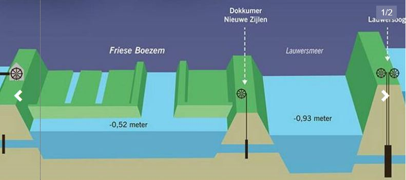
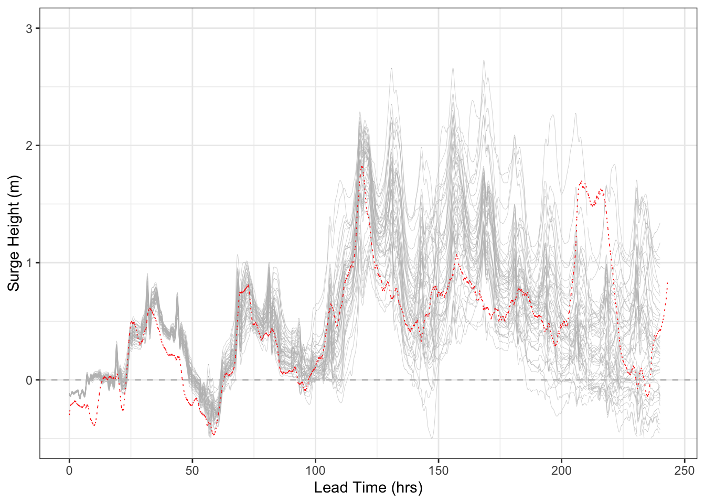
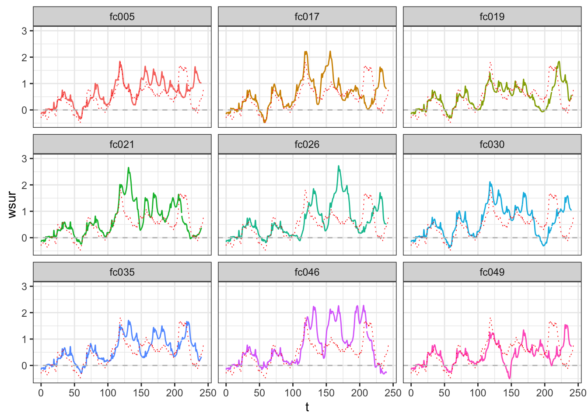
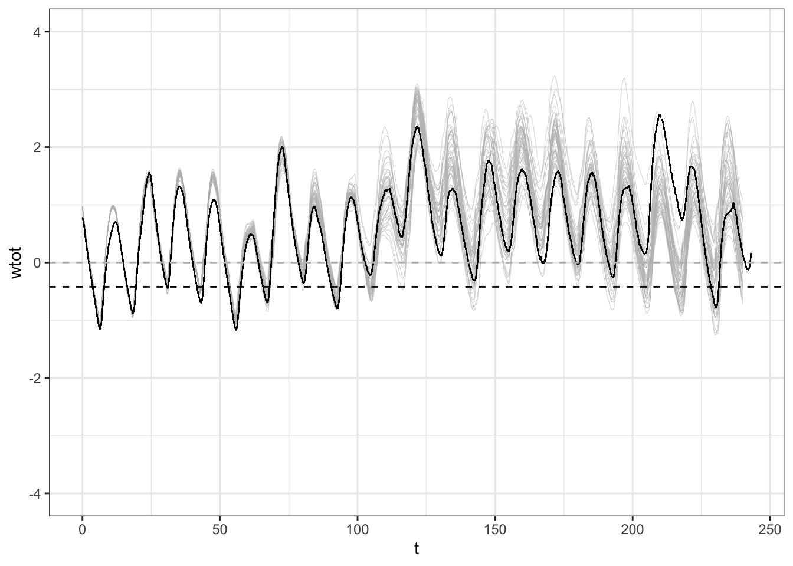
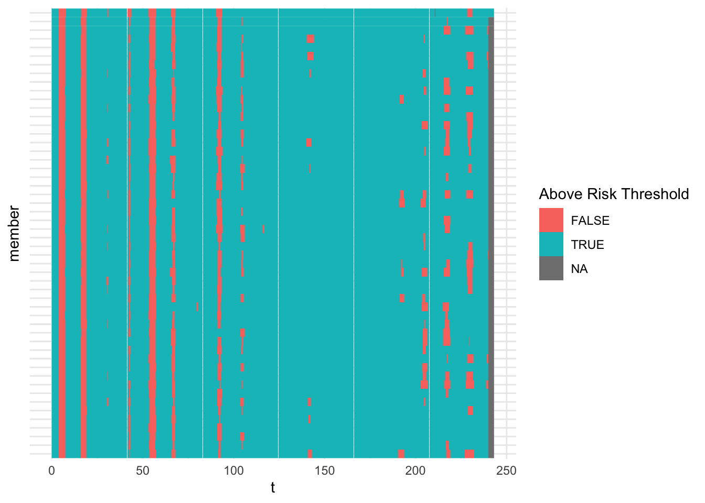

<style>
  .fullslide img {
    margin-top: -85px;
    margin-left: -60px;
    width: 900px; 
    height: 700px;
  }
</style>

<style>
p.comment {
background-color: #DBDBDB;
padding: 10px;
border: 1px solid black;
margin-left: 25px;
border-radius: 5px;
font-style: italic;
}
</style>

```{r setup, include=FALSE}
knitr::opts_chunk$set(echo = FALSE)
library(evd)
library(ggplot2)
library(tidyverse)
library(plotly)
library(extRemes)
library(leaflet)
```

# Dutchsplaining

<!-- ## {.fullslide} -->

<!-- <center> -->
<!--  -->

## Polders and Canals

<center>


## Wetterskip Fryslân 

```{r map, echo = FALSE, warning = FALSE, message = FALSE}

meta_data = data.frame(
  Name = c("Harlingen", "Lake Lauwersoog"), 
  Lat = c(53.17, 53.40),
  Long = c(5.41, 6.20))

leaflet(data = meta_data) %>% addTiles() %>%
  # addMarkers(~Long, ~Lat, popup = ~as.character(Name))
  addCircleMarkers(
    ~Long, ~Lat, popup = ~as.character(Name),
    radius = 7,#ifelse(type == "ship", 6, 10),
    color = "blue",
    stroke = FALSE, fillOpacity = 0.5
  )
```

<!-- Canal belt system -->
## Sluices

```{r sluice, echo = FALSE, warning = FALSE, message = FALSE}
gate_width = 0.03
normal_level = -0.52
avoid_level = -0.32
lly = -1
llx = -1
urx = 1
gate_height = 0
min_diff = 0.1
line_width = 1.25
gate = data.frame(x = c(-gate_width, gate_width, gate_width, -gate_width, -gate_width),
                  y = c(lly, lly, gate_height, gate_height, lly))
inland_levels = data.frame(x = c(llx, -gate_width),
                    y_normal = rep(normal_level,2),
                    y_avoid = rep(avoid_level,2))
sea_levels = data.frame(x = c(gate_width, urx),
                    y_normal = rep(normal_level,2) - min_diff,
                    y_avoid = rep(avoid_level,2) - min_diff)
water_inland = data.frame(x = c(llx, -gate_width, -gate_width, llx, llx),
                          y = c(lly, lly, avoid_level, avoid_level, -1))
water_sea = data.frame(x = c(urx, -gate_width, -gate_width, urx, urx),
                          y = c(lly, lly, avoid_level - min_diff, avoid_level - min_diff, -1))

sluice_plot <- ggplot() +
  geom_polygon(data = water_inland, aes(x = x, y = y),
               fill = "lightblue", alpha = 0.5) +
  geom_polygon(data = water_sea, aes(x = x, y = y),
               fill = "lightblue", alpha = 0.5) +
  geom_polygon(data = gate, aes(x = x, y = y),
               col = "black", fill = "lightgray") +
  geom_line(data = inland_levels, aes(x = x, y = y_normal),
            col = "forestgreen", linetype = "dashed", size = 1.25) +
  geom_line(data = inland_levels, aes(x = x, y = y_avoid),
            col = "red", linetype = "dotted", size = 1.25) +
  geom_line(data = sea_levels, aes(x = x, y = y_normal),
            col = "forestgreen", linetype = "dashed", size = 1.25) +
  geom_line(data = sea_levels, aes(x = x, y = y_avoid),
            col = "red", linetype = "dotted", size = 1.25) +
  geom_text(data = NULL, aes(x = (-gate_width + llx)/2, y = gate_height,
            label = "Canal Belt Side")) +
  geom_text(data = NULL, aes(x = (urx - gate_width)/2, y = gate_height,
                             label = "Sea Side")) +
  geom_line(data = NULL, aes(x = c(0,0),
                                y = c(normal_level, normal_level - min_diff)),
               col = "forestgreen" ,size = 1.25,
              arrow = arrow(length = unit(0.03, "npc"), ends = "both")) +
  geom_line(data = NULL, aes(x = c(0,0),
                                y = c(avoid_level, avoid_level - min_diff)),
               col = "red" ,size = 1.25,
            arrow = arrow(length = unit(0.03, "npc"), ends = "both")) +
  geom_text(data = NULL, aes(x = gate_width, y = normal_level - min_diff/2,
                             label = "0.1 m"),
            hjust = "left",
            col = "forestgreen") +
  geom_text(data = NULL, aes(x = gate_width, y = avoid_level - min_diff/2,
                             label = "0.1 m"), hjust = "left",
            col = "red") +
  ggtitle("Gravity based sluice at Harlingen") +
  theme_bw() +
  ylab("Total Water Level (m)") +
  xlab("")
sluice_plot
```
<font color="white"> ---- </font>
<font color="red"> Risk level to be avoided -0.32 m </font>  
<font color="green"> Normal operating level -0.52 m</font>  

# Compound Events

## Rainfall-Surge Mechansims

Three compound types that increase the flood risk:   
(Wahl et al. 2015)

<font color="#00A6D6"> **Mechanism (1): Both Extreme** </font> the joint occurrence elevates water levels

## Rainfall-Surge Mechansims

Three compound types that increase the flood risk:  
(Wahl et al. 2015)

<font color="lightgray"> **Mechanism (1): Both Extreme** the joint occurrence elevates water levels </font> 

<font color="#00A6D6"> **Mechanism (2): Extreme Surge**    </font> causing flooding, combined with any additional rainfall - even if it is not an extreme

## Rainfall-Surge Mechansims

Three compound types that increase the flood risk:  
(Wahl et al. 2015)  

<font color="lightgray"> **Mechanism (1): Both Extreme** the joint occurrence elevates water levels </font>

<font color="lightgray"> **Mechanism (2): Extreme Surge**     causing flooding, combined with any additional rainfall - even if it is not an extreme </font>

<font color="#00A6D6">  **Mechanism (3): Heavy/Extreme Rainfall** </font> combined with a moderate storm surge that prevents discharge of rainfall run-off using gravity-fed drainage
<!-- </p> -->

## Risk Duration and Height Surge 

<center>


## Reality for Compound Risk

<font color="#00A6D6">  **Don't really care how big the surge is** </font>

<iframe src="https://giphy.com/embed/pPhyAv5t9V8djyRFJH" width="480" height="350" frameBorder="0" class="giphy-embed" allowFullScreen></iframe><p><a href="https://giphy.com/gifs/wtf-obama-wth-pPhyAv5t9V8djyRFJH">via GIPHY</a></p>

## Actually interested in

```{r schematicSurge, echo = FALSE, message = FALSE, warning = FALSE}
num_pi = 7
theta = seq(0, num_pi*pi, length.out = 360*(num_pi+ 1)/2)
tide_cycle = sin(theta)
surge = sin(1/4*theta) + 0.35
surge = surge*(surge > 0)
sea_level = tide_cycle + surge
H_t = -0.42
surge_df <- data.frame(theta, tide_cycle, sea_level, surge)
clusters = rle(sea_level > H_t)
i = 1:(clusters$length[1])
block_x_sur <- range(theta[i])
surge_plot <- ggplot() +
  geom_line(data = surge_df, aes(x = theta, y = surge), col = "red", linetype = "dotted") +
  geom_line(data = surge_df, aes(x = theta, y = tide_cycle), col = "blue", linetype = "dashed") +
  geom_line(data = surge_df, aes(x = theta, y = sea_level)) + 
  geom_hline(yintercept = H_t, linetype = "dashed") + 
  geom_polygon(data = NULL, aes(x = c(block_x_sur, block_x_sur[2:1]), y = c(-1, -1, H_t ,H_t)), 
            fill = "red", alpha = 0.2) +
  ylab("Water Level") +
  ylim(lims = c(-1,2.4)) +
  xlab("Time") +
  ggtitle("Example of a storm surge") + 
  theme_bw()
surge_plot
```
<font color="black"> Total water level </font> 
<font color="white"> ---------- </font> 
<font color="blue"> Harmonic Tide </font>
<font color="white"> --------- </font> 
<font color="red"> Storm Surge </font>  


# Event Based Approach

## Problem set up 

<br><br>
<font color="#00A6D6">  **Want to forecast timing or duration dependent variables** </font>

* Includes duration that the sluice is not able to be used

* Includes aggregated rainfall prior to the start of the surge

## Problem set up 

<br><br>
<font color="gray">  **Want to forecast timing or duration dependent variables** </font>

* Includes duration that the sluice is not able to be used

* Includes aggregated rainfall prior to the start of the surge

<br><br>
<font color="#00A6D6"> 
**For the remainder of this talk:**</font>  

Let's just think about an event based approach for storm surge

## Ensemble: Storm Surge Trajectories

<center>


## Trajectories Features

<center>


<!-- ## Notation  -->

<!-- * Let ${S_t}$ for be the stochastic process representing the storm surge height at time $t$   -->

<!-- * ${s_t}$ be the related time-series of observations    -->

<!-- * ${h_t}$ as the height of the harmonic tide (deterministic)   -->

<!-- * $S_{t+k|t}$ be the the forecast initialised at time $t$ and with lead time $k$. -->

## Forecast Features 

* When does the storm surge peak?

$$g(\mathbf{s}_t; k) = \displaystyle{\text{argmax}_{k \in K}} \left( S_{t+k} \right)$$

* What is the maximum height of the storm surge?

$$g(\mathbf{s}_t; k) = \displaystyle{\text{max}_{k \in K}} \left( S_{t+k} \right)$$

* How long does the storm surge last?

$$g(\mathbf{s}_t; k) = \tfrac{1}{K\Delta{k}}\sum_{k \in K} \mathbb{1}\left(S_{t+k} > 0 \right)$$

* How long is the total level above a risk threshold,  $r$?

$$g(\mathbf{s}_t; k, r) = \tfrac{1}{K\Delta{k}}\sum_{k \in K} \mathbb{1}\left(S_{t+k} + h_{t+k} > r \right)$$

## Ensemble: Total Level

<center>


## Risk Duration

<center>


## Scoring

These quantitites can empircally be estimated from the raw ensemble:

$$ P_t \left[g(\mathbf{s}_t, \theta)\right] = \tfrac{1}{M} \sum_{m=1}^M g(\mathbf{s}^{(m)}_t, \theta), $$
where $M$ is the number of members.

Pinson et al. 2012 suggests using a Brier Skill Score (BSS):

$$BSS = \dfrac{1}{T} \sum_{t = 1}^T \left( P_t \left[ g(\mathbf{s}_t, \theta) \right] - g( \mathbf{s}_t, \theta )  \right) ^2$$

## Careful

<br><br>
<font color="#00A6D6">  **Directly applying the BSS in an event based approach  can violate some basic statistical assumptions ** </font>

* Ignores autocorrelation (due to overlap in forecast time periods)

* Ignores heteorskadiscity (more variability at longer lead times)

# Example

## NGR

## Univ (Rank) 

## Univ (CRPS)

## ECC
 
Want to use Methods of 
* Boulgene
* Möller 

## Duration

## Conclusions

<!-- # Univariate Post-processing -->


<!-- ## {.fullslide} -->

<!-- <center> -->
<!--  -->

<script src = "assets/delft.js"></script>  


