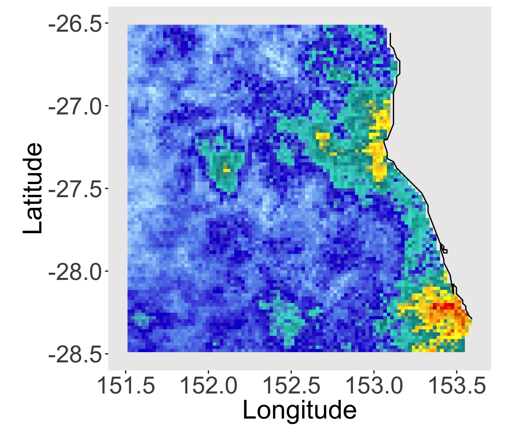
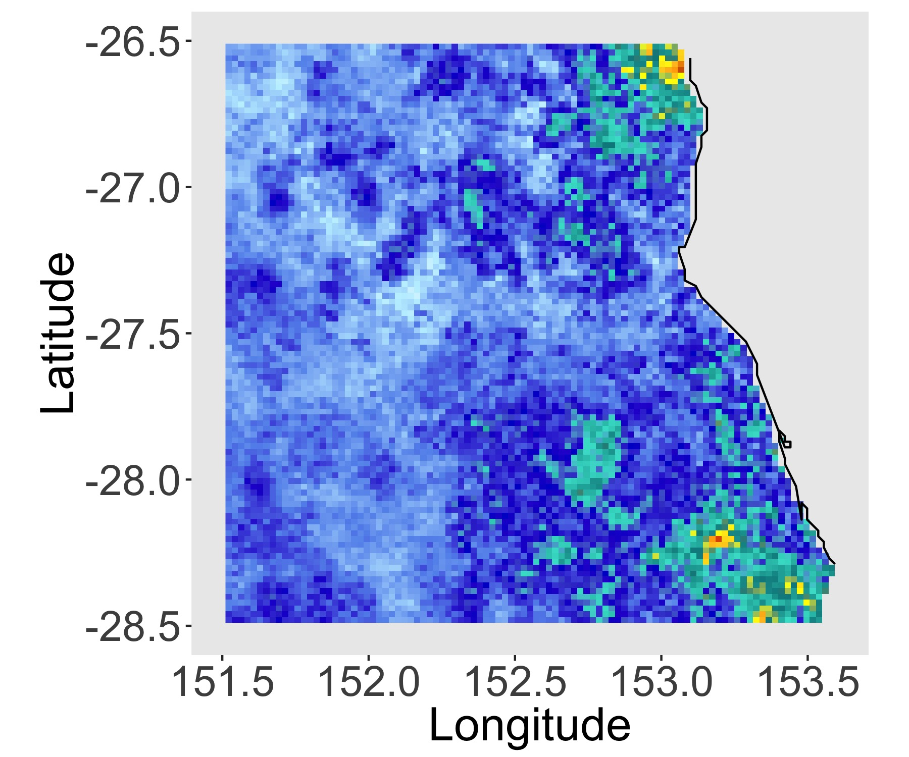
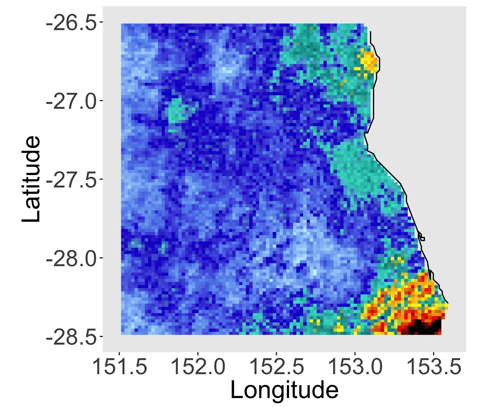
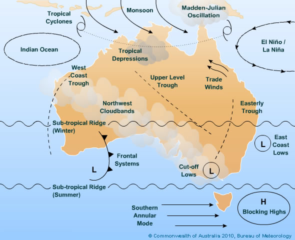

<style>
.fullslide img {
  margin-top: -85px;
  margin-left: -60px;
  width: 900px; 
  height: 700px;
}
</style>

```{r, echo = FALSE, warning = FALSE, include=FALSE}
addResourcePath("assets", "assets/")   # Must include this line !
library(plotly)
library(extRemes)
library(dplyr)
library(ggplot2)
library(plotly)
library(cluster)
library(shiny)
wdir = paste(getwd(), "data", sep = "/")
```


<!-- Jobs:  -->
<!-- * Fix image on title slide -->
<!-- 00A6D6 -->

# Motivation

## Time lapse

<iframe width="560" height="315" src="https://www.youtube.com/embed/qRIm3wqKVJ0" frameborder="0" allow="accelerometer; autoplay; encrypted-media; gyroscope; picture-in-picture" allowfullscreen></iframe>

## Mt Isa, Queensland, Australia 
<!-- Train stowed at high ground for safe keeping derailed by flood waters  -->
<!-- 31/01/2019 -->
</br>
</br>
<center>
 
</center>

<div class="notes">
Key Points
- The train consists of one locomotive and 80 wagons 
- containing a mixture of products including zinc, lead and copper anode
- stored at high ground on January 31
- extreme rainfall on Februray 1
- Due to flood waters continuing to rise and heavy rainfall, Queensland Rail crews are unable to physically access the site
- product has spilled into flood waters
</div>


## Townsville, Queensland, Australia

<br><br>
<center>
 
 
</center>

<div class ="notes">
 - Year's worth of rain in a week (Townsville) 
 - over a metre
 - bandying about 1 in 1000 year event
 - dam management criticised for not releasing water earlier and using operating conditions for a different size event (closer to a 1 in 100)
 - flood inquiry
 https://www.theguardian.com/australia-news/2019/feb/05/townsville-floods-dam-management-under-scrutiny-as-experts-demand-greater-preparation
 https://www.theguardian.com/environment/2019/feb/08/townsville-flood-queensland-announces-inquiry-as-up-to-300000-cattle-die
</div>

## Geographical Scale

<center>
 
</center>

<div class = "notes">
- monsoonal event
- day of the heaviest rainfall
- 900 km away, 9 hours drive

</div>

## Question

</br>
</br>
</br>
</br>
<font color="2292B5">**How should we assess and model risk from extreme rainfall over large geographical scales?** </font> 

## Outline

<font color="2292B5">**Background**</font>  

* Extreme value theory basics
* Max-stable processes
* Examples
* Challenges

<font color="2292B5">**Application**</font>  

* Clustering
* Regionalisation
* Visualising Dependence

# Extreme Value Theory 

<!-- <slide class="segue dark nobackground level1 current" data-slide-num="7" data-total-slides="53" style="background-color: white;"><div class="header-banner"></div><hgroup class="auto-fadein"><h2>Extreme Value Theory<div class="header-underline"></div></h2></hgroup><article id="extreme-value-theory"> -->
<!-- </article><div class="footer-one-banner"></div><div class="footer-two-banner"></div><div class="footer-three-banner"></div></slide> -->

<!-- .segue h2 { -->
<!--     color: #337ab7; -->
<!--     font-size: 60px; -->
<!-- } -->

## Standard Formulation

Let <font color="2292B5">$X_i$</font> be a sequence of iid random variables, define
<font color="2292B5">$$M_{n} = \max\{X_1, \dots, X_{n}\}.$$</font>

The distribution function of <font color="2292B5">$M_n$</font>  is
<font color="2292B5">$$\mathbb{P}(M_n \leq z) = \mathbb{P}(X_1 \leq z, \dots, X_n \leq z) = \mathbb{P}(X \leq z)^n = F(z)^n,$$</font>
where <font color="2292B5">$F(z)$</font>  is the distribution function of <font color="2292B5">$X$</font> .

Let <font color="2292B5">$z^F$</font>  denote the right endpoint of the support of <font color="2292B5">$F$</font> ,
<font color="2292B5">$$z^F = \sup \{z : F(z) < 1\},$$</font>
then as <font color="2292B5">$n \rightarrow \infty$</font>, <font color="2292B5">$F(z)^n \rightarrow 0$</font> for any <font color="2292B5">$z < z^F$</font>.

## GEV Distribution

If there exists sequences of constants
  <font color="2292B5">$\{a_n\} \in \mathbb{R}^+$</font> and
  <font color="2292B5">$\{b_n\} \in \mathbb{R}$</font>
  such that
<font color="2292B5">$$\mathbb{P} \left\{\dfrac{M_n - b_n}{a_n} \leq z \right \} \rightarrow G(z) \quad\hbox{as}\quad\, n \rightarrow \infty
$$</font>
where
  <font color="2292B5">$G(z)$</font> is a non-degenerate distribution function, then
  <font color="2292B5">$G(z)$</font> is a member of the generalised extreme value (GEV) family
<font color="2292B5">$$
 	G(z) = \exp \left\{ - \left[ 1 + \xi \left(\dfrac{z-\mu}{\sigma}\right) \right]_+^{-1 / \xi} \right\},$$</font>
where
  <font color="2292B5">$[v]_+ = \max \left\lbrace 0,v \right\rbrace$</font>,
  <font color="2292B5">$\mu \in \mathbb{R}$</font>,
  <font color="2292B5">$\sigma \in \mathbb{R}^+$</font> and
  <font color="2292B5">$\xi \in \mathbb{R}$</font>.
  
(Fisher and Tippett 1928, Gnendenko 1943)
\citep{fisher1928limiting, gnedenko1943distribution}

<!-- ## GEV Distribution -->

<!-- Parameters: location is <span style="color:#2292B5"> $\mu$ </span>, scale is <span style="color:#2292B5"> $\sigma$ </span> and the shape is <span style="color:#2292B5"> $\xi$ </span>. -->

<!-- ```{r, echo = FALSE} -->
<!-- shinyAppDir("shiny_apps/GEV_slider/",  -->
<!--   options = list(width = "100%", height = 700) -->
<!--    ) -->
<!-- ``` -->

## Practicalities

<font color="2292B5">**Why approximate the $\mathbb{P}(M_n \leq z)$ by the GEV distribution?**</font>  

<div class="notes">
Key Points:
- Most of the time, we don't have a lot of data
- Estimate the probability of rare events
- So events that we've only seen once or twice, or maybe never at all
- By approximating by the limit distribution, have justification for extrolapolation outside the range of our data
</div>

## Practicalities

<font color="lightgray">**Why approximate the $\mathbb{P}(M_n \leq z)$ by the GEV distribution?**</font>    
<br />  
<br />
<br />
<font color="2292B5">**Rainfall observations aren't independent**</font>  
<br />  
<br />
<br />

## Practicalities

<font color="lightgray">**Why approximate the $\mathbb{P}(M_n \leq z)$ by the GEV distribution?**</font>
<br />  
<br />
<br />  
<font color="lightgray">**Rainfall observations aren't independent**</font>    
<br />  
<br />
<br /> 
<font color="2292B5">**Rainfall observations aren't identically distributed**</font>  
<!-- Okay - provided data meets conditions preventing long range dependence (Leadbetter 1983)   -->

## Modelling

<font color="2292B5">**Want to make inference about the extremes of a rainfall field**</font><br />
<center>
<br />
<center>


<div class="notes">
Want to understand how rainfall impacts a region
Not just point location
Moreover, also need to understand how extreme rainfall will impact locations without a station
Need a model that works in continuous space with dependence
</div>

# Max-stable Processes

## Max-stable Processes

* Extremes in continuous space with dependence <br/>
<br/>
* Natural extension from univariate extreme value theory  <br/>
<br/>
* Univariate marginal distributions are GEV distributions <br/>
<br/>
* Can simulate from these processes

## Max-Stable Definition

Let <font color="2292B5">$\{Z_i\}_{i \geq 1}$</font> be a sequence of independent copies of a stochastic process
<font color="2292B5">$\{ Z(x) : x \in \mathcal{X} \subset \mathbb{R}^2 \}$</font>. <br />
<br />
The process
<font color="2292B5">$Z(x)$</font> is max-stable, if there exist normalising functions,
<font color="2292B5">$\{a_n(x)\} \in \mathbb{R}^+$</font> and
<font color="2292B5">$\{b_n(x)\} \in \mathbb{R}$</font>, such that
<font color="2292B5">$$	Z(x) \stackrel{d}{=} \lim_{n\to\infty} \dfrac{ \max _{i=1,\dots,n} Z_i(x) - b_{n}(x) }{ a_{n}(x) }, \quad x \in \mathcal{X}.$$
</font>
If the limiting process for the partial maxima process exists and is non-degenerate, then it is a max-stable process.

(De Haan 2006)

## Spectral Representation

Any non-degenerate simple max-stable process
<font color="2292B5">$\{ Z(x): x \in \mathcal{X}\}$</font> defined on a compact set <font color="2292B5">$\mathcal{X} \subset \mathbb{R}^2$</font>, with continuous sample paths satisfies
<font color="2292B5">$$	Z(x) \stackrel{d}{=} \max_{i \geq 1} \zeta_i Y_i(x), \quad\quad x \in \mathcal{X}, $$</font>
where <font color="2292B5">$\{\zeta_i: i \geq 1 \}$</font> are points of a Poisson process on
<font color="2292B5">$(0, \infty)$</font> with intensity
<font color="2292B5">$\zeta^{-2}\hbox{d}\zeta$</font>, and
<font color="2292B5">$Y_i$</font> are independent copies of a non-negative stochastic process
<font color="2292B5">$\{Y(x): x\in \mathcal{X}\}$</font> with continuous sample paths such that the
<font color="2292B5">$\mathbb{E}\lbrace Y(x) \rbrace = 1$</font> for all
<font color="2292B5">$x \in \mathcal{X}$</font>.

(De Haan 1984, Schlather 2002)

## Parametric Forms

**Smith Process** (Smith 1990)
<font color="2292B5"> $$Y_i(x) = W(x-U_i; 0, \Sigma), \quad x \in \mathcal{X}$$</font>
where <font color="2292B5">$\mathcal{X} \in \mathbb{R}$</font>, <font color="2292B5"> $W(\cdot, 0, \Sigma)$</font> is the bivaraite Guassian density, with mean zero and covariance matrix <font color="2292B5">$\Sigma$</font> and
<font color="2292B5">$U_i$</font> are points of a homogeneous Poisson Process on <font color="2292B5">$\mathbb{R}^2$</font>.

**Extemal-t Process** (Otpiz 2013)
<font color="2292B5"> $$Y_i(x) = g(\nu) \max\{0, W_i(x)\}^\nu, \quad x \in \mathcal{X}$$</font>
where <font color="2292B5">$\nu \geq 1$</font>, <font color="2292B5"> $g(\nu)$</font> normalising constance and <font color="2292B5">$\{W_i(x):x \in \mathcal{X} \}$</font> are indpendent copies of a stationary standard Guassian process with correlation function <font color="2292B5">$\rho(h)$</font>.

## Example Simulation

```{r smith, echo = FALSE}
shinyAppDir("shiny_apps/Maxstable_sim/",
 options = list(width = "100%", height = 700)
)
```

<!-- ## Examples -->

<!-- <center> -->
<!--  -->
<!-- <center> -->

<!-- ## 2D - Extremal-t -->

<!-- <center> -->
<!--  -->
<!--  -->
<!--  -->
<!--  -->
<!--  -->
<!--  -->
<!-- <!--  --> -->
<!-- <!--  --> -->
<!-- <!--  --> -->
<!-- <!--  <br> --> -->
<!-- <br /> -->
<!-- <center> -->
<!--  -->
<!-- </center> -->

<!-- <div class="notes"> -->
<!-- - Realistic representations of the annual maximum rainfall field -->
<!-- - Create multiple realisations -->
<!-- - Evaluate largest rainfall in this region -->
<!-- - Aggregate extreme rainfall across the region -->
<!-- - Taken from an application in an earlier chapter, modelled influence of ENSO -->
<!-- on the marginal distributions, looked at aggregate measure for rainfall -->
<!-- - Neat maths under the hood here -->
<!-- - Taking the maximum over infinitely many replicates of our stochastic process -->
<!-- </div> -->


## Composite Likelihood

<span style="color:#2292B5">
$$
\begin{align} 
	\ell \left( \vartheta ; z \right) = \sum_{i < j} \, \sum_{n=1}^{N_{ij}} \log f( z_{x_i}^{(n)}, z_{x_j}^{(n)} ; \vartheta), \label{eqn:compositeLikelihood}
\end{align}
$$
</span>

* <span style="color:  #2292B5"> $f$ </span> is the bivariate extreme value density at locations <span style="color: #2292B5"> $x_i$ </span> and <span style="color: #2292B5"> $x_j$ </span> 
* <span style="color: #2292B5"> $N_{ij}$ </span> are the number of shared observations between stations
* <span style="color: #2292B5"> $\vartheta$ </span> is parameter vector for estimation

(Padoarn et al. 2011)

<!-- **Response Surface (Linear functions)** -->
<!-- <span style="color:2292B5"> -->
<!-- $$ -->
<!-- \begin{align*} -->
<!-- \mu &= l_1 (\hbox{geographic covariates, temporal covariates}) \\ -->
<!-- \sigma &= l_2 (\hbox{geographic covariates, temporal covariates}) \\ -->
<!-- \xi &= C -->
<!-- \end{align*} -->
<!-- $$ -->
<!-- </span> -->

<div class="notes">
Key Points
- misspecified likelihood (things aren't iid)
- sandwich estimator 
- nice asymptotic properites (what are these again)
- but... pick pairs for efficiency
- and computational that's tricky
- full density (dimension 25)

The properties of composite likelihood estimators, under the appropriate regularity conditions, are similar to those of maximum likelihood estimators: the estimating equation are unbiased and the estimators are asymptotically normal. However, the variance matrix of the composite likelihood is estimated by the inverse the sandwich information matrix, also known as the Godambe information matrix

</div>

## Question
<br><br><br>
<font color="2292B5">**Can we do this type of modelling for all of Australia?**</font>
<br><br><br>

<div class="notes">
* Hopefully I've convinced you that modelling extremes in continuous space with dependence is useful.
* Max-stable processes are a powerful tool that allows us to ask really interesting questions about rainfall extremes that may otherwise not been answerable.
* Fit these kinds of models we've made certain assumptions about dependence
* Such as a common dependence structure across the domain
* Want to explore these assumptions
</div>

## Challenge

<br>



<div class="notes">
- Want to understand extremes on an Australian wide scale
- Challenge is complexity of climate and topography
- Size
</div>

## Challenges

<font color="2292B5">**Variable selection is difficult due to complex covariate interactions**</font>    
<br />
<br />  
<font color="2292B5">**Spatial dependence is clearly not stationary**</font>    
<br />  
<br />
<br /> 
<font color="2292B5">**Composite likelihood methods have limitations due to pair selection**</font>  

# Regionalisation

## Australian Rainfall Network

```{r, echo = FALSE}
working_dir = "/Users/katesaunders/Dropbox/Hard Drive/R/2018/ChapterCluster/"
mainland_df = readRDS("/Users/katesaunders/Documents/Git/Talks/Older/completionSeminar/shiny_apps/record_slider/mainland_df.rds")
tas_df = readRDS("/Users/katesaunders/Documents/Git/Talks/Older/completionSeminar/shiny_apps/record_slider/tas_df.rds")

coords = readRDS(paste(working_dir, "Data/region_coords.rds", sep = "")) %>% dplyr::bind_rows()
station_plot <- ggplot(data = coords) +
  geom_point(aes(x = longitude, y = latitude), size = 0.2, alpha = 0.5) +
  geom_path(data = mainland_df, aes(x = Long, y =Lat)) +
  geom_path(data = tas_df, aes(x = Long, y =Lat)) +
  xlab("Longitude") +
  ylab("Latitude") +
  ggtitle("Station Locations") +
  coord_fixed() +
  theme_bw()

station_plot
```

<div class="notes">
 * Need something robust to these problemes - Hierarchical Clustering
</div>

## Regionalisation

<center>


<div class="notes">
Which stations are dependent - which are independent
Which stations should be group together for modelling
Which locations are likely to be impacted together
Where can we assume a single dependence structure

* Cluster
* Classify
* Fit

</div>

# Clustering

## Clustering Distance

<br><br>
<font color="2292B5">**Require:**</font> Measure of closeness between two locations<br/ >
<br><br>
<font color="2292B5">**Want:**</font> Form clusters based on extremal dependence<br/ >
<br><br>
<font color="2292B5">**Solution:**</font> The F-madogram distance</br>

<br><br><br><br>
<font size="3">
Bernard, Elsa, et al. "Clustering of maxima: Spatial dependencies among heavy rainfall in France." Journal of Climate 26.20 (2013): 7929-7937.
</font>

<div class="notes">
- In spatial statistics normally we have a notion of how close two things are using the variogram
- For heavy-tail distribution (problem) variance isn't finite
- Fmadogram gets aroudn this by using distribution funcitons
- Estiamte this distance non-parametrically
- Just going to consider hte clustering in terms of hte dependence
</div>

## F-madogram distance

<font color="2292B5">$$d(x_i, x_j) = \tfrac{1}{2} \mathbb{E} \left[ \left| F_i(M_{x_i}) - F_j(M_{x_j}) \right| \right]$$</font>
where
<font color="2292B5">$M_{x_i}$</font> is the annual maximum rainfall at location
<font color="2292B5">$x_i \in \mathbb{R}^2$</font> and <font color="2292B5">$F_i$</font> is the distribution function of
<font color="2292B5">$M_{x_i}$</font>.

<br>
<font color="2292B5"> **Advantages:** </font>

* Only use the raw block (annual) maxima
* No information about climate or topography
* Non-parametric estimation (fast)

<br>
<font size="3">
Cooley, D., Naveau, P. and Poncet, P., 2006. Variograms for spatial max-stable random fields. In Dependence in probability and statistics (pp. 373-390). Springer, New York, NY.
</font>

<div class="notes">
- In spatial statistics normally we have a notion of how close two things are using the variogram
- For heavy-tail distribution (problem) variance isn't finite
- Fmadogram gets aroudn this by using distribution funcitons
- Estiamte this distance non-parametrically
- Just going to consider hte clustering in terms of hte dependence
</div>
  
## Extremal Coefficient
  
For <font color="2292B5">$M_{x_i}$</font> and
<font color="2292B5">$M_{x_j}$</font> with common Fréchet marginals is
<font color="2292B5">$$\mathbb{P}\left( M_{x_i} \leq z, M_{x_j} \leq z \right) = \left[\mathbb{P}(M_{x_i}\leq z)\mathbb{P}(M_{x_i}\leq z)) \right]^{\tfrac{1}{2}\theta(x_i - x_j)}. %= \exp\left(\dfrac{-\theta(h)}{z}\right),$$</font>
  where <font color="2292B5">$\theta(x_i - x_j)$</font> is the extremal coefficient and the range of <font color="2292B5">$\theta(x_i - x_j)$ is $[1 , 2]$</font>.

Can express the F-madogram as:
  <font color="2292B5">
  $$d(x_i, x_j) = \dfrac{\theta(x_i - x_j) - 1}{2(\theta(x_i - x_j) + 1)},$$</font>
  so the range of <font color="2292B5">$d(x_i, x_j)$</font> is <font color="2292B5">$[0 , 1/6]$</font>.

<div class="notes">
  - Extremal coefficient is a measure for parital dependence
- Using it for clustering, means our clsuters will have a natural interpretation
- Importnat to note the range (talk about that again in a little bit)
</div>
  
## Clustering
<br><br>
$\checkmark$ Distance

<br><br><br>
  $?$ Algorithm

## K-Medoids Clustering and PAM

1. Randomly select an initial set of <font color="2292B5">$K$</font> stations. These are the set of the initial medoids.
2. Assign each station, <font color="2292B5">$x_i$</font>, to its closest medoid, <font color="2292B5">$m_k$</font>, based on the F-madogram distance.
3. For each cluster, <font color="2292B5">$C_k$</font>, update the medoid according to
<font color="2292B5">
  $$m_k = \mathop{\mathrm{argmin}}\limits_{x_i \in C_k} \sum_{x_j \in C_k} d(x_i, x_j).$$</font>
  4. Repeat steps 2. -- 4. until the medoids are no longer updated.

<br>
  <font size="3">Kaufman, L. and Rousseeuw, P.J., 1990. Partitioning around medoids (PAM). Finding groups in data: an introduction to cluster analysis, pp.68-125.</font>
  
## Example: Southwest Western Australia
  
```{r, echo = FALSE, warning = FALSE}

plot_coords = readRDS(paste(wdir, "plot_coords.rds", sep =  "/"))
text.type.large <- element_text(size = 12)
text.type.small <- element_text(size = 11)

gg_color_hue <- function(n) {
  hues = seq(15, 375, length = n + 1)
  hcl(h = hues, l = 65, c = 100)[1:n]
}

plot_coords <- plot_coords %>%
  mutate(temp = if_else(distance_type == plot_coords$distance_type[1],
                        T, F)) %>%
  mutate(cluster_id = cluster_id + temp*10) %>%
  mutate(cluster_id = if_else(cluster_id == 12, 1, cluster_id)) %>%
  mutate(cluster_id = if_else(cluster_id == 11, 3, cluster_id)) %>%
  mutate(cluster_id = if_else(cluster_id == 15, 2, cluster_id)) %>%
  mutate(cluster_id = if_else(cluster_id == 17, 4, cluster_id)) %>%
  mutate(cluster_id = if_else(cluster_id == 13, 7, cluster_id)) %>%
  mutate(cluster_id = if_else(cluster_id == 16, 5, cluster_id)) %>%
  mutate(cluster_id = if_else(cluster_id == 14, 6, cluster_id))

plot_title = "K-medoids clustering"

cluster_plot <- ggplot() +
  geom_point(data = plot_coords %>% 
               filter(distance_type == plot_coords$distance_type[1]),
             aes(x = longitude, y = latitude,
                 col = as.factor(cluster_id),
                 shape = as.factor(cluster_id%%6),
                 key = cluster_id), size = 0.8) + #,
  # group = distance_type)) +
  coord_fixed() +
  # facet_wrap(~distance_type, ncol = 2) +
  geom_path(data = mainland_df, aes(x = Long, y = Lat)) +
  geom_path(data = tas_df, aes(x = Long, y = Lat)) +
  scale_x_continuous(limits = range(plot_coords$longitude) + c(-0.1, 0.1)) +
  scale_y_continuous(limits = range(plot_coords$latitude) + c(-0.1, 0.1)) +
  scale_color_manual(values = gg_color_hue(10)[c(1,2,3,4,5,6,7, rep(8,2))]) + 
  # red, orange, #brown, # green, #lightgreen, #light blue, #blue
  theme_bw() +
  xlab("Longitude") +
  ylab("Latitude") +
  ggtitle(plot_title) +
  theme(legend.position = "none",
        legend.text = text.type.small,
        strip.text.x = text.type.large,
        axis.text = text.type.small,
        plot.title = text.type.large,
        axis.title = text.type.large)

ggplotly(cluster_plot, source = "select", tooltip = c("key"))
```

## Example

Consider the <font color="2292B5"> $\max \{ \| x_i - x_j \|, 2\}$</font> as the clustering distance.
```{r, echo = F, warning = F}
set.seed(1)
cap = 2
theta = seq(0, 2*pi, length.out = 360)
circle = data.frame(x = cap*cos(theta), y = cap*sin(theta))

# CAP ON DISTANCE
xshift = 7

x0 = rnorm(500, 0, 1)
y0 = rnorm(500, 0, 1)

x1 = x0 + xshift
y1 = y0

x = c(x0,x1)
y = c(y0,y1)

DD = dist(cbind(x,y))
i = which(DD > cap)
DD[i] = cap

pam_clusters = pam(DD, k = 2)

k = 2
cap_df = data.frame(x,y)
cap_df$K = rep(k, nrow(cap_df))
cap_df$cluster_id = pam_clusters$clustering
cap_df$medoids_x = rep(NA, nrow(cap_df))
cap_df$medoids_y = rep(NA, nrow(cap_df))
cap_df$medoids_x[pam_clusters$medoids] = cap_df$x[pam_clusters$medoids]
cap_df$medoids_y[pam_clusters$medoids] = cap_df$y[pam_clusters$medoids]

kmedoids_eg1_plot <- ggplot() +
  geom_point(data = cap_df, aes(x=x, y=y,
                                col = as.factor(pam_clusters$clustering),
                                shape = as.factor(pam_clusters$clustering),
                                text = paste("Cluster ID:", as.factor(pam_clusters$clustering)))) +
  scale_color_manual(values = c("purple", "orange")) +
  geom_point(data = cap_df, aes(x = medoids_x,
                                y = medoids_y),
             col = "black", shape = 20, size = 2) +
  geom_path(aes(x = circle$x, y = circle$y), linetype = "dashed") +
  geom_path(aes(x = circle$x + xshift, y = circle$y), linetype = "dashed") +
  coord_fixed() +
  xlab("") + ylab("") +
  theme_bw() +
  theme(legend.position = "none") +
  ggtitle("Example of K-Medoids showing spurious clustering")

ggplotly(kmedoids_eg1_plot, tooltip = c("text"))

```

## Density example

```{r, echo = F, warning = F}

xshift = 7
x0 = rnorm(1000, 0, 1)
y0 = rnorm(1000, 0, 1)

i = sample(1:length(x0), 100)
x1 = x0[i] + xshift
y1 = y0[i]

x = c(x0,x1)
y = c(y0,y1)

cap = 2
DD = dist(cbind(x,y))
i = which(DD > cap)
DD[i] = cap

pam_clusters_1 = pam(DD, k = 2)

plot_df = data.frame(x,y)
plot_df$K = paste("K = ", c(rep(2, length(x))))
plot_df$cluster_id = c(pam_clusters_1$clustering)
plot_df$medoids_x = rep(NA, nrow(plot_df))
plot_df$medoids_y = rep(NA, nrow(plot_df))
plot_df$medoids_x[pam_clusters_1$medoids] = plot_df$x[pam_clusters_1$medoids]
plot_df$medoids_y[pam_clusters_1$medoids] = plot_df$y[pam_clusters_1$medoids]

density_eg_plot <- ggplot(plot_df) +
  geom_point(aes(x = x, y = y,
                 col = as.factor(cluster_id),
                 shape = as.factor(cluster_id),
                 text = paste("Cluster ID:", as.factor(cluster_id)))) +
  geom_point(aes(x = medoids_x,
                 y = medoids_y),
             col = "black", shape = 20, size = 2) +
  coord_fixed() +
  theme_bw() +
  facet_wrap( ~ K, nrow = 2) +
  theme(legend.position = "none") +
  ggtitle("Station Density Example of K-Medoids")

ggplotly(density_eg_plot, tooltip = c("text"))

```

<!-- ## Gridded data -->

<!-- * Ensure there are sufficient medoids -->

<!-- <br> -->

<!--   * Spatial density is changed by land-sea and domain boundaries   -->

<!-- <br> -->

<!--   * Tendancy toward clusters of equal size  -->

<!-- <br> -->

<!--   * Clustering is in F-madogram space not Euclidean   -->

## Hierarchical Clustering

<font color="2292B5">$$d(C_k, C_{k'}) = \frac{1}{|C_k| |C_{k'}|} \sum_{x_k \in C_k} \sum_{x_{k'} \in C_{k'}} d(x_k, x_{k'}).$$</font>

<center>

</center>

<div class="notes">
* Explain how a cut in the tree produces the clusters
* (x axis) Each single point/station forms a leaf in the tree.
* When these leaves are connected they form branches, clusters
* branches in the most trivial sense can be a single leaf.
* (y axis) Average distance between branches
*  Obtain our clustering by cuttign this dendrogram
* Explain that higher cut heights smaller depenence
* Lower cut heights greater dependence
</div>
<div class="notes">
* Many different linkage criteria (this one works for us)
* What we end up with is a dendrogram
* Graphical way of displaying connectness
</div>

## Back to the first example
  
```{r, echo = FALSE, warning = FALSE}

plot_title = "Comparison"

plot_coords = readRDS(paste(wdir, "plot_coords.rds", sep =  "/"))

plot_coords <- plot_coords %>%
  mutate(temp = if_else(distance_type == plot_coords$distance_type[1],  
                        T, F)) %>%
  mutate(cluster_id = cluster_id + temp*10) %>%
  mutate(cluster_id = if_else(cluster_id == 12, 1, cluster_id)) %>%
  mutate(cluster_id = if_else(cluster_id == 11, 3, cluster_id)) %>%
  mutate(cluster_id = if_else(cluster_id == 15, 2, cluster_id)) %>%
  mutate(cluster_id = if_else(cluster_id == 17, 4, cluster_id)) %>%
  mutate(cluster_id = if_else(cluster_id == 13, 7, cluster_id)) %>%
  mutate(cluster_id = if_else(cluster_id == 16, 8, cluster_id)) %>%
  mutate(cluster_id = if_else(cluster_id == 14, 6, cluster_id)) 


cluster_plot1 <- ggplot() +
  geom_point(data = plot_coords,
             aes(x = longitude, y = latitude,
                 col = as.factor(cluster_id),
                 shape = as.factor(cluster_id%%6),
                 group = distance_type)) +
  coord_fixed() +
  facet_wrap(~distance_type, ncol = 2) +
  geom_path(data = mainland_df, aes(x = Long, y = Lat)) +
  geom_path(data = tas_df, aes(x = Long, y = Lat)) +
  scale_x_continuous(limits = range(plot_coords$longitude) + c(-0.1, 0.1)) +
  scale_y_continuous(limits = range(plot_coords$latitude) + c(-0.1, 0.1)) +
  scale_color_manual(values = gg_color_hue(10)[c(1,2,3,4,5,6,7, 8,9,10)]) + 
  theme_bw() +
  xlab("Longitude") +
  ylab("Latitude") +
  ggtitle(plot_title) +
  theme(legend.position = "none",
        legend.text = text.type.small,
        strip.text.x = text.type.large,
        axis.text = text.type.small,
        plot.title = text.type.large,
        axis.title = text.type.large)

# got a bug here - need to find out what it is!!!
# ggplotly(cluster_plot1)
cluster_plot1
```

## Classify

* Classify a station relative to its closest neighbours
* Use a weighted classification $w$-kNN

<center>


<div class="notes">
* Need to be able to classify locations without a station
* Need to be able to identify regional boundaries
</div>

# Results 

## Results

```{r regions, echo = FALSE}
shinyAppDir("shiny_apps/region_summary/",
 options = list(width = "100%", height = 700)
)
```

## Choosing a cut height

<center>

</center>

<div class="notes">
Depends on what you are trying to do?

Lower cut heights ~0.115 stronger dependence

Higher cut heights ~0.133 weaer dependence

Low than 0.1 (very strong dependence, starts to decrease rapidly to zero - clusters become small)

Greater than 0.135 (very week depdence, starts to decrease rapidly to zero - clusters become small)

Depends on the topography as well
</div>

## Similar Dependence

<br><br><br><br><br>
<font color="2292B5">**Where can we assume a common dependence structure?**</font>
<br>

## Visualising Dependence

* Fit a Smith model
* Visualise the partition using elliptical level curves

<font color="2292B5">
$$ \mathbb{P}(\| \mathbf{x} - \mathbf{\mu} \| < r) = 1 - \exp \left( \frac{-r^2}{2} \right)$$
</font>
 
* Understand uncertainty through sampling
* Size and direction of ellipses have a natural intepretation in terms dependence

<!-- ## A comment -->

<!-- ## Spurious Clustering -->

<!-- Let <font color="2292B5">$d_e(x_i,x_j)$</font> be the Euclidean distance between x and y.<br /> -->
<!-- Consider the <font color="2292B5">$\max\{d_e(x_i,x_j), 2\}$</font> as the clustering distance. -->
<!-- ```{r, echo = F, warning = F} -->
<!-- set.seed(1) -->
<!-- cap = 2 -->
<!-- theta = seq(0, 2*pi, length.out = 360) -->
<!-- circle = data.frame(x = cap*cos(theta), y = cap*sin(theta)) -->

<!-- # CAP ON DISTANCE -->
<!-- xshift = 7 -->

<!-- x0 = rnorm(500, 0, 1) -->
<!-- y0 = rnorm(500, 0, 1) -->

<!-- x1 = x0 + xshift -->
<!-- y1 = y0 -->

<!-- x = c(x0,x1) -->
<!-- y = c(y0,y1) -->

<!-- DD = dist(cbind(x,y)) -->
<!-- i = which(DD > cap) -->
<!-- DD[i] = cap -->

<!-- pam_clusters = pam(DD, k = 2) -->

<!-- k = 2 -->
<!-- cap_df = data.frame(x,y) -->
<!-- cap_df$K = rep(k, nrow(cap_df)) -->
<!-- cap_df$cluster_id = pam_clusters$clustering -->
<!-- cap_df$medoids_x = rep(NA, nrow(cap_df)) -->
<!-- cap_df$medoids_y = rep(NA, nrow(cap_df)) -->
<!-- cap_df$medoids_x[pam_clusters$medoids] = cap_df$x[pam_clusters$medoids] -->
<!-- cap_df$medoids_y[pam_clusters$medoids] = cap_df$y[pam_clusters$medoids] -->

<!-- kmedoids_eg1_plot <- ggplot() + -->
<!--   geom_point(data = cap_df, aes(x=x, y=y, -->
<!--                                 col = as.factor(pam_clusters$clustering), -->
<!--                                 shape = as.factor(pam_clusters$clustering), -->
<!--                                 text = paste("Cluster ID:", as.factor(pam_clusters$clustering)))) + -->
<!--   scale_color_manual(values = c("purple", "orange")) + -->
<!--   geom_point(data = cap_df, aes(x = medoids_x, -->
<!--                                 y = medoids_y), -->
<!--              col = "black", shape = 20, size = 2) + -->
<!--   geom_path(aes(x = circle$x, y = circle$y), linetype = "dashed") + -->
<!--   geom_path(aes(x = circle$x + xshift, y = circle$y), linetype = "dashed") + -->
<!--   coord_fixed() + -->
<!--   theme_bw() + -->
<!--   theme(legend.position = "none") + -->
<!--   ggtitle("Example of K-Medoids showing spurious clustering") -->

<!-- ggplotly(kmedoids_eg1_plot, tooltip = c("text")) -->
<!-- ``` -->

<!-- ## Density Sensitive -->

<!-- ```{r, echo = F, warning = F} -->

<!-- # DENSITY EXAMPLE -->

<!-- xshift = 7 -->
<!-- x0 = rnorm(1000, 0, 1) -->
<!-- y0 = rnorm(1000, 0, 1) -->

<!-- i = sample(1:length(x0), 100) -->
<!-- x1 = x0[i] + xshift -->
<!-- y1 = y0[i] -->

<!-- x = c(x0,x1) -->
<!-- y = c(y0,y1) -->

<!-- cap = 2 -->
<!-- DD = dist(cbind(x,y)) -->
<!-- i = which(DD > cap) -->
<!-- DD[i] = cap -->

<!-- pam_clusters_1 = pam(DD, k = 2) -->

<!-- plot_df = data.frame(x,y) -->
<!-- plot_df$K = paste("K = ", c(rep(2, length(x)))) -->
<!-- plot_df$cluster_id = c(pam_clusters_1$clustering) -->
<!-- plot_df$medoids_x = rep(NA, nrow(plot_df)) -->
<!-- plot_df$medoids_y = rep(NA, nrow(plot_df)) -->
<!-- plot_df$medoids_x[pam_clusters_1$medoids] = plot_df$x[pam_clusters_1$medoids] -->
<!-- plot_df$medoids_y[pam_clusters_1$medoids] = plot_df$y[pam_clusters_1$medoids] -->

<!-- density_eg_plot <- ggplot(plot_df) + -->
<!--   geom_point(aes(x = x, y = y, -->
<!--                  col = as.factor(cluster_id), -->
<!--                  shape = as.factor(cluster_id), -->
<!--                  text = paste("Cluster ID:", as.factor(cluster_id)))) + -->
<!--   geom_point(aes(x = medoids_x, -->
<!--                  y = medoids_y), -->
<!--              col = "black", shape = 20, size = 2) + -->
<!--   coord_fixed() + -->
<!--   theme_bw() + -->
<!--   facet_wrap( ~ K, nrow = 2) + -->
<!--   theme(legend.position = "none") + -->
<!--   ggtitle("Station Density Example of K-Medoids") -->

<!-- ggplotly(density_eg_plot, tooltip = c("text")) -->
<!-- ``` -->

<!-- <div class="notes"> -->
<!--  * Need something robust to these problemes - Hierarchical Clustering -->
<!--  * Medoids need to cover the domain so that every station is dependent on a medoid in some way -->
<!--  * Clustering selection method also don't work the way they were intended -->
<!--  * Density creates medoids in denser areas - making more problems -->
<!--  * Explain differences in station density -->
<!-- </div> -->


## Southwest Western Australia

<center>
<!--  -->

</center>

## Southwest Western Australia

<center>


</center>

## Tasmania

<center>


</center>

## Conclusions

* Grouped stations using hierarchical clustering
* Identified regions of similar extremal dependence
* Shown different regions have different extremal dependence
* Method helps us understand were we can reasonably assume
a single dependence structure

Future work: Non-stationary dependence!

<font size="3">
**e.** K.R.Saunders@tudelft.nl

**t.** @katerobsau

**g.** github.com/katerobsau

Saunders, K. R., A. G. Stephenson, and D. J. Karoly. "A Regionalisation Approach for Rainfall based on Extremal Dependence." arXiv preprint arXiv:1907.05750 (2019).
</font>

<!-- ## {.fullslide} -->

<!-- <center> -->
<!--  -->
<!-- </center> -->

## {.fullslide}

<center>

</center>

## Dependence

```{r records, echo = FALSE}
shinyAppDir("shiny_apps/record_slider/",
 options = list(width = "100%", height = 700)
)
```

<div class="notes">
surely those events are independent?
Key Points
- Explain the colours
- Large spatial range dependence
- Station network change in time
- Looking for patterns
- Colours are to help distinguish which events occur in the same years
- Which station experience events together?
- What is the range?
- Are the years important? (1974 )
- Large areas are affected together
</div>


<script src = "assets/delft.js"></script>
