<style>
.fullslide img {
  margin-top: -85px;
  margin-left: -60px;
  width: 900px; 
  height: 700px;
}
</style>

```{r setup, include=FALSE}
knitr::opts_chunk$set(echo = FALSE)
library(plotly)
library(extRemes)
library(dplyr)
library(ggplot2)
library(plotly)
library(cluster)
library(shiny)
```

<!-- Title details are set in the torino_sytle.js file -->
<!-- See the section commented - Handle title slide -->

## 

<center>  </center>

<div class="notes">
* Three supervisors
* Family
* Friends - Climate college friends, Daryl, Jackson
* Daryl - proofreading
</div>

## Background

<center> 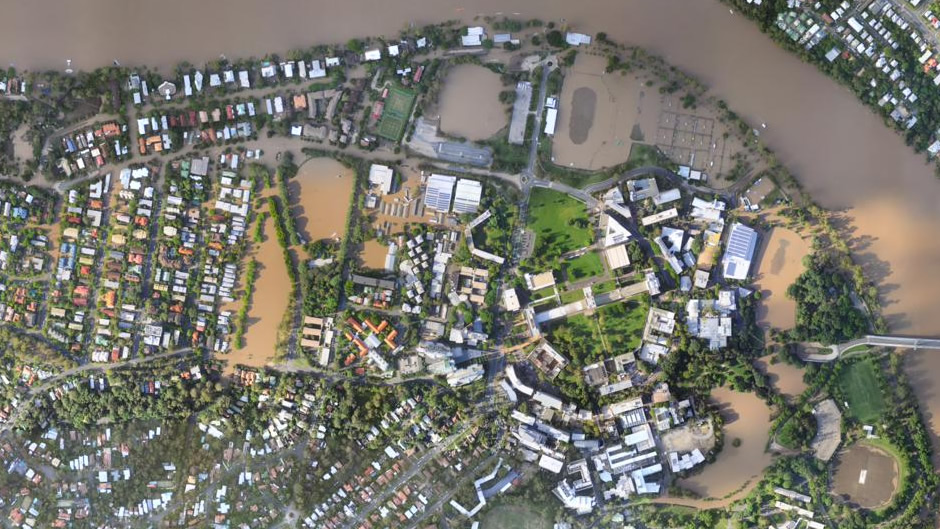</center>

<div class="notes">
How did I get interested in my thesis topic?
</div>

## Motivation

<b> Toowoomba Flash Flooding </b>


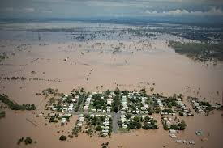

<br>
<font color="blue">
**What was the probability of this flash flood occurring?**
</font>

## El Niño Southern Oscillation (ENSO)
<br>
<br>
<center>
  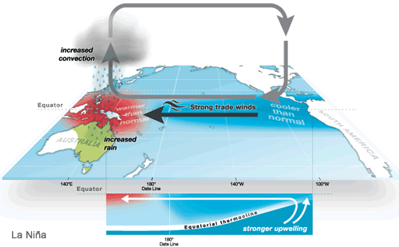
  
</center>
<br>
<br>
<font color="blue">
**Did ENSO affect the probability of this flash flood occurring?**
</font>

## Thesis Overview

<font color="blue">**1. Quality Assurance**</font>
<!-- How do errors within observational data impact the analysis of extremes? -->

## Thesis Overview

<font color="lightgray"> **1. Quality Assurance**</font><br />
<!-- How do errors within observational data impact the analysis of extremes?</font><br /> -->
<br />
<br />
<font color="blue">**2. Non-stationarity of Extremes**</font><br />
<!-- How does ENSO influence the marginal distributions of Australian rainfall extremes?  <br /> -->
<br />

## Thesis Overview

<font color="lightgray"> **1. Quality Assurance**<br /><br />
<!-- How do errors within observational data impact the analysis of extremes?  <br /> -->
<br />
**2. Non-stationarity of Extremes**</font><br />
<!-- How does ENSO influence the marginal distributions of Australian rainfall extremes?  </font><br /> -->
<br /><br />
<font color="blue"> **3. Extremes in Continuous Space with Dependence**  </font><br />
<!-- How does ENSO influence the spatial distribution of Australian rainfall extremes?  <br /> -->

## Thesis Overview

<font color="lightgray"> **1. Quality Assurance**<br /><br />
<!-- How do errors within observational data impact the analysis of extremes?  <br /> -->
<br />
**2. Non-stationarity of Extremes**  <br />
<!-- How does ENSO influence the marginal distributions of Australian rainfall extremes?  <br /> -->
<br /><br />
**3. Extremes in Continuous Space with Dependence**   </font><br />
<!-- How does ENSO influence the spatial distribution of Australian rainfall extremes?  </font><br /> -->
<br /><br />
<font color="blue"> **4. Extremal Dependence**  </font>  <br />
<!-- How does the dependence of rainfall extremes vary in Australia? -->

# Extreme Value Theory 

<!-- <slide class="segue dark nobackground level1 current" data-slide-num="7" data-total-slides="53" style="background-color: white;"><div class="header-banner"></div><hgroup class="auto-fadein"><h2>Extreme Value Theory<div class="header-underline"></div></h2></hgroup><article id="extreme-value-theory"> -->
<!-- </article><div class="footer-one-banner"></div><div class="footer-two-banner"></div><div class="footer-three-banner"></div></slide> -->

<!-- .segue h2 { -->
<!--     color: #337ab7; -->
<!--     font-size: 60px; -->
<!-- } -->

## Standard Formulation

Let <font color="blue">$X_i$</font> be a sequence of iid random variables, define
<font color="blue">$$M_{n} = \max\{X_1, \dots, X_{n}\}.$$</font>

The distribution function of <font color="blue">$M_n$</font>  is
<font color="blue">$$\mathbb{P}(M_n \leq z) = \mathbb{P}(X_1 \leq z, \dots, X_n \leq z) = \mathbb{P}(X \leq z)^n = F(z)^n,$$</font>
where <font color="blue">$F(z)$</font>  is the distribution function of <font color="blue">$X$</font> .

Let <font color="blue">$z^F$</font>  denote the right endpoint of the support of <font color="blue">$F$</font> ,
<font color="blue">$$z^F = \sup \{z : F(z) < 1\},$$</font>
then as <font color="blue">$n \rightarrow \infty$</font>, <font color="blue">$F(z)^n \rightarrow 0$</font> for any <font color="blue">$z < z^F$</font>.

## GEV Distribution

If there exists sequences of constants
  <font color="blue">$\{a_n\} > 0$</font> and
  <font color="blue">$\{b_n\} \in \mathbb{R}$</font>
  such that
<font color="blue">$$\mathbb{P} \left\{\dfrac{M_n - b_n}{a_n} \leq z \right \} \rightarrow G(z) \quad\hbox{as}\quad\, n \rightarrow \infty
$$</font>
where
  <font color="blue">$G(z)$</font> is a non-degenerate distribution function, then
  <font color="blue">$G(z)$</font> is a member of the generalised extreme value (GEV) family
<font color="blue">$$
 	G(z) = \exp \left\{ - \left[ 1 + \xi \left(\dfrac{z-\mu}{\sigma}\right) \right]_+^{-1 / \xi} \right\},$$</font>
where
  <font color="blue">$[v]_+ = \max \left\lbrace 0,v \right\rbrace$</font>,
  <font color="blue">$\mu \in \mathbb{R}$</font>,
  <font color="blue">$\sigma \in \mathbb{R}^+$</font> and
  <font color="blue">$\xi \in \mathbb{R}$</font>.
  
(Fisher and Tippett 1928, Gnendenko 1943)
\citep{fisher1928limiting, gnedenko1943distribution}

## Practicalities

<font color="blue">**Why approximate the $\mathbb{P}(M_n \leq z)$ by the GEV distribution?**</font>  

<div class="notes">
Key Points:
- Most of the time, we don't have a lot of data
- Estimate the probability of rare events
- So events that we've only seen once or twice, or maybe never at all
- By approximating by the limit distribution, have justification for extrolapolation outside the range of our data
</div>

## Practicalities

<font color="lightgray">**Why approximate the $\mathbb{P}(M_n \leq z)$ by the GEV distribution?**</font>    
<br />  
<br />
<br />
<font color="blue">**Rainfall observations aren't independent**</font>  
<br />  
<br />
<br />

## Practicalities

<font color="lightgray">**Why approximate the $\mathbb{P}(M_n \leq z)$ by the GEV distribution?**</font>    
<br />  
<br />
<br />  
<font color="lightgray">**Rainfall observations aren't independent**</font>    
<!-- Okay - provided data meets conditions preventing long range dependence (Leadbetter 1983)   -->
<br />  
<br />
<br /> 
<font color="blue">**Rainfall observations aren't identically distributed**</font>  

<!-- ## Practicalities -->
<!-- <br> -->
<!-- <font color="blue">**What if I want to model exceedances above a high threshold instead of block maxima?**</font> -->
<!-- <br> -->
<!-- Okay too - limit theory extends to exceedances over a high threshold, see Generalised Pareto distribution (Picklands 1971) -->
<!-- <br> -->

## GEV Distribution

<!-- # ```{r gev, echo = F, warning = F, message = F} -->
<!-- # library(plotly) -->
<!-- # library(extRemes) -->
<!-- # library(magrittr) -->
<!-- #  -->
<!-- # x = seq(-5,7,length.out = 500) -->
<!-- # y = devd(x,0,1,0) -->
<!-- # y_p = 1 - pevd(x,0,1,0) -->
<!-- # y.loc = devd(x,1,1,0) -->
<!-- # y.loc_p = 1 - pevd(x,1,1,0) -->
<!-- # y.loc.scale = devd(x,1,1.5,0) -->
<!-- # y.loc.scale_p =  1- pevd(x,1,1.5,0) -->
<!-- #  -->
<!-- # df = data.frame(x, y, y.loc, y.loc.scale, -->
<!-- #                 y_p, y.loc_p, y.loc.scale_p) -->
<!-- #  -->
<!-- # loc.scale.plot <- plot_ly(data = df) %>% -->
<!-- #   add_lines(x = x, y = y, name = "GEV(0,1,0)", -->
<!-- #             text = round(y_p, 3), hoverinfo = "text", -->
<!-- #             line = list(color = "#000000")) %>% -->
<!-- #   add_lines(x=x, y = y.loc, name = "GEV(1,1,0)", -->
<!-- #             text = round(y.loc_p, 3), hoverinfo = "text", -->
<!-- #             line = list(color = "#0033cc", dash = "dash")) %>% -->
<!-- #   add_lines(x=x, y = y.loc.scale, name = "GEV(1,1.5,0)", -->
<!-- #             text = round(y.loc.scale_p, 3), hoverinfo = "text", -->
<!-- #             line = list(color = "#ff3333",dash = "dot")) %>% -->
<!-- #   layout(showlegend = TRUE) -->
<!-- #  -->
<!-- # loc.scale.plot -->
<!-- #  -->
<!-- # ``` -->

For the GEV: <span style="color:#0000cc"> $\mu$ </span> is the location parameter, <span style="color:#0000cc"> $\sigma$ </span>is the scale parameter, <span style="color:#0000cc"> $\xi$ </span> is the shape parameter.

```{r, echo = FALSE}
addResourcePath("assets", "assets/")
shinyAppDir("shiny_apps/GEV_slider/",
 options = list(width = "100%", height = 700)
)
```

## Covariates

GEV Parameters (linear functions):
<font color="blue">
$$ \mu = l_{\mu}(\hbox{geographic covariates, climate covariates})$$ </font>
<font color="blue">
$$\sigma = l_{\sigma}(\hbox{geographic covariates, climate covariates})$$
</font>
<font color="blue">
$$\xi = \hbox{constant}$$
</font><br/>

Use Southern Oscillation Index (SOI) as a measure for ENSO strength.

</font>


## Modelling

<font color="blue">**Want to make inference about the extremes of a rainfall field**</font><br />
<center>
<br />
<center>
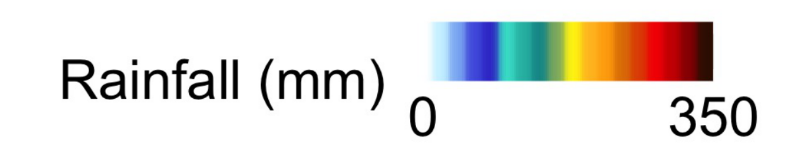

<div class="notes">
Want to understand how rainfall impacts a region
Not just point location
Moreover, also need to understand how extreme rainfall will impact locations without a station
Need a model that works in continuous space with dependence
</div>

# Max-stable Processes

## Max-stable Processes

* Extremes in continuous space with dependence <br/>
<br/>
* Natural extension from univariate extreme value theory  <br/>
<br/>
* Univariate marginal distributions are GEV distributions <br/>
<br/>
* Can simulate from these processes

## Wettest Day of the Year

<center>
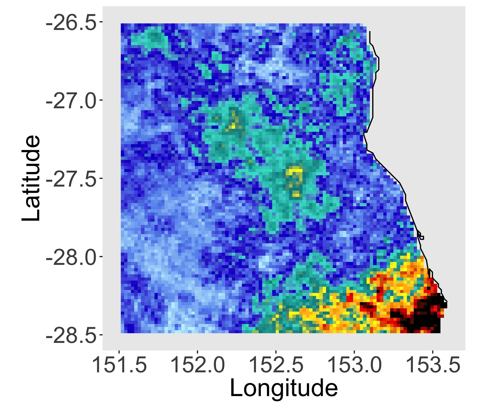


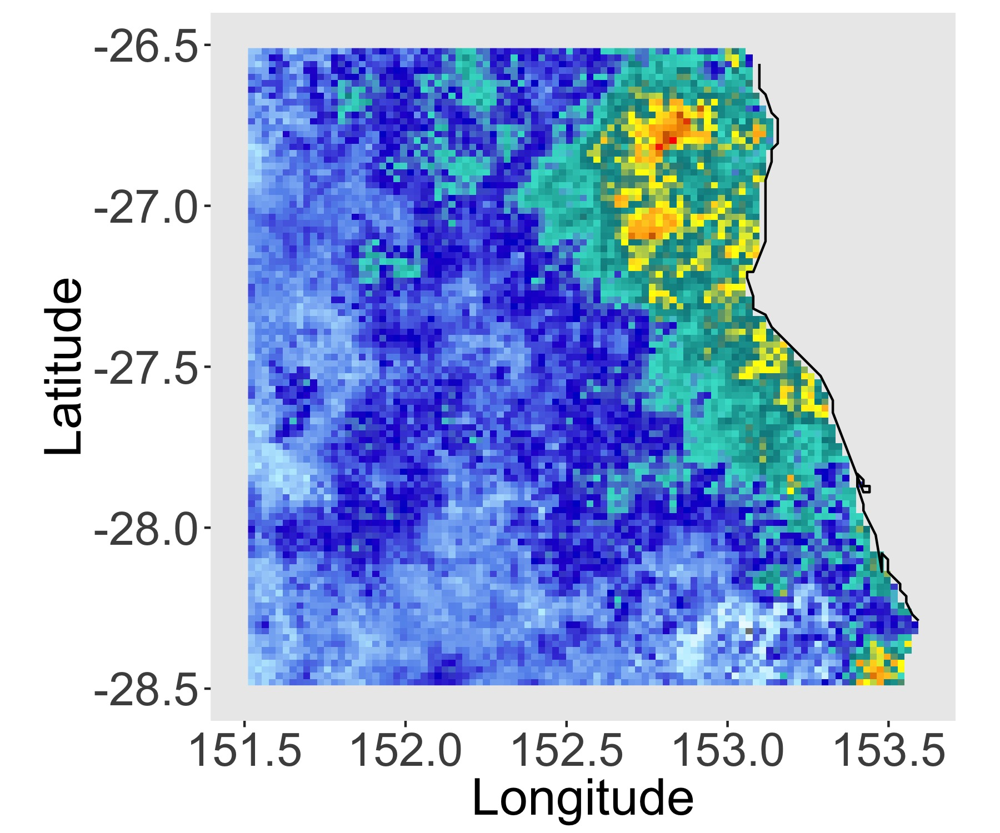
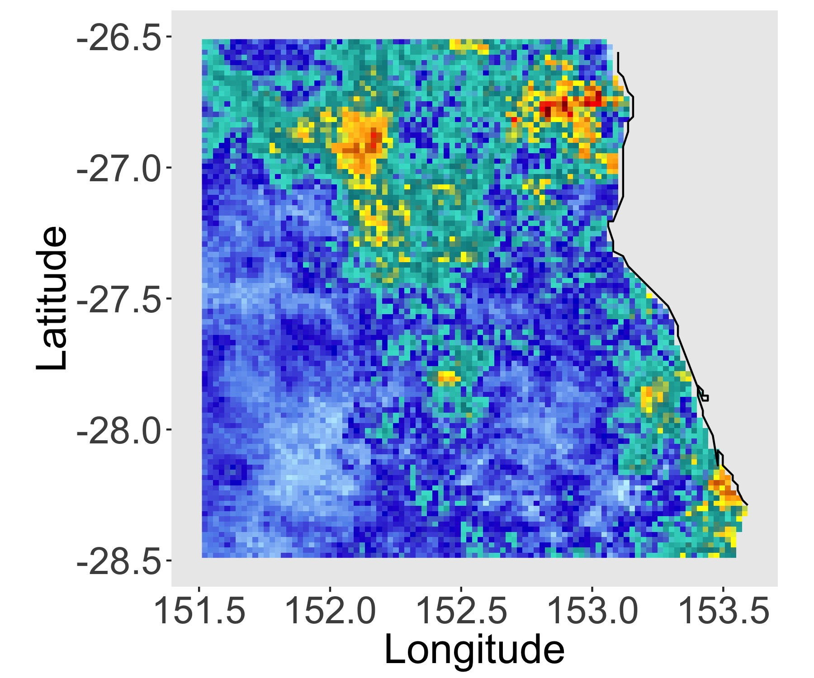


<!--  <br> -->
</center>

<div class="notes">
- Realistic representations of the annual maximum rainfall field
- Create multiple realisations
- Evaluate largest rainfall in this region
- Aggregate extreme rainfall across the region
- Taken from an application in an earlier chapter, modelled influence of ENSO
on the marginal distributions, looked at aggregate measure for rainfall
- Neat maths under the hood here
- Taking the maximum over infinitely many replicates of our stochastic process
</div>

## Definition

Let <font color="blue">$\{Z_i\}_{i \geq 1}$</font> be a sequence of independent copies of a stochastic process
<font color="blue">$\{ Z(x) : x \in \mathcal{X} \subset \mathbb{R}^2 \}$</font>. <br />
<br />
The process
<font color="blue">$Z(x)$</font> is max-stable, if there exist normalising functions,
<font color="blue">$\{a_n(x)\} \in \mathbb{R}^+$</font> and
<font color="blue">$\{b_n(x)\} \in \mathbb{R}$</font>, such that
<font color="blue">$$	Z(x) \stackrel{d}{=} \lim_{n\to\infty} \dfrac{ \max _{i=1,\dots,n} Z_i(x) - b_{n}(x) }{ a_{n}(x) }, \quad x \in \mathcal{X}.$$
</font>
If the limiting process for the partial maxima process exists and is non-degenerate, then it is a max-stable process.

(De Haan 2006)

## Spectral Representation

Any non-degenerate simple max-stable process
<font color="blue">$\{ Z(x): x \in \mathcal{X}\}$</font> defined on a compact set <font color="blue">$\mathcal{X} \subset \mathbb{R}^2$</font>, with continuous sample paths satisfies
<font color="blue">$$	Z(x) \stackrel{d}{=} \max_{i \geq 1} \zeta_i Y_i(x), \quad\quad x \in \mathcal{X}, $$</font>
where <font color="blue">$\{\zeta_i: i \geq 1 \}$</font> are points of a Poisson process on
<font color="blue">$(0, \infty)$</font> with intensity
<font color="blue">$\zeta^{-2}\hbox{d}\zeta$</font>, and
<font color="blue">$Y_i$</font> are independent copies of a non-negative stochastic process
<font color="blue">$\{Y(x): x\in \mathcal{X}\}$</font> with continuous sample paths such that the
<font color="blue">$\mathbb{E}\lbrace Y(x) \rbrace = 1$</font> for all
<font color="blue">$x \in \mathcal{X}$</font>.

(De Haan 1984, Schlather 2002)

## Conditional Simulation

<center>
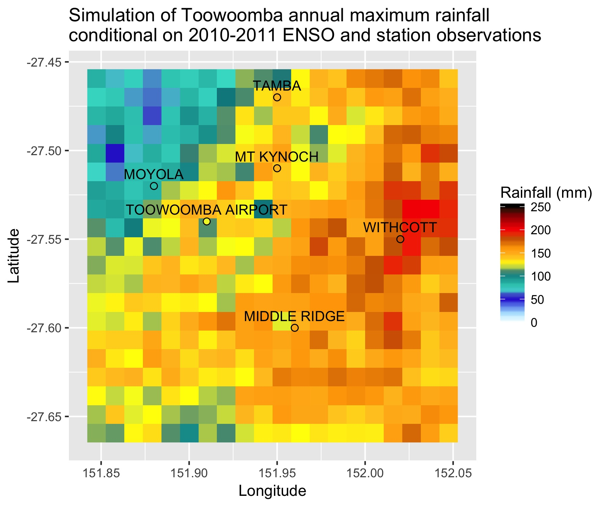
</center>

## Original Questions

<!-- <font color="blue"> -->
<!-- **What was the probability of this flash flood occurring?** -->
<!-- </font> -->
<!-- <font color="blue"> -->
<!-- **Did ENSO affect the probability of this flash flood occurring?** -->
<!-- </font> -->

<font color="blue">**Was the Toowoomba flash flood more likely due to the 2010-2011 La Nina ?**</font><br />
<br />
Yes ~ 85% more likely compared with a El Nino year.<br />
<br />
<font color="blue">**If we had a similar strength La Nina, what is the probability of this flash flood occurring?**</font><br />
<br />
1 in 7.5 (0.134)
<br />

(For details see Saunders et al. 2017.)

<div class="notes">
* Fast and loose - with how I've defined these probabilities.
* Recommend going to look at the paper for further details
</div>

## Question
<br><br><br>
<font color="blue">**Can we do this type of modelling for all of Australia?**</font>
<br><br><br>

<div class="notes">
* Hopefully I've convinced you that modelling extremes in continuous space with dependence is useful.
* Max-stable processes are a powerful tool that allows us to ask really interesting questions about rainfall extremes that may otherwise not been answerable.
* Fit these kinds of models we've made certain assumptions about dependence
* Such as a common dependence structure across the domain
* Want to explore these assumptions
</div>

# Dependence

## Dependence
```{r, echo = FALSE}
addResourcePath("assets", "assets/")
shinyAppDir("shiny_apps/record_slider/",
 options = list(width = "100%", height = 700)
)
```

<div class="notes">
Key Points
- Explain the colours
- Large range dependence
- Station network change in time
- Looking for patterns
- Colours are to help distinguish which events occur in the same years
- Which station experience events together?
- What is the range?
- Are the years important? (1974 )
- Large areas are affected together
</div>

## Challenge

<br>


<div class="notes">
- Want to understand extremes on an Australian wide scale
- Challenge is complexity of climate and topography
- Size
</div>

## Regionalisation

<center>
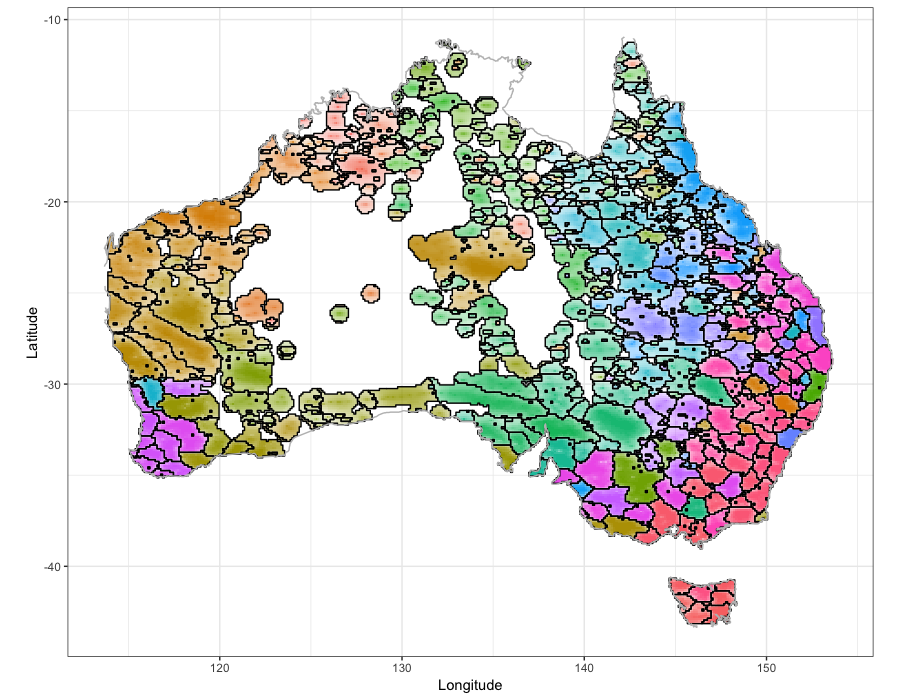

<div class="notes">
Which stations are dependent - which are independent
Which stations should be group together for modelling
Which locations are likely to be impacted together
Where can we assume a single dependence structure

* Cluster
* Classify
* Fit

</div>

# Clustering

## Clustering Distance

**Form clusters based on extremal dependence!**<br/ >
(Bernard et al 2013)

* Use only the raw annual maxima
* No information about climate or topography

**Use the F-madogram distance** (Cooley et al 2006)
<font color="blue">$$d(x_i, x_j) = \tfrac{1}{2} \mathbb{E} \left[ \left| F_i(M_{x_i}) - F_j(M_{x_j})) \right| \right]$$</font>
where
<font color="blue">$M_{x_i}$</font> is the annual maximum rainfall at location
<font color="blue">$x_i \in \mathbb{R}^2$</font> and <font color="blue">$F_i$</font> is the distribution function of
<font color="blue">$M_{x_i}$</font>.

This distance can be estimated non-parametrically.

<div class="notes">
- In spatial statistics normally we have a notion of how close two things are using the variogram
- For heavy-tail distribution (problem) variance isn't finite
- Fmadogram gets aroudn this by using distribution funcitons
- Estiamte this distance non-parametrically
- Just going to consider hte clustering in terms of hte dependence
</div>

## Extremal Coefficient

For <font color="blue">$M_{x_i}$</font> and
<font color="blue">$M_{x_j}$</font> with common GEV marginals, <font color="blue">$\theta(x_i - x_j)$</font> is
<font color="blue">$$\mathbb{P}\left( M_{x_i} \leq z, M_{x_j} \leq z \right) = \left[\mathbb{P}(M_{x_i}\leq z)\mathbb{P}(M_{x_i}\leq z)) \right]^{\tfrac{1}{2}\theta(x_i - x_j)}. %= \exp\left(\dfrac{-\theta(h)}{z}\right),$$</font>

The range of <font color="blue">$\theta(x_i - x_j)$ is $[1 , 2]$</font>.

Can write our distance measure as a function of the extremal coefficient, <font color="blue">$\theta(x_i - x_j)$,
$$d(x_i, x_j) = \dfrac{\theta(x_i - x_j) - 1}{2(\theta(x_i - x_j) + 1)}.$$</font>

Therefore the range of <font color="blue">$d(x_i, x_j)$</font> is <font color="blue">$[0 , 1/6]$</font>.

<div class="notes">
- Extremal coefficient is a measure for parital dependence
- Using it for clustering, means our clsuters will have a natural interpretation
- Importnat to note the range (talk about that again in a little bit)
</div>

## K-Medoids Clustering

Partitioning around Medoids (PAM):
(Kaufman and Rousseeuw 1990)

1. Randomly select an initial set of $K$ stations. These are the set of the initial medoids.
2. Assign each station, $x_i$, to its closest medoid, $m_k$, based on the F-madogram distance.
3. For each cluster, $C_k$, update the medoid according to
$$m_k = \mathop{\mathrm{argmin}}\limits_{x_i \in C_k} \sum_{x_j \in C_k} d(x_i, x_j).$$
4. Repeat steps 2. -- 4. until the medoids are no longer updated.

## Clustering

<center>
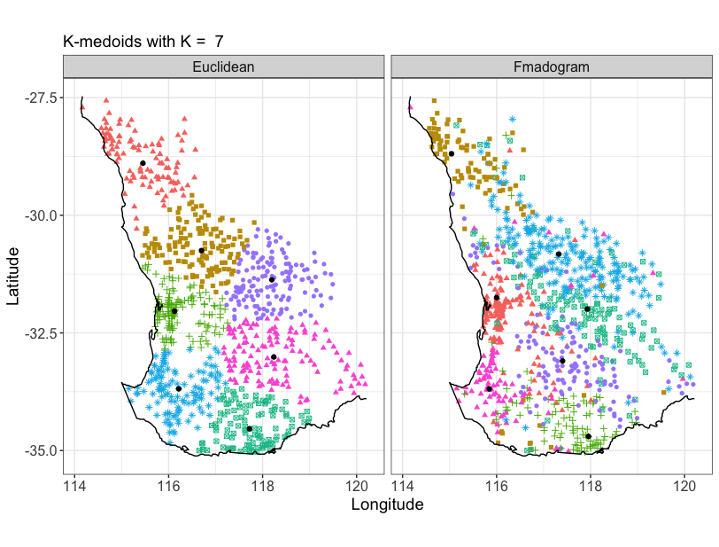
</center>

<div class="notes">
* Looking at southwest western Australia
* Used stations with 50 years or more of data that are 90% complete.
 (Remote or isolated stations were excluded)
* Noticable differences between euclidean and fmadogram distance
* euclidean clusters similar size
* fmadogram clusters observing this dominant northwest to southeast orientation
* no inforamtion about cliamte or topography and we've got spatially homogeneous clusters
* Forgiven for thinking everything looked hunky dory
</div>

## Spurious Clustering
Let $d_e(x_i,x_j)$ be the Euclidean distance between x and y.<br />
Consider the $\max\{d_e(x_i,x_j), 2\}$ as the clustering distance.
```{r, echo = F, warning = F}
set.seed(1)
cap = 2
theta = seq(0, 2*pi, length.out = 360)
circle = data.frame(x = cap*cos(theta), y = cap*sin(theta))

# CAP ON DISTANCE
xshift = 7

x0 = rnorm(500, 0, 1)
y0 = rnorm(500, 0, 1)

x1 = x0 + xshift
y1 = y0

x = c(x0,x1)
y = c(y0,y1)

DD = dist(cbind(x,y))
i = which(DD > cap)
DD[i] = cap

pam_clusters = pam(DD, k = 2)

k = 2
cap_df = data.frame(x,y)
cap_df$K = rep(k, nrow(cap_df))
cap_df$cluster_id = pam_clusters$clustering
cap_df$medoids_x = rep(NA, nrow(cap_df))
cap_df$medoids_y = rep(NA, nrow(cap_df))
cap_df$medoids_x[pam_clusters$medoids] = cap_df$x[pam_clusters$medoids]
cap_df$medoids_y[pam_clusters$medoids] = cap_df$y[pam_clusters$medoids]

kmedoids_eg1_plot <- ggplot() +
  geom_point(data = cap_df, aes(x=x, y=y,
                                col = as.factor(pam_clusters$clustering),
                                shape = as.factor(pam_clusters$clustering),
                                text = paste("Cluster ID:", as.factor(pam_clusters$clustering)))) +
  scale_color_manual(values = c("purple", "orange")) +
  geom_point(data = cap_df, aes(x = medoids_x,
                                y = medoids_y),
             col = "black", shape = 20, size = 2) +
  geom_path(aes(x = circle$x, y = circle$y), linetype = "dashed") +
  geom_path(aes(x = circle$x + xshift, y = circle$y), linetype = "dashed") +
  coord_fixed() +
  theme_bw() +
  theme(legend.position = "none") +
  ggtitle("Example of K-Medoids showing spurious clustering")

ggplotly(kmedoids_eg1_plot, tooltip = c("text"))
```

## Density Sensitive

```{r, echo = F, warning = F}

# DENSITY EXAMPLE

xshift = 7
x0 = rnorm(1000, 0, 1)
y0 = rnorm(1000, 0, 1)

i = sample(1:length(x0), 100)
x1 = x0[i] + xshift
y1 = y0[i]

x = c(x0,x1)
y = c(y0,y1)

cap = 2
DD = dist(cbind(x,y))
i = which(DD > cap)
DD[i] = cap

pam_clusters_1 = pam(DD, k = 2)

plot_df = data.frame(x,y)
plot_df$K = paste("K = ", c(rep(2, length(x))))
plot_df$cluster_id = c(pam_clusters_1$clustering)
plot_df$medoids_x = rep(NA, nrow(plot_df))
plot_df$medoids_y = rep(NA, nrow(plot_df))
plot_df$medoids_x[pam_clusters_1$medoids] = plot_df$x[pam_clusters_1$medoids]
plot_df$medoids_y[pam_clusters_1$medoids] = plot_df$y[pam_clusters_1$medoids]

density_eg_plot <- ggplot(plot_df) +
  geom_point(aes(x = x, y = y,
                 col = as.factor(cluster_id),
                 shape = as.factor(cluster_id),
                 text = paste("Cluster ID:", as.factor(cluster_id)))) +
  geom_point(aes(x = medoids_x,
                 y = medoids_y),
             col = "black", shape = 20, size = 2) +
  coord_fixed() +
  theme_bw() +
  facet_wrap( ~ K, nrow = 2) +
  theme(legend.position = "none") +
  ggtitle("Station Density Example of K-Medoids")

ggplotly(density_eg_plot, tooltip = c("text"))
```

<div class="notes">
 * Need something robust to these problemes - Hierarchical Clustering
 * Medoids need to cover the domain so that every station is dependent on a medoid in some way
 * Clustering selection method also don't work the way they were intended
 * Density creates medoids in denser areas - making more problems
 * Explain differences in station density
</div>

## Australian Rainfall Network

```{r}
working_dir = "/Users/saundersk1/Dropbox/Hard Drive/R/2018/ChapterCluster/"
mainland_df = readRDS("/Users/saundersk1/Documents/Git/completionSeminar/shiny_apps/record_slider/mainland_df.rds")
tas_df = readRDS("/Users/saundersk1/Documents/Git/completionSeminar/shiny_apps/record_slider/tas_df.rds")

coords = readRDS(paste(working_dir, "Data/region_coords.rds", sep = "")) %>% dplyr::bind_rows()
station_plot <- ggplot(data = coords) +
  geom_point(aes(x = longitude, y = latitude), size = 0.2, alpha = 0.5) +
  geom_path(data = mainland_df, aes(x = Long, y =Lat)) +
  geom_path(data = tas_df, aes(x = Long, y =Lat)) +
  xlab("Longitude") +
  ylab("Latitude") +
  ggtitle("Station Locations") +
  coord_fixed() +
  theme_bw()

station_plot
```

<div class="notes">
 * Need something robust to these problemes - Hierarchical Clustering
</div>

<!-- ## SHINY APP -->

<!-- CUT HEIGHT -->
<!-- DENDROGRAM -->
<!-- CLUSTERING -->

## Hierarchical Clustering

1. Each station starts in its own cluster
2. For each pair of clusters, $C_k$ and $C_k'$, define the distance between the clusters as
$$d(C_k, C_{k'}) = \frac{1}{|C_k| |C_{k'}|} \sum_{x_k \in C_k} \sum_{x_{k'} \in C_{k'}} d(x_k, x_{k'}).$$
3. Merge the the clusters with the smallest distance
4. Update the distances relative to the new cluster
5. Repate steps 3 - 5, until all points are combined in a single cluster

<div class="notes">
* Many different linkage criteria (this one works for us)
* What we end up with is a dendrogram
* Graphical way of displaying connectness
</div>

## Dendrogram

<center>

</center>

<div class="notes">
* Explain how a cut in the tree produces the clusters
* (x axis) Each single point/station forms a leaf in the tree.
* When these leaves are connected they form branches, clusters
* branches in the most trivial sense can be a single leaf.
* (y axis) Average distance between branches
*  Obtain our clustering by cuttign this dendrogram
* Explain that higher cut heights smaller depenence
* Lower cut heights greater dependence
</div>

## Revisit our examples

```{r, echo = F, warning = F}

set.seed(1)
cap = 2
theta = seq(0, 2*pi, length.out = 360)
circle = data.frame(x = cap*cos(theta), y = cap*sin(theta))

#---------------------------------------------------
method1 = "average"

# CAP ON DISTANCE
xshift = 7

x0 = rnorm(500, 0, 1)
y0 = rnorm(500, 0, 1)

x1 = x0 + xshift
y1 = y0

x = c(x0,x1)
y = c(y0,y1)

DD = dist(cbind(x,y))
i = which(DD > cap)
DD[i] = cap

hclust_clusters = hclust(DD, method = method1) %>%
  cutree(hclust_clusters, k = 2)

cap_df = data.frame(x,y)
cap_df$K = rep(k, nrow(cap_df))
cap_df$cluster_id = hclust_clusters

cap_eg_plot <- ggplot() +
  geom_point(data = cap_df, aes(x=x, y=y,
                                col = as.factor(cluster_id),
                                shape = as.factor(cluster_id),
                                text = as.factor(cluster_id))) +
  scale_color_manual(values = c("purple", "orange")) +
  # geom_path(aes(x = circle$x, y = circle$y), linetype = "dashed") +
  # geom_path(aes(x = circle$x + xshift, y = circle$y), linetype = "dashed") +
  coord_fixed() +
  theme_bw() +
  theme(legend.position = "none") +
  ggtitle("Finite Distance Example", paste("Hierarchical clustering with linkage method:", method1))

ggplotly(cap_eg_plot, tooltip =c("text"))

```

## Revisit our examples

```{r, echo = F, warning = F}

# DENSITY EXAMPLE

x0 = rnorm(1000, 0, 1)
y0 = rnorm(1000, 0, 1)

i = sample(1:length(x0), 100)
x1 = x0[i] + xshift
y1 = y0[i]

x = c(x0,x1)
y = c(y0,y1)

cap = 2
DD = dist(cbind(x,y))
i = which(DD > cap)
DD[i] = cap

method2 = "single"

hclust_clusters1 = hclust(DD, method = method1) %>%
  cutree(hclust_clusters, k = 2)
hclust_clusters2 = hclust(DD, method = method2) %>%
  cutree(hclust_clusters, k = 2)

plot_df = data.frame(x,y)
plot_df = rbind(plot_df, plot_df,plot_df, plot_df)
plot_df$K = c(rep(method1, length(x)), rep(method2, length(x)))
plot_df$cluster_id = c(hclust_clusters1,
                       hclust_clusters2)

plot_df <- plot_df %>% filter(K == method1)

density_eg_plot <- ggplot(plot_df) +
  geom_point(aes(x = x, y = y,
                 col = as.factor(cluster_id),
                 shape = as.factor(cluster_id),
                 text = as.factor(cluster_id))) +
  coord_fixed() +
  theme_bw() +
  # facet_wrap( ~ K, nrow = 2) +
  theme(legend.position = "none") +
  # ggtitle("Station Density Example of Hierarchical Clustering with K = 2")
  ggtitle(paste("Station Density Example", "Hierarchical clustering with linkage method:", method1))

ggplotly(density_eg_plot, tooltip = c("text"))

```

## Examples

<center>
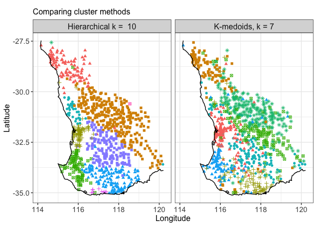

## Classify

* Classify a station relative to its closest neighbours
* Use a weighted classification $w$-kNN

<center>


<div class="notes">
* Need to be able to classify locations without a station
* Need to be able to identify regional boundaries
</div>

<!-- library(ggplot2) -->

<!-- target = data.frame(x = 0, y = 0, shape = "target") -->
<!-- triangles = data.frame(x = c(-3,-3, -3, -1), y = c(4, 0, 3, 4), shape = rep("triange", 4)) -->
<!-- crosses = data.frame(x = c(-0.5, -0.5), y = c(0.5, -0.5), shape = rep("squares", 2)) -->
<!-- circles = data.frame(x = c(1, -0.5, 0.5, 1.5, 1.5, 2.5, 3, 2.5, 2.5, 3, 2.5, 2, 1.5), -->
<!--                      y = c(1, 2.5, 3, 2, 4.5, 4, 3, 2,-1,-2,-3,-1,-2), -->
<!--                      shape = rep("crosses", 13)) -->
<!-- all_pnts = rbind(target, triangles, crosses, circles) -->

<!-- ggplot(all_pnts) + -->
<!--   geom_point(aes(x=x,y=y, col = shape, shape = shape), size = 5) + -->
<!--   theme_bw() -->


<!-- Let $x_t$ be the target location we wish to classify and let $c_i$ be the cluster label assigned to station $x_i$. As we are interested in classification in euclidean space, we use euclidean distance to determine the neighbours. -->

<!-- 1. Get the $k + 1$ nearest neighbours to $x$. <br /> -->
<!-- 2. Standardise the distances -->
<!-- $$	d_s(x, x_i) = \dfrac{\lVert x -  x_{i} \rVert^2}{\lVert x - x_{k+1} \rVert^2}. $$ <br /> -->
<!-- 3. Transform the normalised distances using a kernel function to determine the weights. We have chosen an inverse weighted kernel, -->
<!-- $$	w_i = \dfrac{1}{|d_s(x, x_i)|}. $$ <br /> -->
<!-- 4. Classify $x$ according to the weighted majority of $k$ nearest neighbours, -->
<!-- $$	c = \mathop{\mathrm{argmax}}_{c \in \mathcal{C}} \left( \sum_{i=1}^k \dfrac{\mathbb{I}(c_i = c)}{|d_s(x, x_i)|}\right), $$ -->
<!-- where $\mathcal{C}$ is the set of classifications of the $k$-nearest neighbours. <br /> -->

# Regionalisation

##
```{r regions, echo = FALSE}
addResourcePath("assets", "assets/")
shinyAppDir("shiny_apps/region_summary/",
 options = list(width = "100%", height = 700)
)
```

<!-- ## Tasmania  -->

<!-- Change cut height - Clustering change - Show Elevation Map -->
<!-- <center> -->
<!--  -->
<!-- </center> -->

<!-- ## Western Australia -->

<!-- <center> -->
<!--  -->
<!-- </center> -->

<!-- ## Eastern Australia -->

<!-- <center> -->
<!--  -->
<!-- </center> -->

<!-- ## Southeast Australia -->

<!-- <center> -->
<!--  -->
<!-- </center> -->

## Choosing a cut height

<center>
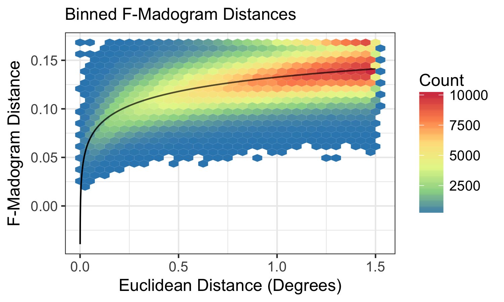
</center>

<div class="notes">
Depends on what you are trying to do?

Lower cut heights ~0.115 stronger dependence

Higher cut heights ~0.133 weaer dependence

Low than 0.1 (very strong dependence, starts to decrease rapidly to zero - clusters become small)

Greater than 0.135 (very week depdence, starts to decrease rapidly to zero - clusters become small)

Depends on the topography as well
</div>

## Similar Dependence

<br>
<font color="blue">**Where can we assume a common dependence structure?**</font>
<br>

## Australia

<center>
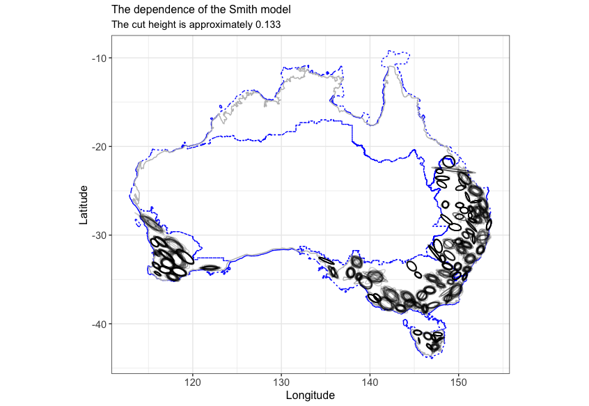
</center>

## Conclusions

* Max-stable models powerful tool for modelling extremes

* Dependence of annual maxima in Australia is highly variable and highly localised

* Exercise caution in our modelling assumptions

**e.** katerobinsonsaunders@gmail.com

**t.** @katerobsau

**g.** github.com/katerobsau

<!-- ## {.fullslide} -->

<!-- <center> -->
<!--  -->
<!-- </center> -->

## {.fullslide}

<center>

</center>

<!-- ## Australia  -->

<!-- <center> -->
<!-- 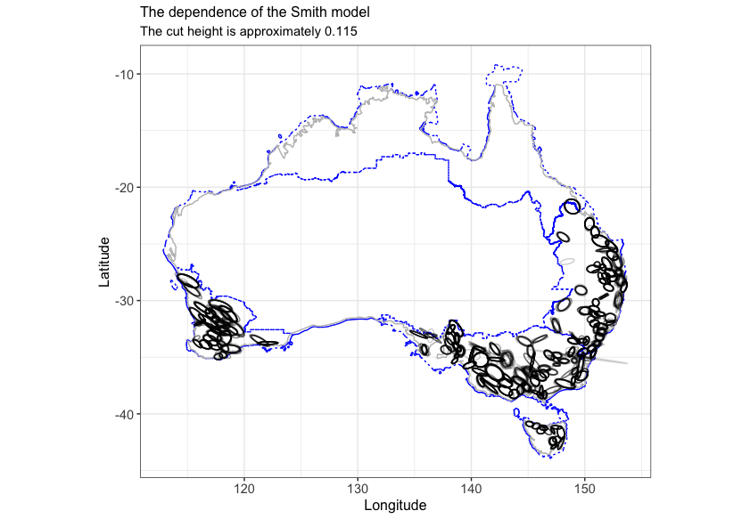 -->
<!-- </center> -->


<!-- Example slides ------------------------------------------------------- -->

<!-- ## R Markdown -->

<!-- ```{r} -->
<!-- x = rnorm(10) -->
<!-- y = x + rnorm(10) -->
<!-- plot(x, y) -->
<!-- ``` -->

<!-- ## Text slide -->
<!-- SOME TEXT HERE -->

<!-- ## -->

<!-- No icon when there is no header -->

<!-- Load the relevant css ------------------------------------------------ -->

<script src = "assets/torino_style.js"></script>
